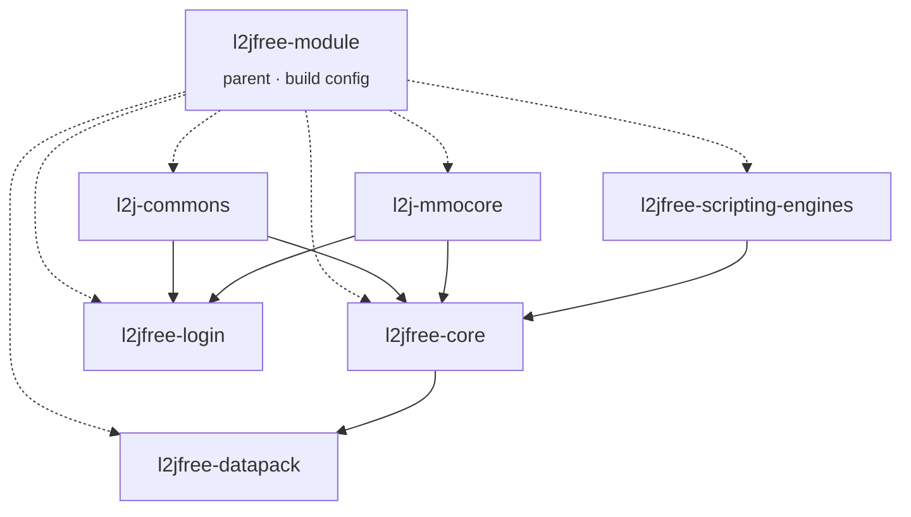

<div align="center">

# l2jfree

### Gracia Final. Protocol 83. Frozen since 2015 — building again since today.

[](https://github.com/l2go/l2jfree/actions/workflows/build.yml)
[](LICENSE)
[](#requirements)

</div>

> **Fan-made, non-commercial. Not affiliated with or endorsed by NCSoft.**
> "Lineage 2" is a trademark of its owner. No NCSoft assets, no client, no reverse engineering —
> just a GPLv3 server pack, kept buildable.

## Lineage

```
savormix (2010) → lord_rex / l2jfree-ct2.3 (2015) → this fork (today)
```

Unmodified original: [`UPSTREAM_README.md`](UPSTREAM_README.md).

## Module graph



## Build

```sh
git clone git@github.com:l2go/l2jfree.git && cd l2jfree && ./mvnw install
```

On Windows: `mvnw.cmd install`. No separately installed Maven required — the wrapper fetches the
exact pinned version (3.6.3, checksum-verified) on first run. Only a JDK is your responsibility.

Verified on JDK 11 by CI on every push, via the same `./mvnw` anyone else would run — never taken
on faith, never built on one person's machine.

<details>
<summary><strong>What changed, and why</strong> — build tooling only, zero game logic touched</summary>

| Change | Reason |
|---|---|
| Root `pom.xml` | The reactor already existed, just rooted at `l2jfree-module/` instead of repo root. This is a 3-line delegator. |
| `maven-compiler-plugin` 3.3 → 3.8.1 | Only real JDK 11 risk in the plugin set. Bytecode level unchanged (still `1.8`). |
| `mysql-connector-java` 5.1.36 → 5.1.49 | Last 5.1.x release; fixes 3 known CVEs without jumping to the 8.x driver line. |
| `maven-antrun-plugin` pinned to `1.8` | Was unpinned and had silently drifted to a release that broke the build's `<tasks>` syntax — a real bug CI caught on the first run, not a style choice. |
| CI added | Build health now lives on a reproducible JDK 11 runner. |
| Maven Wrapper (`mvnw`/`mvnw.cmd`) added | Pins the exact Maven version (checksum-verified) instead of requiring a separately installed, correctly-versioned Maven — one less manual step for anyone self-hosting this on the target OS. |

**Left alone, on purpose:** `spring` 2.0.2, `spring-mock` 2.0.2, `hibernate` 3.2.2.ga — old enough to
be a plausible security risk, but bumping them is a behavioral gamble across a decade of changes,
not a bounded fix. Flagged, not silently carried or silently patched.

</details>

<details>
<summary><strong>Requirements</strong> — pinned to a specific target, not "whatever's newest"</summary>

| | Version | Why |
|---|---|---|
| OS (server-side) | Windows 7 Pro SP1 x64 | The floor everything below is chosen for. Client-side is unrestricted. |
| JDK | 11 (LTS) | Last LTS Oracle's certified configs list for Windows 7 SP1. |
| Maven | 3.6.3, via `./mvnw` — no manual install needed | JDK 11 compatibility, not an OS constraint. |
| MySQL | 5.7 | Its own docs name Windows 7 SP1 explicitly. |
| Git | 2.46.2 | Last release before Windows 7/8 support was dropped upstream. |

**Deploying on the target OS — what you actually need to install:**

- **JRE 11**, not the full JDK, is enough to *run* a built release (see [Releases](../../releases)):
  [Temurin 11 JRE, Windows x64 MSI](https://github.com/adoptium/temurin11-binaries/releases/download/jdk-11.0.32.1%2B1/OpenJDK11U-jre_x64_windows_hotspot_11.0.32.1_1.msi)
  (`sha256: f8c7da672f5dba36b6f870608820b6b598cfae91296929f1b8f21ef2f1e8a0dd`) — the same distribution CI
  builds with.
- **MySQL 5.7.44** (the last 5.7.x release): [MySQL Archives — pick `mysql-5.7.44-winx64.zip`](https://downloads.mysql.com/archives/community/?product=mysql-installer-community&version=5.7.44)
  (Oracle blocks direct hotlinks to the file itself; use the archive page).
- **Visual C++ Redistributable** — **unresolved, not just "pick an older build."** MySQL 5.7.44
  needs the 2019-era v14 runtime (5.7.40+ requirement). Microsoft's official page
  (`aka.ms/vc14/vc_redist.x64.exe`) only offers one auto-updating link, no archive of past builds —
  and that link's current build supports only Windows 10/11. There is currently no confirmed,
  first-party source for a Windows-7-compatible build of this runtime. Do not treat this as solved;
  test on a real or emulated Windows 7 SP1 x64 machine before relying on MySQL 5.7.44 there.

</details>

## Not this

Not a modified/redistributed client — get that yourself, officially, unmodified. Not a live server
operated by anyone here — just buildable source, run it on your own infrastructure if you want it.

## License

GPLv3 — [`LICENSE`](LICENSE). Every source file already carries its own header; this just adds the
file the headers implied.

## Elsewhere

[L2JFree Genesis](https://github.com/savormix/l2jfree-genesis) · [l2jfree/l2jfree-ct2.3](https://github.com/l2jfree/l2jfree-ct2.3)
