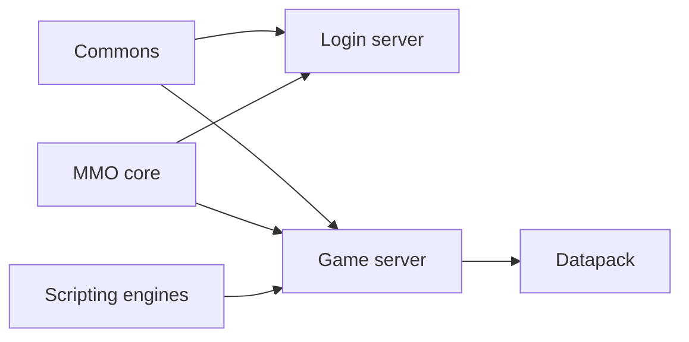

<div align="center">

# L2JFree

**Gracia Final · Protocol 83**

An archived Lineage II server, maintained for modern builds and a documented Windows 10 migration.

[](https://github.com/l2go/l2jfree/actions/workflows/build.yml)
[](LICENSE)


[Build](#quick-start) · [Upgrade](#windows-10-upgrade) · [Architecture](#architecture)

</div>

> **Upgrade status:** the build is prepared; Windows 10, MySQL 8.4, and the final deployment image still need runtime qualification.

## Quick start

Install a JDK, then build from the repository root:

```sh
git clone https://github.com/l2go/l2jfree.git
cd l2jfree
./mvnw install
```

On Windows, run `mvnw.cmd install`. The wrapper downloads checksum-verified Maven 3.9.16. Distribution ZIPs appear in the `target` directories of `l2jfree-login`, `l2jfree-core`, and `l2jfree-datapack`.

CI builds with Microsoft OpenJDK 11 and 25; the output uses Java 8 bytecode. Tests are skipped by default.

## Windows 10 upgrade

| Component | Target |
|---|---|
| Host | Windows 10 Pro 22H2 x64 |
| Java | Microsoft OpenJDK 25 LTS x64 |
| Database | MySQL 8.4 LTS with Connector/J 26.7.0 |

Windows 10 is past regular support; this plan assumes no ESU. Oracle does not list Windows 10 as a supported MySQL 8.4 platform. The [upgrade plan](docs/2026-Q4-UPGRADE.md) covers qualification, supported database hosting, migration, and rollback.

## Architecture



## Provenance and license

This fork descends from [savormix](https://github.com/savormix/l2jfree-genesis) through [lord_rex](https://github.com/l2jfree/l2jfree-ct2.3). The [original README](UPSTREAM_README.md) is preserved unchanged.

This noncommercial fan project is unaffiliated with NCSoft. It provides server source, not a client or hosted server. This fork added no client binaries or extracted client assets; inherited datapack text and HTML were not audited here. "Lineage 2" is a trademark of its owner. Code is distributed under [GPLv3](LICENSE).
