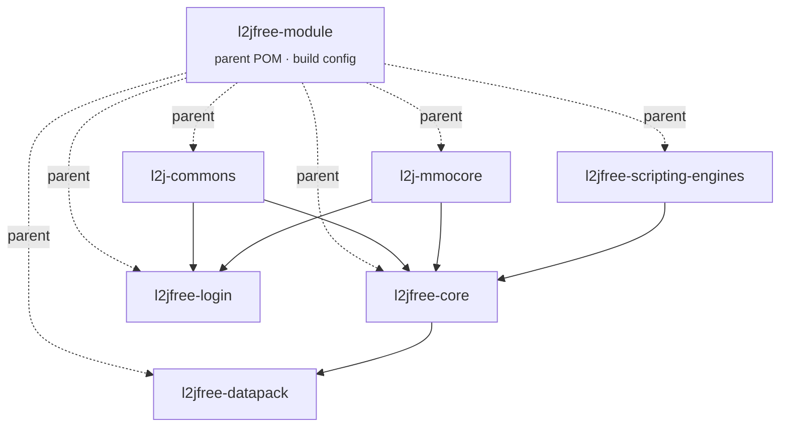

<div align="center">

# l2jfree-ct2.3

**Gracia Final · protocol 83 · GPLv3**

[](https://github.com/l2go/l2jfree-ct2.3/actions/workflows/build.yml)
[](LICENSE)
[](#requirements)
[](#requirements)

*An archival, self-hostable fork — not a service, not a product.*

</div>

---

> **Fan-made, non-commercial project. Not affiliated with or endorsed by NCSoft.**
> "Lineage 2" is a trademark of its respective owner. This repository contains no NCSoft assets,
> no client, and no modification of NCSoft software — see [What this is not](#what-this-is-not).

## What this is

The last known well-formed, buildable, GPLv3 implementation of Lineage 2's **Gracia Final**
chronicle (network protocol version **83**) — a genuine snapshot of MMORPG server engineering from
2010, kept alive rather than lost.



## Lineage of this pack

```
savormix / L2JFree Genesis (2010–2015, original)
        │
        ▼
lord_rex / l2jfree-ct2.3 (2015, Bitbucket → GitHub — refactor, modernization, this pack's base)
        │
        ▼
l2go / l2jfree-ct2.3 (this repository — archival fork + bounded build modernization only)
```

## What l2go changed — and, just as importantly, what it didn't

l2go's involvement with this pack is deliberately narrow, recorded in
[l2go's ADR-0002](https://github.com/l2go/l2go-workspace/blob/main/adr/ADR-0002-l2jfree-fork-scope.md):
**bounded build/toolchain maintenance only — no architectural refactor, no new gameplay features.**
Everything below is build tooling; not one line of game logic changed.

| Change | Why |
|---|---|
| Root `pom.xml` added | The pack already had a full Maven reactor — but rooted at `l2jfree-module/`, not the repository root, so `mvn install` only worked from inside that subdirectory. This is a thin delegator, no build logic of its own. |
| `maven-compiler-plugin` 3.3 → 3.8.1 | The only plugin in the build with real JDK 11 compatibility risk. Source/target level is untouched (`1.8`, same as upstream) — this changes *what builds it*, not *what it builds*. |
| `mysql-connector-java` 5.1.36 → 5.1.49 | Fixes CVE-2019-2692, CVE-2020-2934, CVE-2020-2875 — the last release in the same 5.1.x branch, chosen to match [MySQL 5.7, l2go's ADR-0007 pin](https://github.com/l2go/l2go-workspace/blob/main/adr/ADR-0007-l2jfree-database-mysql57.md) rather than jumping to 8.x. |
| CI workflow added | Build verification now happens on a real, reproducible JDK 11 runner — not on any single maintainer's machine. See the badge above. |

**Left untouched, on purpose:** `spring` 2.0.2, `spring-mock` 2.0.2, and `hibernate` 3.2.2.ga are
old enough to be plausible CVE risk, but bumping them is a judgment call with real behavioral risk
across such a large version gap — exactly the kind of change ADR-0002 D2 reserves for a real
architectural decision, not bounded maintenance. Flagged here deliberately rather than silently
carried forward or silently "fixed."

## What this is not

- Not a modified or redistributed NCSoft client. Get the official client yourself, from an
  official source, unmodified.
- Not a public, playable server operated by l2go. This is source code you can build and run
  yourself; l2go does not host or advertise a live instance.
- Not where l2go's own database facts come from *verbatim* — l2go's public reference database
  reimplements the facts this pack's data represents, independently, not by copying this pack's
  files. See [l2go's README](https://github.com/l2go/l2go-workspace#data-source).

## Requirements

Pinned deliberately for a specific target, not "whatever's newest" — see l2go
[ADR-0006](https://github.com/l2go/l2go-workspace/blob/main/adr/ADR-0006-target-platform-windows7.md)
and [ADR-0008](https://github.com/l2go/l2go-workspace/blob/main/adr/ADR-0008-remaining-server-toolchain.md)
for the full reasoning behind every version below.

| | Version | Notes |
|---|---|---|
| OS (target) | Windows 7 Pro SP1 x64 | The floor this whole pin set is chosen for — server-side only, nothing here constrains what browser or OS a *client* uses. |
| JDK | 11 (LTS) | Last LTS Oracle's own certified configurations list for Windows 7 SP1. |
| Maven | 3.6.x | Build tool; the real constraint is JDK 11 compatibility, not the OS. |
| Database | MySQL 5.7 | Its own docs explicitly name Windows 7 SP1. |
| Git (if cloning directly on the target box) | 2.46.2 | Last version before Windows 7/8 support was dropped. |

## Building

```sh
git clone git@github.com:l2go/l2jfree-ct2.3.git
cd l2jfree-ct2.3
mvn install
```

Build artifacts land in each module's `target/` directory
(`l2jfree-login/target/l2jfree-login-1.3.0-dist.zip`,
`l2jfree-core/target/l2jfree-core-1.3.0-dist.zip`,
`l2jfree-datapack/target/l2jfree-datapack-1.3.0-dist.zip`).

Database setup and known quirks from the original pack still apply — see
[`l2jfree-datapack/`](l2jfree-datapack) for the SQL install scripts.

## License

GPLv3 — see [`LICENSE`](LICENSE). Every source file carries its own GPLv3 header; this repository
adds an explicit `LICENSE` file matching what the headers already declared.

## Links

- Original: [L2JFree Genesis (savormix)](https://github.com/savormix/l2jfree-genesis)
- Immediate upstream: [l2jfree/l2jfree-ct2.3](https://github.com/l2jfree/l2jfree-ct2.3)
- Why this fork exists, and the project it feeds into:
  [l2go-workspace](https://github.com/l2go/l2go-workspace)
