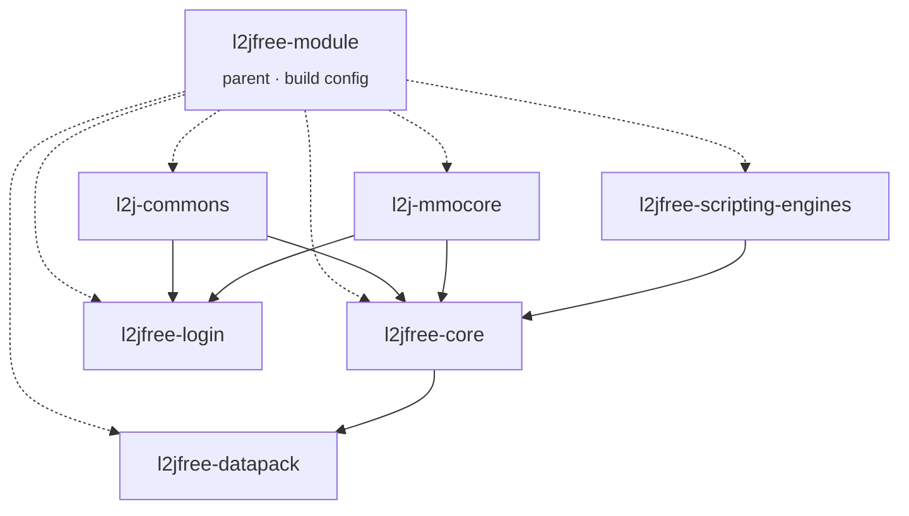

<div align="center">

# l2jfree

### Gracia Final · Protocol 83 · 2026 Q4 Windows 10 x64 Upgrade

[](https://github.com/l2go/l2jfree/actions/workflows/build.yml)
[](LICENSE)
[](#requirements)

</div>

> **Fan-made, non-commercial. Not affiliated with or endorsed by NCSoft.**
> "Lineage 2" is a trademark of its owner. No client binaries or extracted assets (art, audio,
> models) here or added by this fork. The upstream datapack's text content (NPC dialogue
> templates, HTML) is inherited from upstream under GPLv3, not authored or added here — this fork
> keeps the build tooling current, it doesn't audit or strip that inherited content. This project
> did not reverse-engineer anything itself; `l2jfree` upstream's own history predates this fork by
> years and isn't something this README can retroactively characterize.

## Lineage

```
savormix (2010) → lord_rex / l2jfree-ct2.3 (2015) → this fork (today)
```

Unmodified original: [`UPSTREAM_README.md`](UPSTREAM_README.md).

## 2026 Q4 Upgrade

The deployment is moving from Windows 7 SP1 x64 to Windows 10 Pro 22H2 x64. Repository implementation now targets Microsoft Build of OpenJDK 25 while retaining Java 8 bytecode, Maven Wrapper 3.9.16, MySQL Connector/J 26.7.0, and launchers that honor `JAVA_HOME`. Windows 7 compatibility is not a goal. Windows host runtime qualification and the MySQL server migration remain pending; the target versions, qualification limits, migration sequence, rollback requirements, and exit criteria are documented in the [2026 Q4 Upgrade plan](docs/2026-Q4-UPGRADE.md).

## Module graph



## Build

```sh
git clone git@github.com:l2go/l2jfree.git && cd l2jfree && ./mvnw install
```

On Windows: `mvnw.cmd install`. No separately installed Maven required — the wrapper fetches the
exact pinned version (3.9.16, SHA-256 verified) on first run. Only a JDK is your responsibility.

CI is configured for Microsoft Build of OpenJDK 11 and 25. The existing baseline has prior CI
verification; the new JDK 25 workflow and Windows 10 runtime still require qualification.

<details>
<summary><strong>What changed, and why</strong> — build and deployment tooling; gameplay logic unchanged</summary>

| Change | Reason |
|---|---|
| Root `pom.xml` | The reactor already existed, just rooted at `l2jfree-module/` instead of repo root. This is a 3-line delegator. |
| `maven-compiler-plugin` 3.3 → 3.8.1 | Only real JDK 11 risk in the plugin set. Bytecode level unchanged (still `1.8`). |
| `mysql-connector-java` 5.1.36 → 5.1.49 | Last 5.1.x release; fixes 3 known CVEs without jumping to the 8.x driver line. |
| `c3p0` 0.9.5.1 → 0.9.5.4 | Same 0.9.5.x branch; fixes CVE-2018-20433 (XXE, critical) and CVE-2019-5427 (billion-laughs XML expansion). |
| `maven-antrun-plugin` pinned to `1.8` | Was unpinned and had silently drifted to a release that broke the build's `<tasks>` syntax — a real bug CI caught on the first run, not a style choice. |
| CI added | Build health now lives on a reproducible JDK 11 runner. |
| Maven Wrapper (`mvnw`/`mvnw.cmd`) added | Pins the exact Maven version (checksum-verified) instead of requiring a separately installed, correctly-versioned Maven — one less manual step for anyone self-hosting this on the target OS. |
| 2026 Q4 toolchain upgrade | Pins Maven 3.9.16, configures Java 8 release bytecode and Microsoft OpenJDK 11/25 CI, updates MySQL Connector/J to 26.7.0, and makes Windows launchers use `JAVA_HOME` when set. Runtime qualification is pending. |

**Left alone, on purpose:**
- `spring` 2.0.2, `spring-mock` 2.0.2, `hibernate` 3.2.2.ga — old enough to be a plausible security
  risk, but bumping them is a behavioral gamble across a decade of changes, not a bounded fix.
- `jython` 2.2.1 — has a known, real vulnerability (CVE-2013-2027, local file-permission issue via
  umask handling). Not bumped: the next line (2.5+) is a materially different Python-language
  implementation, and this pack's 449 AI/quest scripts are written against 2.2's specific behavior —
  the same "behavioral gamble, not a bounded fix" reasoning as Spring/Hibernate above.

Both are flagged here deliberately, not silently carried or silently patched.

</details>

<details>
<summary><strong>Requirements</strong> — current build baseline and server target</summary>

| | Version | Why |
|---|---|---|
| Existing server OS | Windows 7 SP1 x64 | Existing deployment baseline; not the upgrade target. |
| 2026 Q4 OS target | Windows 10 Pro 22H2 x64 | Target deployment; Windows 10 runtime qualification is pending. |
| CI JDK matrix | Microsoft Build of OpenJDK 11 and 25 x64 | Workflow configured for both; Windows 10 runtime qualification remains pending. |
| Target JDK | Microsoft Build of OpenJDK 25 LTS x64 | Upgrade runtime and build JDK; application qualification is required. |
| Maven Wrapper | 3.9.16 | Exact distribution pinned with SHA-256. |
| Java bytecode | Java 8 (`--release 8`) | Retains the existing bytecode contract during runtime modernization. |
| Existing MySQL package | 5.7.37 | Prepared-deployment baseline. |
| JDBC driver | MySQL Connector/J 26.7.0 | Repository dependency and driver class updated; runtime qualification remains pending. |
| Target database | MySQL 8.4 LTS, latest patch at deployment | Retained as the maintained target; Windows 10 operation needs project qualification or a separate supported database host. MySQL 8.0 is EOL and is not the production fallback. |
| Upgrade release | 1.4.0 (`v1.4.0`) | Prepared as the first release containing the upgrade; publish as a prerelease first and promote only after the exact deploy image passes qualification. |
| Git | Only if building from source | A release download needs no Git installation. |

The workflow is configured for JDK 11 and 25, but the new matrix has not yet been run in this repository and neither JDK 25 nor the Windows 10 / MySQL 8.4 stack has passed runtime qualification. The first upgraded release is planned as `v1.4.0`; publish it as a prerelease for deployment qualification, then promote the same assets to stable. Windows 10 is beyond general support and no ESU is assumed; see the [2026 Q4 Upgrade plan](docs/2026-Q4-UPGRADE.md) for the operating constraint and deployment precautions.

**Existing prepared package baseline (not the 2026 Q4 target):**

The following legacy package notes describe the current JDK 11 / MySQL 5.7.37 release only. They are not installation instructions for the planned Windows 10 / OpenJDK 25 / MySQL 8.4 profile; use the [2026 Q4 Upgrade plan](docs/2026-Q4-UPGRADE.md) for that migration.

- **JRE 11**, not the full JDK, is enough to *run* a built release (see [Releases](../../releases)):
  [Temurin 11 JRE, Windows x64 MSI](https://github.com/adoptium/temurin11-binaries/releases/download/jdk-11.0.32.1%2B1/OpenJDK11U-jre_x64_windows_hotspot_11.0.32.1_1.msi)
  (`sha256: 2ee24ab2946b0454463bb38f5d9b2d7e4d2620af7f4fb46df6f313f32635ccdd`) — the same distribution CI
  builds with.
- **MySQL 5.7.37** is the current prepared-package version:
  [MySQL Archives — select `mysql-5.7.37-winx64.zip`](https://downloads.mysql.com/archives/community/?product=mysql-installer-community&version=5.7.37).
  The version is retained for compatibility with the existing SQL; an upgrade should be
  tested separately and this old release should not be assumed to have current support.
- **Visual C++ 2013 Redistributable**, version `12.0.40664.0`, is required by that
  prepared MySQL package. Install both, as recorded for this package:
  [x64 — `vcredist_x64.exe`](https://aka.ms/highdpimfc2013x64enu) ·
  [x86 — `vcredist_x86.exe`](https://aka.ms/highdpimfc2013x86enu).
  A different MySQL package may require a different runtime.

</details>

## Not this

Not a modified/redistributed client — get that yourself, officially, unmodified. Not a live server
operated by anyone here — just buildable source, run it on your own infrastructure if you want it.

## License

GPLv3 — [`LICENSE`](LICENSE). Every source file already carries its own header; this just adds the
file the headers implied.

## Elsewhere

[L2JFree Genesis](https://github.com/savormix/l2jfree-genesis) · [l2jfree/l2jfree-ct2.3](https://github.com/l2jfree/l2jfree-ct2.3)
