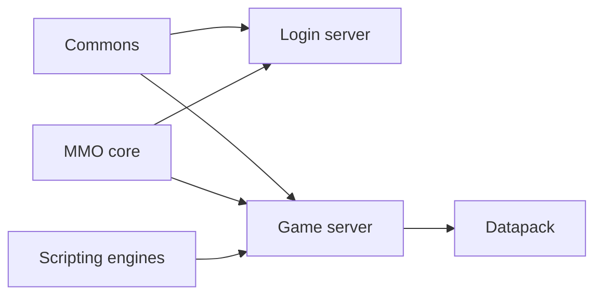

<div align="center">


# L2JFree

**Gracia Final · Protocol 83**

An archived Lineage II server, maintained for modern builds and Windows 10 deployment qualification.

[](https://github.com/l2go/l2jfree/actions/workflows/build.yml)
[](LICENSE)


[Build](#quick-start) · [Upgrade](#windows-10-upgrade) · [Infrastructure](#infrastructure-modernization) · [Architecture](#architecture) · [Correctness](#correctness-program)

</div>

> **Upgrade status:** the build is prepared; Windows 10, MySQL 8.4, and the final deployment image still need runtime qualification.

## Quick start

Install a JDK, then build from the repository root:

```sh
git clone https://github.com/l2go/l2jfree.git
cd l2jfree
./mvnw install
```

On Windows, run `mvnw.cmd install`. The wrapper downloads checksum-verified Maven 3.9.16. Distribution ZIPs appear in the `target` directories of `l2jfree-login`, `l2jfree-core`, and `l2jfree-datapack`.

CI builds with Microsoft OpenJDK 25 and runs unit tests on that JDK. The output uses Java 8 bytecode. Test sources compile at release 21.

## Windows 10 deployment

| Component | Target |
|---|---|
| Host | Windows 10 Pro 22H2 x64 |
| Java | Microsoft OpenJDK 25 LTS x64 |
| Database | MySQL Server 8.4 LTS installed as a Windows service; Connector/J 26.7.0 |

The deployment uses the three ZIP assets from the GitHub [v1.5.0 release](https://github.com/l2go/l2jfree/releases/tag/v1.5.0), verified with that release's SHA256SUMS.txt. The source build above creates artifacts from the checked-out source and is separate from assembling this pinned deployment image. The [deployment plan](docs/2026-Q4-UPGRADE.md) records the target and qualification steps.

## Infrastructure modernization

[Issue #52](https://github.com/l2go/l2jfree/issues/52) starts the next stage by addressing the login server's Spring 2 and Hibernate 3 startup failure on JDK 25. The [modernization roadmap](docs/2026-Q4-INFRASTRUCTURE-MODERNIZATION.md) records the subsequent infrastructure slices and the runtime evidence required for each one.

## Architecture


```mermaid
flowchart LR
    A[Commons] --> C[Login server]
    B[MMO core] --> C
    A --> D[Game server]
    B --> D
    E[Scripting engines] --> D
    D --> F[Datapack]
```

## Correctness program

The [1.4.0 Project](https://github.com/users/l2go/projects/1) shows the live backlog, priorities, milestones, and pull requests. The [audit decision record](docs/2026-Q4-CORRECTNESS-AUDIT.md) explains the filing bar and review gate. Each defect has one issue and one pull request; the maintainer merges after CI and manual review.

## Provenance and license

This fork descends from [savormix](https://github.com/savormix/l2jfree-genesis) through [lord_rex](https://github.com/l2jfree/l2jfree-ct2.3). The [original README](UPSTREAM_README.md) is preserved unchanged.

This noncommercial fan project is unaffiliated with NCSoft. It provides server source, not a client or hosted server. This fork added no client binaries or extracted client assets; inherited datapack text and HTML were not audited here. "Lineage 2" is a trademark of its owner. Code is distributed under [GPLv3](LICENSE).
