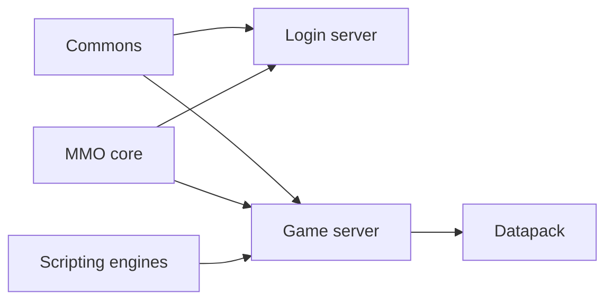

# L2JFree

**Gracia Final · Protocol 83**

An archived Lineage II server, maintained for modern builds and Windows 10 deployment qualification.

[Build](#quick-start) · [Upgrade](#windows-10-upgrade) · [Infrastructure](#infrastructure-modernization) · [Architecture](#architecture) · [Correctness](#correctness-program)

> **Target platform:** Windows 10 x64, Microsoft Build of OpenJDK 25, and MySQL Server 8.4.

## Quick start

Download the published [L2JFree release artifacts](https://github.com/l2go/l2jfree/releases). From v2.5.0 the release contains LoginServer and GameServer archives. The datapack is inside the GameServer archive. `SHA256SUMS.txt` covers the published files. The deployment target uses Microsoft OpenJDK 25 x64 and MySQL Server 8.4.

Build and package verification run in GitHub Actions with the checksum-pinned Maven Wrapper and Microsoft OpenJDK 25. The [infrastructure vision](docs/INFRASTRUCTURE-MODERNIZATION-VISION-2.0.md) is the contract of this release line. v2.5.0 is the current release on it.

Operators can use the [operations runbook](docs/OPERATIONS-RUNBOOK.md) for release verification, database safety, startup/shutdown, and incident capture.

The [logging migration plan](docs/LOGGING-MIGRATION-PLAN.md) records the audit and gameplay log channels. v2.5.0 loads Logback from `config/logback.xml`.

The [dependency inventory](docs/DEPENDENCY-INVENTORY.md) lists the current direct dependencies, selected platform components, and gated replacement candidates.

## Windows 10 deployment

| Component | Target |
|---|---|
| Host | Windows 10 Pro 22H2 x64 |
| Java | Microsoft Build of OpenJDK 25 x64 |
| Database | MySQL Server 8.4 installed as a Windows service; Connector/J 26.7.0 |

Both Windows server launchers reject Java runtimes whose major version is not 25. Set `JAVA_HOME` to the Microsoft JDK 25 installation or make that runtime the `java` command found through `PATH`.

The current stable release is [v2.5.0](https://github.com/l2go/l2jfree/releases/tag/v2.5.0). It publishes the LoginServer archive, the GameServer archive with the datapack merged in, the documentation archive, a CycloneDX SBOM, a vulnerability report, and `SHA256SUMS.txt`. [v2.0.0](https://github.com/l2go/l2jfree/releases/tag/v2.0.0) remains the previous stable release and still publishes a separate datapack archive. The maintainer ran the v2.5.0 tree on the Windows 10 and MySQL 8.4 host. The [deployment qualification notes](docs/2026-Q4-UPGRADE.md) record that acceptance. The v2.0.0 vulnerability findings are upgraded in this release.

## Infrastructure modernization

The first database qualification issue, [#52](https://github.com/l2go/l2jfree/issues/52), is complete in v1.5.1. Stable [v2.5.0](https://github.com/l2go/l2jfree/releases/tag/v2.5.0) is the current release. [v2.0.0](https://github.com/l2go/l2jfree/releases/tag/v2.0.0) is the previous stable release. The [modernization vision](docs/INFRASTRUCTURE-MODERNIZATION-VISION-2.0.md) records the architecture and the execution status. Parent issue [#59](https://github.com/l2go/l2jfree/issues/59) tracked the work that produced v2.0.0.

Release archives include a checksum manifest and signed GitHub provenance. See the [release verification guide](docs/RELEASE-VERIFICATION.md) before deploying downloaded artifacts.

## Architecture

```mermaid
flowchart LR
    A[Commons] --> C[Login server]
    B[MMO core] --> C
    A --> D[Game server]
    B --> D
    E[Scripting engines] --> D
    D --> F[Datapack]
```

## Correctness program

The [1.4.0 Project](https://github.com/users/l2go/projects/1) shows the live backlog, priorities, milestones, and pull requests. The [audit decision record](docs/2026-Q4-CORRECTNESS-AUDIT.md) explains the filing bar and review gate. Each defect has one issue and one pull request; the maintainer merges after CI and manual review.

## Provenance and license

This fork descends from [savormix](https://github.com/savormix/l2jfree-genesis) through [lord_rex](https://github.com/l2jfree/l2jfree-ct2.3). The [original README](UPSTREAM_README.md) is preserved unchanged.

This noncommercial fan project is unaffiliated with NCSoft. It provides server source, not a client or hosted server. This fork added no client binaries or extracted client assets; inherited datapack text and HTML were not audited here. "Lineage 2" is a trademark of its owner. Code is distributed under [GPLv3](LICENSE).
