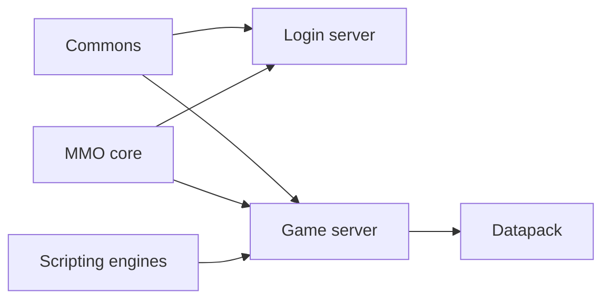

# L2JFree

**Gracia Final · Protocol 83**

An archived Lineage II server, being rebuilt as Platform 3.0: a Linux image that runs with Docker Compose on Docker Desktop, Colima, or Docker Engine.

[Platform 3.0](#platform-30-in-development) · [How this project is run](#how-this-project-is-run) · [Architecture](#architecture) · [Legacy 2.x](#legacy-2x-retired) · [Correctness](#correctness-program)

> **Status:** Platform 3.0 is in development and has no release yet. v2.5.0 is the final release of the 2.x line, which is retired and unsupported.

## Platform 3.0 (in development)

The target is one Linux image that starts with `docker compose up -d --wait` and publishes two ports: **2106** for login and **7777** for the world. The image runs one process with a login module and a world module on Java 25 (Eclipse Temurin), with PostgreSQL 18 as the database. The base is Arch Linux for `linux/amd64`.

| Environment | How it runs |
|---|---|
| Linux | Docker Engine with the Compose plugin |
| Windows | Docker Desktop |
| macOS | Colima with the Docker CLI and Compose. On Apple Silicon the image runs through emulation |

Today the image runs the login server on PostgreSQL 18; see [deploy](deploy/README.md). There is no systemd unit, no Kubernetes manifest, and no install script on the host. Read the [vision](docs/PLATFORM-3.0-VISION.md) and the [delivery decision](docs/adr/0002-linux-image-delivered-with-compose.md) for the details and the limits.

## How this project is run

| Question | Where the answer is |
|---|---|
| Why was a decision made? | [Architecture decision records](docs/adr/README.md) |
| What is planned and when is it done? | [Roadmap](docs/roadmap.md) and the [Platform 3.0 project board](https://github.com/users/l2go/projects/2) |
| What does it look like? | [Architecture views](docs/architecture.md) |
| What could go wrong? | [Risk register](docs/risks.md) |
| Which document is current? | [Documentation index](docs/index.md) |
| How are defects handled? | [Correctness program](#correctness-program) |

The project ships one release of the 3.0 line, `v3.0.0`. Until then every merge to `main` builds an image for acceptance ([release policy](docs/adr/0007-release-policy.md)).

## Architecture

Modules of the current code base. Platform 3.0 runs login and world as two modules of one process ([decision](docs/adr/0003-one-process-two-modules.md)).

```mermaid
flowchart LR
    A[Commons] --> C[Login server]
    B[MMO core] --> C
    A --> D[Game server]
    B --> D
    E[Scripting engines] --> D
    D --> F[Datapack]
```

## Legacy 2.x (retired)

[v2.5.0](https://github.com/l2go/l2jfree/releases/tag/v2.5.0) is the final release of the 2.x line ([decision](docs/adr/0008-retire-the-2x-line.md)). It ran on Windows 10 x64, Microsoft Build of OpenJDK 25, and MySQL Server 8.4 with two processes. It receives no further releases, patches, or security fixes. The release and its checksums, SBOM, vulnerability report, and attestations stay published as history; see the [release verification guide](docs/RELEASE-VERIFICATION.md). The 2.x documents are listed in the [documentation index](docs/index.md). A 3.0 installation starts clean; there is no tool that migrates a 2.x database.

## Correctness program

The [2.x project board](https://github.com/users/l2go/projects/1) (“L2JFree: correctness program and Java 25 releases”) is the closed record of the backlog, priorities, milestones, and pull requests of that program. Platform 3.0 has its own board. The [audit decision record](docs/2026-Q4-CORRECTNESS-AUDIT.md) explains the filing bar and review gate. Each defect has one issue and one pull request; the maintainer merges after the `build` and `commit-identity` checks pass and review threads are resolved.

## Provenance and license

This fork descends from [savormix](https://github.com/savormix/l2jfree-genesis) through [lord_rex](https://github.com/l2jfree/l2jfree-ct2.3). The [original README](UPSTREAM_README.md) is preserved unchanged.

This noncommercial fan project is unaffiliated with NCSoft. It provides server source, not a client or hosted server. This fork added no client binaries or extracted client assets; inherited datapack text and HTML were not audited here. "Lineage 2" is a trademark of its owner. Code is distributed under [GPLv3](LICENSE).
