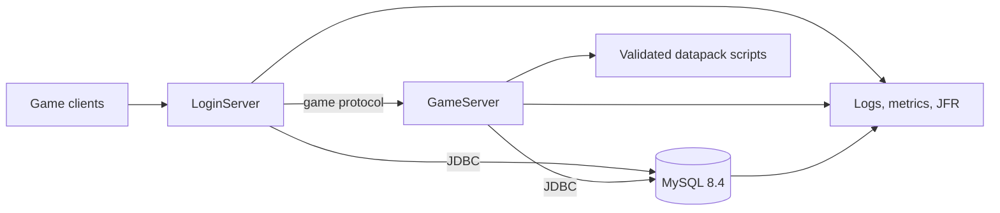

# L2JFree Infrastructure Modernization Vision

## Purpose

This document defines the target infrastructure for the next major L2JFree
release, 2.0.0. It turns the incremental modernization that began with issue
#52 into a coherent end state and an implementation sequence. The intent is to
improve startup reliability, runtime observability, database safety, script
quality, and performance while keeping experiments isolated from release
behavior until evidence supports adoption.

See the [infrastructure stack map](INFRASTRUCTURE-STACK.md) for a consolidated
list of fixed platform choices, current baselines, approved candidates, and
promotion evidence.

## Fixed constraints

- Production operating system: Windows 10 x64.
- Production Java runtime and build JDK: Microsoft Build of OpenJDK 25.
- Production database: MySQL Server 8.4.
- The project remains a Java MMORPG server with separate LoginServer and
  GameServer processes and a versioned datapack.
- All build and runtime verification runs in GitHub Actions or on the target
  Windows/MySQL host. Project builds, tests, and server runs are not performed
  on developer workstations.
- Public project documentation, issues, and release notes are written in
  English.

These constraints are deliberate. JDK 25 is an LTS release and matches the
installed target runtime. MySQL 8.4 remains the authoritative data store. This
vision does not spend effort evaluating alternative databases or Java runtimes.

## Target architecture

Keep LoginServer and GameServer as separately deployable JVM processes, sharing
the existing MySQL deployment and communicating over the established game
protocol. Keep gameplay simulation, world state, AI, and packet handling in the
GameServer process. Preserve the datapack as an independently versioned release
artifact.

Treat this as a modular monolith across two server processes, not as a mandate
to split world simulation into microservices. The world is latency-sensitive
and stateful; introducing remote calls into hot gameplay paths would increase
failure modes and complicate consistency without an established operational
need.

## Decisions and rationale

| Area | Target | Rationale and constraints |
|---|---|---|
| Java baseline | Compile production modules for Java 25; run and build with Microsoft JDK 25 | The 1.5.1 baseline targeted Java 8 bytecode, preserving an obsolete compatibility constraint. The fixed production runtime is Java 25, so the project should be able to use its APIs and supported libraries. Upgrade compiler, tests, scripts, and launch configuration together, then qualify both Linux CI and the Windows target. |
| Database access | JDBC repositories, explicit transaction boundaries, MySQL Connector/J 26.7.x | Issue #52 removed the login ORM path. Both servers now use JDBC. Connector/J 26.7.0 is already present and officially supports MySQL 8.4 and Java 8+, so replacing it brings no immediate benefit. Pin a current patch when each change is implemented. |
| Connection pools | HikariCP 7.1.0, with bounded waits, explicit lifecycle, and pool metrics | Replace c3p0 with a smaller, actively maintained pool. HikariCP 7.1.0 targets Java 11+, which fits the fixed runtime. Preserve current transaction semantics and qualify reconnect, idle validation, shutdown, and exhaustion behavior. |
| Schema changes | Versioned SQL migrations, with Liquibase 4.33 as the test candidate | The legacy installer has 69 historical updates and records completion in machine-local Java Preferences; its clean-install path drops all tables. A migration ledger and repeatable CI validation can make future upgrades auditable, but replaying this history is unsafe. Liquibase 4.33 lists MySQL 8.4 and remains Apache-licensed; validate its checksum, repeatability, locking, licensing, and baseline behavior before production adoption. Never reset or destructively recreate an established world database. See the [database migration strategy](DATABASE-MIGRATION-STRATEGY.md). |
| Scripting | ECJ 3.44.0 for legacy Java scripts; compile validated scripts in CI as part of a versioned datapack; migrate Python 2 scripts by domain | Jython 2.2.1 and ECJ 4.4.2 are prominent compatibility risks, and target logs showed widespread script execution failures. Jython 2.7.5 has Java 25 work but remains a beta; do not make it a production foundation until it is stable and passes the full datapack qualification. Validate scripts before deployment, expose a documented server scripting API, and retire the interpreter only as scripts have replacements. |
| Network layer | Retain the custom MMO core initially; prototype Netty 4.2 behind protocol compatibility tests | A mature event-driven framework could reduce custom buffer and selector maintenance. A wholesale replacement is high risk for framing, encryption, ordering, and latency. Compare throughput, tail latency, allocation, and disconnect behavior before making the decision. |
| Collections | Replace Javolution and Trove selectively with JDK collections | The current libraries are deeply embedded. Replacing them mechanically could regress the hottest world loops. Migrate low-risk utilities first; use repeatable load and allocation measurements for hot paths. |
| Logging | SLF4J 2.x API with a maintained Logback backend | One logging facade and backend provide structured fields, consistent levels, rotation, and better library integration. The 1.5.1 code had hundreds of Commons Logging callers and custom JUL audit/gameplay channels, so migrate in package-sized steps and preserve those streams explicitly. Keep credentials, passwords, and session secrets out of logs. See the [logging migration plan](LOGGING-MIGRATION-PLAN.md). |
| Observability | OpenTelemetry Java SDK, JFR, structured logs, and health/readiness status | Operators need evidence for startup failures, deadlocks, DB pool pressure, script failures, GC pauses, and packet load. OpenTelemetry provides portable metrics and traces; JFR gives low-overhead JVM diagnostics available in the fixed runtime. |
| Build and tests | Maven Wrapper, Microsoft JDK 25 in GitHub Actions, MySQL 8.4 integration service | Keep Maven unless a measured limitation appears. Run unit, integration, packaging, dependency, and archive-content checks in CI. Test the same MySQL major/minor family used by the deployment. |
| Releases | Immutable, checksummed LoginServer, GameServer, and Datapack archives plus a private Windows image assembled from those archives | Release artifacts must be traceable to a commit and reproducible in CI. The deployment assembler verifies release checksums, geodata, classpaths, and absence of credentials. Keep environment-specific configuration outside the public repository. |

The version numbers above identify current candidate lines, not a blanket
upgrade instruction. Every dependency change must be pinned, checked for
licensing and Java 25 compatibility, and qualified through CI. In particular,
the migration framework, logging backend, network framework, and script runtime
must be validated with the actual server workloads before adoption.

This is a pre-production modernization program. It explicitly permits early
evaluation of beta and preview technologies in isolated CI jobs, disposable
databases, and experimental branches. Experimental dependencies must not enter
the release classpath until their compatibility, behavior, security posture,
and operational value have been demonstrated. A non-blocking experiment is a
measurement stage, not an adoption decision.

### Experimental qualification tracks

| Track | Candidates | Evidence required before adoption |
|---|---|---|
| Python runtime | Jython 2.7.4 stable; Jython 2.7.5b1 beta; GraalPy 25.3 / Python 3.13 on Microsoft OpenJDK 25 | Compile or parse the full script inventory; exercise Java interop, script lifecycle, representative quests and AI, startup time, memory, and Windows behavior. Keep Jython 2.2.1 as the comparison baseline. Candidate jobs are non-blocking while incompatibilities are inventoried. |
| Network I/O | Netty 4.2.18.Final as the initial comparison point; current custom MMO core | Replay protocol fixtures and encrypted sessions, then compare disconnect behavior, throughput, p95/p99 latency, allocation rate, and recovery under load on Linux and Windows runners. Recheck the current 4.2 patch before each adoption decision. |
| Concurrency | Stable JDK virtual threads for blocking administrative, login, and background I/O tasks | Compare throughput, tail latency, thread count, pinning, and shutdown behavior against the existing executor model. Do not move CPU-bound world ticks or lock-sensitive simulation loops without separate evidence. |
| Telemetry | JFR recordings and OpenTelemetry Java agent / SDK | Measure startup, GC, database pool, script load, scheduler, and request/packet paths; record instrumentation overhead and provide repeatable incident artifacts. Start in CI now rather than waiting for final operations work. |
| Schema lifecycle | Liquibase 4.33 and direct SQL migration runner prototypes against disposable MySQL 8.4 databases | Demonstrate fresh install, non-destructive baseline, upgrade, checksum drift detection, concurrent startup locking, interruption recovery, backup restore, and restart persistence. Existing world databases are never experimental fixtures. |

Record candidate versions, CI run URLs, measured results, incompatibilities,
and decisions in the dependency inventory and pull request. Promote a candidate
only after its evidence is reviewable; otherwise retain the experiment and
document the remaining blocker.

## Quality attributes

The 2.0.0 infrastructure should provide:

- Predictable startup that reports a clear failing subsystem and its root cause.
- A preflight check for configuration, schema compatibility, database access,
  required datapack files, and script compilation before accepting traffic.
- Bounded connection acquisition and observable pool state rather than
  unbounded waits.
- Database upgrades that are versioned, reviewable, repeatable in CI, and
  non-destructive to existing game data.
- Script errors caught during CI or deployment validation, with per-script
  results and actionable diagnostics.
- Consistent structured logs and operational metrics for both server processes.
- A documented process for obtaining JVM flight recordings and thread dumps
  during a production incident.
- Release archives with checksums, software bill of materials, dependency
  vulnerability results, and an unambiguous source revision.
- No behavior changes to game rules unless a separate gameplay change requests
  them.

## Delivery sequence

### Stage 0: Establish the 2.0 baseline

- Publish and maintain this vision as the parent plan for the 2.0.0 work.
- Inventory runtime dependencies from the release archives and establish
  supported Java and MySQL versions in CI.
- Add a dependency bill of materials, automated dependency update proposals,
  archive checks, and release provenance.
- Add an integration CI job using MySQL 8.4 and Microsoft JDK 25.
- Run non-blocking candidate jobs for Jython 2.7.4, Jython 2.7.5b1, and GraalPy
  on Microsoft OpenJDK 25; retain Jython 2.2.1 as the comparison baseline.
- Capture JFR recordings for CI test processes and start OpenTelemetry
  measurements for representative startup and integration scenarios.
- Capture baseline startup time, script load results, pool metrics, GC behavior,
  and representative gameplay load.
- Scan the generated runtime dependency SBOM and publish the vulnerability
  report with the release artifacts. Treat the initial report as a baseline to
  triage before setting a blocking severity threshold.

Exit evidence: CI builds all modules and release archives; MySQL integration
scenarios pass; candidate compatibility reports and baseline telemetry are
available for comparison.

### Stage 1: Move the codebase to Java 25

- Raise production and test compiler releases to Java 25.
- Remove obsolete Java 8 compatibility workarounds where evidence allows.
- Update compiler, test, and packaging plugins as required.
- Build and inspect the release distributions on a Windows GitHub runner as
  well as running the main test suite on the Linux GitHub runner.
- Keep the release runtime on the Microsoft JDK 25 distribution.

Exit evidence: clean GitHub Actions build and test on Microsoft JDK 25; packaged
LoginServer and GameServer start on the Windows target without extra JDK flags.

### Stage 2: Modernize JDBC operations

- Migrate c3p0 to HikariCP with measured pool sizing, bounded acquisition, and
  health metrics.
- Consolidate JDBC lifecycle, transaction handling, exception translation,
  and resource closure behind repositories.
- Add versioned, non-destructive schema migrations and a baseline procedure for
  existing installations. Follow the [database migration strategy](DATABASE-MIGRATION-STRATEGY.md)
  and do not replay historical installer updates to invent a baseline.
- Add MySQL 8.4 integration coverage for login, account management, game state,
  reconnects, shutdown, and restart persistence.

Exit evidence: existing data survives an upgrade; both processes start, persist,
restart, recover from database connection loss, and shut down cleanly.

### Stage 3: Make datapack scripts release-safe

- Inventory every Java and Python script, classify it by feature, and record
  startup/runtime failures.
- Create a stable, versioned server scripting API.
- Compile Java scripts in CI and include their validated output in the datapack
  release.
- Compare the Jython 2.7.4 stable and 2.7.5b1 beta candidates with the current
  Jython 2.2.1 runtime, including Java 25 and Windows qualification.
- Prototype GraalPy on Microsoft OpenJDK 25 and inventory the Python 2 to
  Python 3 migration required by the existing datapack.
- Port scripts incrementally to the selected supported runtime, preserving
  gameplay behavior through scenario checks.
- Remove ECJ and the legacy Jython integration only after all supported scripts
  have replacements and the selected runtime passes full qualification.

Exit evidence: all required scripts compile or load; the release reports no
unexplained failures; representative quests, AI, events, and scheduled scripts
pass target-runtime scenarios.

### Stage 4: Improve concurrency and network observability

- Audit locks and ownership in KnownList, movement, AI, and world-region paths.
- Add repeatable concurrency and load profiles with deadlock detection enabled.
- Prototype Netty 4.2.18.Final with protocol-level compatibility and
  performance tests, checking for a newer security patch before adoption.
- Compare stable virtual threads for blocking I/O workloads with the current
  executor model.
- Adopt a replacement only if measurements show a clear operational or
  performance benefit and protocol behavior remains compatible.

Exit evidence: no known deadlock-triggered restarts during sustained load;
packet behavior remains compatible; p95/p99 latency and allocation data are
recorded for the selected network implementation.

### Stage 5: Complete operations and release qualification

- Complete the OpenTelemetry metrics and structured log fields for process,
  world, database pool, scripts, and scheduled jobs, building on the Stage 0
  instrumentation baseline.
- Document Windows service installation, startup ordering, backup/restore,
  health checks, and incident capture.
- Generate a release SBOM, verify dependency vulnerabilities, sign or attest
  CI artifacts where supported, and verify SHA-256 manifests.
- Assemble the private Windows image from final GitHub Release artifacts and
  qualify it on Windows 10, Microsoft JDK 25, and MySQL 8.4.

Exit evidence: target-host acceptance checklist passes; release artifacts are
traceable, checksummed, and deployable; rollback and database recovery are
demonstrated.

## RC and 2.0.0 release gate

Complete the implementation stages and publish a final `v2.0.0-rc.N`
pre-release with the checksummed and attested artifacts intended for the stable
release. Use this release candidate for final qualification on Windows 10,
Microsoft JDK 25, and MySQL 8.4, including existing-database upgrade and
recovery scenarios. A CI pass alone does not qualify the target deployment
image.

After publishing the final RC, pause for maintainer review of its artifacts
and target-host acceptance evidence. Publish the stable `v2.0.0` tag and
release only after the maintainer explicitly confirms acceptance. The stable
release must include a migration guide from 1.5.1, database backup and upgrade
instructions, a dependency inventory, an operations runbook, and exact
checksums for every published archive. Do not automatically create the stable
release after RC publication.

## Current project context

Issue #52 is complete in release 1.5.1. It delivered JDBC persistence for the
login path, removed the c3p0 synthetic test-table requirement, and qualified
runtime fixes. The KnownList update deadlock reported during gameplay was fixed
in the same final release. The remaining modernization is tracked by this
2.0.0 vision; completion of #52 does not imply completion of the broader
infrastructure program.

## Execution status

As of 2026-09-30, implementation is in progress under parent issue #59. The
current implementation branch sets Java 25 for production and test compilation,
replaces c3p0 with HikariCP 7.1.0 in both server processes, upgrades ECJ for
current Java class files, and corrects forward-only JDBC result-set usage found
during Windows runtime qualification. CI and target-host evidence are still
required before marking these steps complete.
The GameServer closes its Hikari pool if the startup connection check fails and
publishes the pool only after that check succeeds.
The LoginServer and GameServer now have MySQL 8.4 integration coverage for
startup connection checkout without creating a synthetic connection-test
table. Login tests also exercise account DAO upserts against the repository
schema, pool metrics, and transaction commit/rollback. A test-only Liquibase
4.33.0 check applies two probe changesets on MySQL 8.4 and checks repeatability,
validation, and checksum rejection; it does not enable production schema
migrations. Liquibase 5.x is excluded from selection because its license is no
longer Apache 2.0.
The non-interactive legacy installer now refuses clean mode unless the operator
repeats the exact database name with `-confirm-clean`; the update mode does not
accept or invoke that destructive operation.
These tests execute in the GitHub Actions test job.
Logging inventory originally found 274 Java files using Commons Logging and
two direct `Jdk14Logger` casts, alongside specialized JUL handlers for audit,
chat, IRC, item, login-attempt, and failed-login output. The first migration
slice moves `l2j-commons` application loggers to SLF4J and removes both casts;
256 Java files still use Commons Logging. The [logging migration plan](LOGGING-MIGRATION-PLAN.md)
tracks remaining migrations and requires preserving all channels before
switching the backend.
Login persistence upserts use MySQL's row aliases instead of the deprecated
`VALUES(column)` form, matching the fixed MySQL 8.4 target.
The old Commons Lang 3.4 dependency is upgraded to 3.20.0 and its version is
centralized in the parent build.
Java scripts now compile against the running JDK release instead of Java 8,
avoiding class-file incompatibility with Java 25 server classes. Their compiler
classpath includes both the running server and datapack scripts; previously it
contained only the scripts directory, which prevented Java scripts from
resolving server classes and libraries. Java compilation errors now preserve
diagnostic kind, compiler code, line, and column in per-script reports. The
script loader uses UTF-8, closes source and cache file handles, visits
directory contents in a stable order, and reports load summaries for Windows
diagnostics.
GitHub Actions now packages and inspects distributions on a Windows runner in
addition to the Linux build. The release job promotes the exact distributions
and CycloneDX SBOM that passed the Linux CI checks; it does not rebuild them.
The release checksum manifest covers those promoted artifacts. The Linux job
also scans the SBOM with Grype and places the JSON findings report beside the
SBOM in the checksummed release artifacts. This first scan records findings
without blocking the build while the inherited dependency set is triaged.
CI passes the full source commit into every packaged jar manifest; datapack
build metadata records the same Git revision. The release job creates signed
GitHub artifact attestations for all distributed archives, reports, and the
checksum manifest. See the [release verification guide](RELEASE-VERIFICATION.md).
Deadlock thread reports now include the lock a thread is waiting on and its
owner when the JVM still has that information, and handle threads that exit
between detection and capture. The existing LoginServer `status` command and
GameServer `status` output now expose active, idle, total, waiting, and maximum
database-pool connections.
The KnownList update path now holds its monitor only while updating its two
indexes. Range, instance, AI, and target operations run outside that monitor so
opposite-direction world updates cannot hold one creature's KnownList lock
while entering another creature's logic. The Windows combat report showed this
path in a JVM-detected deadlock; repeat the Gremlin/combat scenario on the
target host before treating it as qualified.
GitHub Actions run [36692274856](https://github.com/l2go/l2jfree/actions/runs/36692274856)
verified commit `2b0a79dfd367707ba214b3ca54e9e9622fd6a21e`: Linux build and tests
used Microsoft JDK 25, and the Windows 2022 runner packaged and inspected the
distributions. The tag-only release job was skipped. These results do not
qualify the Windows 10 target host or a populated production database. No
2.0.0 release candidate has been published; `v1.5.1` remains the latest stable
release. The modernization remains open until all required stage evidence is
complete, the final RC passes target-host acceptance, and the maintainer
confirms the stable release.

## Reference projects and documentation

- [HikariCP](https://github.com/brettwooldridge/HikariCP)
- [MySQL Connector/J compatibility](https://dev.mysql.com/doc/connector-j/en/connector-j-versions.html)
- [Liquibase 4.33 MySQL 8.4 support](https://docs.liquibase.com/oss/integration-guide-4-33/connect-liquibase-with-mysql-server)
- [Liquibase 4.33 Apache 2.0 license](https://central.sonatype.com/artifact/org.liquibase/liquibase-core/4.33.0)
- [Liquibase 5.0 license change](https://docs.liquibase.com/community/release-notes/5-0)
- [Netty releases](https://github.com/netty/netty/releases)
- [Eclipse JDT compiler](https://github.com/eclipse-jdt/eclipse.jdt.core)
- [Jython downloads and support](https://www.jython.org/download.html)
- [OpenTelemetry Java](https://github.com/open-telemetry/opentelemetry-java)
- [CycloneDX Maven plugin](https://github.com/CycloneDX/cyclonedx-maven-plugin)
- [JUnit Framework](https://github.com/junit-team/junit-framework)
