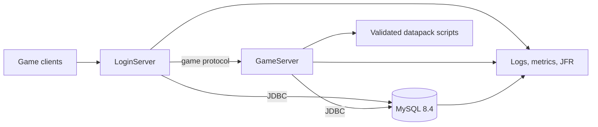

# L2JFree Infrastructure Modernization Vision

## Purpose

This document defines the target infrastructure for the 2.0 release line.
v2.5.0 is the current release on that line. The execution status at the end
of this document is the live record. Sections that schedule work for 2.1.0
record the rule used to ship v2.0.0; v2.5.0 restored CI test execution and
did not open a 2.1.0 release. The text turns the incremental modernization
that began with issue #52 into a coherent end state and an implementation
sequence. The intent is to
improve startup reliability, runtime observability, database safety, script
quality, and performance while keeping experiments isolated from release
behavior until evidence supports adoption.

See the [infrastructure stack map](INFRASTRUCTURE-STACK.md) for a consolidated
list of fixed platform choices, current baselines, approved candidates, and
promotion evidence.

## Fixed constraints

- Production operating system: Windows 10 x64.
- Production Java runtime and build JDK: Microsoft Build of OpenJDK 25.
- Production database: MySQL Server 8.4.
- The project remains a Java MMORPG server with separate LoginServer and
  GameServer processes. Java and Python scripts ship with the GameServer
  delivery and share its revision and checksum manifest.
- All build and runtime verification runs in GitHub Actions or on the target
  Windows/MySQL host. Project builds, tests, and server runs are not performed
  on developer workstations.
- Public project documentation, issues, and release notes are written in
  English.

These constraints are deliberate. JDK 25 is an LTS release and matches the
installed target runtime. MySQL 8.4 remains the authoritative data store. This
vision does not spend effort evaluating alternative databases or Java runtimes.

## Target architecture

Keep LoginServer and GameServer as separately deployable JVM processes, sharing
the existing MySQL deployment and communicating over the established game
protocol. Keep gameplay simulation, world state, AI, and packet handling in the
GameServer process. Compile Java scripts in CI and include their bytecode in
the GameServer delivery. Ship Python scripts and Jython with that same
revision; do not maintain an independently versioned datapack release.

Treat this as a modular monolith across two server processes, not as a mandate
to split world simulation into microservices. The world is latency-sensitive
and stateful; introducing remote calls into hot gameplay paths would increase
failure modes and complicate consistency without an established operational
need.

## Decisions and rationale

| Area | Target | Rationale and constraints |
|---|---|---|
| Java baseline | Compile production modules for Java 25; run and build with Microsoft JDK 25 | The 1.5.1 baseline targeted Java 8 bytecode, preserving an obsolete compatibility constraint. Use Java 25 bytecode and standard JDK APIs without dependencies on vendor-specific APIs. Upgrade compiler, tests, scripts, and launch configuration together, then qualify in GitHub Actions and on the Windows target. |
| Database access | JDBC repositories, explicit transaction boundaries, MySQL Connector/J 26.7.x | Issue #52 removed the login ORM path. Both servers now use JDBC. Connector/J 26.7.0 is already present and officially supports MySQL 8.4 and Java 8+, so replacing it brings no immediate benefit. Pin a current patch when each change is implemented. |
| Connection pools | HikariCP 7.1.0, with bounded waits, explicit lifecycle, and pool metrics | Replace c3p0 with a smaller, actively maintained pool. HikariCP 7.1.0 targets Java 11+, which fits the fixed runtime. Preserve current transaction semantics and qualify reconnect, idle validation, shutdown, and exhaustion behavior. |
| Schema changes | Numbered SQL files for new schema changes; MySQL syntax contained in the repository layer | The historical installer has destructive clean-install behavior and cannot safely be replayed to derive a baseline. Liquibase remains a test-only probe; neither it nor Flyway is the 2.0 release journal. Preserve established data and qualify numbered forward changes on disposable MySQL 8.4 databases and existing-schema copies. Platform 3.0 adopts Flyway for PostgreSQL. |
| Scripting | The CI JDK compiles Java scripts into the GameServer delivery; Jython 2.7.5b1 runs the Python 2 scripts from the same delivery revision | Do not compile Java scripts during server startup, and do not ship ECJ. Register the project Jython factory directly. Platform 3.0 replaces b1 with final Jython 2.7; GraalPy and a Python 3 port are excluded. |
| Network layer | Retain the existing custom MMO network core in 2.0 | Keep the established protocol, encryption, ordering, and disconnect behavior on the Windows acceptance host. Netty 4.2 with `io_uring` is a Platform 3.0 replacement, after migration to Linux; no Netty port is part of 2.0. |
| Collections | Keep Javolution and Trove in 2.0; replace with JDK collections and fastutil on measured paths in Platform 3.0 | The current libraries are deeply embedded. Replacing them in 2.0 could regress the hottest world loops. Platform 3.0 uses Linux JFR to identify hot paths before moving cold paths to the JDK and measured primitive hot paths to fastutil. |
| Logging | SLF4J 2.0.20 and Logback 1.5 with named operational channels and a one-way JUL bridge | The unified backend and removal of Commons Logging/JUL handlers are implemented. Verify channel routing, rotation, Windows file permissions, and secret redaction before 2.0 stable. See the [logging migration plan](LOGGING-MIGRATION-PLAN.md). |
| IRC integration | Not a supported feature | The admin IRC bridge and irclib 1.10 are removed. Login and gameplay do not use IRC. |
| Observability | Optional OpenTelemetry Java agent with OTLP metrics/traces, JFR, structured logs, and health/readiness status | Operators need evidence for startup failures, deadlocks, DB pool pressure, script failures, GC pauses, and packet load. OpenTelemetry provides portable metrics and traces; JFR gives low-overhead JVM diagnostics available in the fixed runtime. The agent remains disabled until a collector endpoint is configured and target-host overhead is qualified. |
| Build and verification | Maven Wrapper, Microsoft JDK 25 in GitHub Actions | v2.0.0 CI ran production compilation, packaging, provenance, dependency, and archive-content checks only. v2.5.0 also compiles and runs the unit tests on Linux and Windows, and runs MySQL tests in a separate Linux job. |
| Releases | Immutable, checksummed LoginServer and GameServer archives plus a private Windows image assembled from those archives | Java bytecode and Python scripts have one GameServer revision and are covered by its checksum manifest. Release artifacts are traceable to a commit and reproducible in CI. Keep environment-specific configuration outside the public repository. |

The 2.0 runtime keeps the existing network core and platform-thread execution
model. Virtual threads, Generational ZGC, and the JDK AOT cache are not enabled
in the 2.0 release; they are evaluated only on the Platform 3.0 Linux process.
The launch command is `java`, configuration stays outside release archives,
and Windows `.bat` files only set the environment before invoking Java.

The version numbers above identify selected target versions, not a blanket
upgrade instruction. Every dependency change must be pinned, checked for
licensing and Java 25 compatibility, and qualified through CI. In particular,
the logging backend and selected Jython bridge must
be validated with the actual server workloads before adoption. GraalPy is
excluded from the target and from further qualification.

This is a pre-production modernization program. It permits a beta Jython
runtime in the isolated qualification path because Jython 2.7.5b1 is the
selected 2.0 target. Other Platform 3.0 technologies are outside the 2.0
implementation and release scope. Experimental dependencies must not enter
release archives until their compatibility, behavior, security posture, and
operational value have been demonstrated.

### Experimental qualification tracks

| Track | Candidates | Evidence required before adoption |
|---|---|---|
| Python runtime | Jython 2.7.5b1 for 2.0; Jython 2.7 final for Platform 3.0 | Qualify the embedded bridge, every supported script, Java interop, lifecycle, representative quests and AI, and Windows behavior. Jython 2.7.5b1 is the only candidate being qualified. GraalPy and a Python 3 migration are excluded. |
| Network I/O | Existing custom MMO core for 2.0 | Netty 4.2 and the Linux transports are Platform 3.0 work; no 2.0 network replacement experiment is planned. |
| Telemetry | JFR recordings and OpenTelemetry Java agent / SDK | Measure startup, GC, database pool, script load, scheduler, and request/packet paths; record instrumentation overhead and provide repeatable incident artifacts. Start in CI now rather than waiting for final operations work. |
| Schema lifecycle | Numbered forward SQL changes for 2.0; Flyway 13 for PostgreSQL in Platform 3.0 | Qualify numbered MySQL changes on disposable databases and copies. Do not ship Liquibase or Flyway in the 2.0 runtime, and never use established world databases as experiments. |

Record candidate versions, CI run URLs, measured results, incompatibilities,
and decisions in the dependency inventory and pull request. Promote a candidate
only after its evidence is reviewable; otherwise retain the experiment and
document the remaining blocker.

## Quality attributes

The 2.0.0 infrastructure should provide:

- Predictable startup that reports a clear failing subsystem and its root cause.
- A preflight check for configuration, schema compatibility, database access,
  required datapack files, and script compilation before accepting traffic.
- A deployment command that invokes `java`, external configuration, and thin
  Windows batch launchers that only prepare the environment.
- Bounded connection acquisition and observable pool state rather than
  unbounded waits.
- Database upgrades that are versioned, reviewable, repeatable in CI, and
  non-destructive to existing game data.
- Script errors caught during CI or deployment validation, with per-script
  results and actionable diagnostics.
- Consistent structured logs and operational metrics for both server processes.
- A documented process for obtaining JVM flight recordings and thread dumps
  during a production incident.
- Release archives with checksums, software bill of materials, dependency
  vulnerability results, and an unambiguous source revision.
- No behavior changes to game rules unless a separate gameplay change requests
  them.

## Delivery sequence

### Test execution policy

Release 2.5.0 restored test compilation and execution in GitHub Actions. The
rules below are the record of what 2.0.0 required.

Do not compile or run the repository test suites in local environments or
GitHub Actions before the stable 2.0.0 release. The 2.0.0 RC gate uses
production compilation, archive and provenance checks in GitHub Actions, plus
operator qualification on the Windows 10 / Microsoft JDK 25 / MySQL 8.4 host.
Test modernization and re-enabling CI test execution are scheduled for
2.1.0, after 2.0.0 has been released. No 2.0.0 acceptance claim may rely on
test results from an earlier revision.

### Stage 0: Establish the 2.0 baseline

- Publish and maintain this vision as the parent plan for the 2.0.0 work.
- Inventory runtime dependencies from the release archives and establish
  supported Java and MySQL versions in CI.
- Add a dependency bill of materials, automated dependency update proposals,
  archive checks, and release provenance.
- Keep all unit, integration, and script-test jobs disabled through 2.0.0;
  schedule their modernization and reactivation for 2.1.0.
- Capture JFR recordings for CI production build processes. Qualify optional
  OpenTelemetry export on the Windows target host before enabling it for
  routine operation.
- Capture baseline startup time, script load results, pool metrics, GC behavior,
  and representative gameplay load.
- Scan the generated runtime dependency SBOM and publish the vulnerability
  report with the release artifacts. Treat the initial report as a baseline to
  triage before setting a blocking severity threshold.

Exit evidence: CI production compilation and release-archive checks pass;
operator qualification and baseline telemetry are available for review. No
automated test result is required or claimed for 2.0.0.

### Stage 1: Move the codebase to Java 25

- Raise production and test compiler releases to Java 25.
- Remove obsolete Java 8 compatibility workarounds where evidence allows.
- Update compiler, test, and packaging plugins as required.
- Build and inspect the release distributions on Linux and Windows GitHub
  runners. Test compilation and execution remain disabled until 2.1.0.
- Keep the release runtime on the Microsoft JDK 25 distribution.

Exit evidence: clean GitHub Actions production build and packaging on Microsoft
JDK 25; packaged LoginServer and GameServer start on the Windows target without
extra JDK flags.

### Stage 2: Modernize JDBC operations

- Migrate c3p0 to HikariCP with measured pool sizing, bounded acquisition, and
  health metrics.
- Consolidate JDBC lifecycle, transaction handling, exception translation,
  and resource closure behind repositories.
- Add versioned, non-destructive schema migrations and a baseline procedure for
  existing installations. Follow the [database migration strategy](DATABASE-MIGRATION-STRATEGY.md)
  and do not replay historical installer updates to invent a baseline.
- Defer automated MySQL 8.4 integration coverage for login, account management,
  game state, reconnects, shutdown, and restart persistence to 2.1.0. For the
  2.0.0 RC, use operator qualification on the target host.
- Put new SQL changes in numbered files and keep MySQL-specific persistence
  syntax in the repository layer. Keep Liquibase test-only and do not add a
  migration framework to the 2.0 release journal.

Exit evidence: operator qualification confirms existing data survives an
upgrade and both processes start, persist, restart, recover from database
connection loss, and shut down cleanly. Automated database tests are deferred
to 2.1.0.

### Stage 3: Make datapack scripts release-safe

- Inventory every Java and Python script, classify it by feature, and record
  startup/runtime failures.
- Create a stable, versioned server scripting API.
- Compile Java scripts in CI and include their validated bytecode in the
  GameServer delivery; do not compile them at server startup.
- Qualify the embedded Jython 2.7.5b1 bridge and supported Python 2 scripts on
  Microsoft JDK 25 and Windows. Jython 2.7.5b1 is the only candidate runtime.
- Port the remaining required scripts to Jython 2.7.5b1, preserving gameplay
  behavior through operator qualification of representative scenarios. The
  automated script compatibility suite is deferred to 2.1.0.
- Ship one Python runtime, Jython 2.7.5b1, and one GameServer revision and
  checksum manifest for the runtime and both script languages. Platform 3.0
  updates Jython to the final 2.7 release. Do not add GraalPy or a second
  interpreter.

Exit evidence: CI compiles Java scripts, and operator qualification confirms
that required Python scripts load without unexplained failures and that
representative quests, AI, events, and scheduled scripts behave as expected.
Automated script tests are deferred to 2.1.0.

### Stage 4: Qualify world concurrency and preserve the network core

- Audit locks and ownership in KnownList, movement, AI, and world-region paths.
- Defer automated concurrency and load profiles to 2.1.0.
- Repeat the combat and world-interaction scenario that exposed the KnownList
  deadlock during operator qualification on the target Windows host.
- Retain the custom MMO transport and existing platform-thread model for 2.0.
  Netty, virtual threads, Generational ZGC, and the JDK AOT cache belong to the
  Platform 3.0 Linux qualification path.

Exit evidence: no known deadlock-triggered restarts during sustained target
host gameplay; the existing packet behavior remains compatible.

### Stage 5: Complete operations and release qualification

- Complete the OpenTelemetry metrics and structured log fields for process,
  world, database pool, scripts, and scheduled jobs, building on the Stage 0
  instrumentation baseline.
- Document Windows service installation, startup ordering, backup/restore,
  health checks, and incident capture.
- Generate a release SBOM, verify dependency vulnerabilities, sign or attest
  CI artifacts where supported, and verify SHA-256 manifests.
- Assemble the private Windows image from final GitHub Release artifacts and
  qualify it on Windows 10, Microsoft JDK 25, and MySQL 8.4.

Exit evidence: target-host acceptance checklist passes; release artifacts are
traceable, checksummed, and deployable; rollback and database recovery are
demonstrated.

## RC and 2.0.0 release gate

Complete the implementation stages and publish a final `v2.0.0-rc.N`
pre-release with the checksummed and attested artifacts intended for the stable
release. Use this release candidate for final qualification on Windows 10,
Microsoft JDK 25, and MySQL 8.4, including existing-database upgrade and
recovery scenarios. A CI pass alone does not qualify the target deployment
image.

After publishing the final RC, pause for maintainer review of its artifacts
and target-host acceptance evidence. Publish the stable `v2.0.0` tag and
release only after the maintainer explicitly confirms acceptance. The stable
release must include a migration guide from 1.5.1, database backup and upgrade
instructions, a dependency inventory, an operations runbook, and exact
checksums for every published archive. Do not automatically create the stable
release after RC publication.

`v2.0.0-rc.1`, `v2.0.0-rc.2`, and stable `v2.0.0` are published. The maintainer
accepted the later `v2.5.0` tree on Windows 10 and MySQL 8.4.
[#95](https://github.com/l2go/l2jfree/issues/95) is closed on that acceptance.
The stable release was not created automatically from a candidate tag.

## Current project context

Issue #52 is complete in release 1.5.1. It delivered JDBC persistence for the
login path, removed the c3p0 synthetic test-table requirement, and qualified
runtime fixes. The KnownList update deadlock reported during gameplay was fixed
in the same final release. Completion of #52 does not describe the later
v2.0.0 release. Follow-up after v2.0.0 is listed in the execution status.

## Execution status

Stable [v2.5.0](https://github.com/l2go/l2jfree/releases/tag/v2.5.0) is the
current release. It keeps the Java 25 bytecode and HikariCP 7.1.0 line from
v2.0.0 and adds the post-release corrections: quoted `clan_privs.rank`,
`cursed_weapons.charId` during id compaction, KnownList removal that keeps an
object added during the walk, database pool bounds read from configuration,
direct Jython registration without a runtime Java compiler, removal of the
admin IRC bridge and irclib, a JFR recording of the Maven build JVM, and a
GameServer archive that contains the datapack and loads Logback from
`config/logback.xml`. GitHub Actions compiles and runs the unit tests on Linux
and Windows. MySQL 8.4 tests run in a separate Linux job. The maintainer ran
this tree on Windows 10 and MySQL 8.4 and accepted it for release.
Stable [v2.0.0](https://github.com/l2go/l2jfree/releases/tag/v2.0.0) was
published on 2026-09-30. The tags `v2.0.0-rc.1` and `v2.0.0-rc.2` were
published before it. That release sets Java 25 for production and test
compilation, uses HikariCP 7.1.0 in both server processes, and corrects
forward-only JDBC result-set usage found during Windows runtime qualification.
GitHub Actions built the tag. It publishes a separate datapack archive and
skips tests. Parent issue
[#59](https://github.com/l2go/l2jfree/issues/59) tracked the work that
produced v2.0.0.
The GameServer closes its Hikari pool if the startup connection check fails and
publishes the pool only after that check succeeds.
The repository contains MySQL 8.4 integration coverage for startup connection
checkout without creating a synthetic connection-test table, account DAO
upserts, pool metrics, transaction commit/rollback, and a test-only Liquibase
4.33.0 compatibility probe. v2.0.0 skipped these tests. v2.5.0 runs the
retained suite again: unit tests in the Linux and Windows package jobs, and
the MySQL tests in the integration job. Liquibase does not enable production
schema migrations. Liquibase 5.x is excluded from selection because its
license is no longer Apache 2.0.
The non-interactive legacy installer now refuses clean mode unless the operator
repeats the exact database name with `-confirm-clean`; the update mode does not
accept or invoke that destructive operation.
Earlier CI runs executed these tests. The v2.0.0 workflows skip all test
compilation and execution. v2.5.0 restores that CI execution.
[#93](https://github.com/l2go/l2jfree/issues/93) is closed.
The logging inventory began with 274 Java files using Commons Logging and two
direct `Jdk14Logger` casts, alongside specialized JUL handlers. The later
application migration converted first-party callers to SLF4J, unified JUL and
SLF4J under Logback, and removed the legacy handlers and Commons Logging
bridge. The [logging migration plan](LOGGING-MIGRATION-PLAN.md) records the
resulting channel layout and remaining qualification gates.
Login persistence upserts use MySQL's row aliases instead of the deprecated
`VALUES(column)` form, matching the fixed MySQL 8.4 target.
The old Commons Lang 3.4 dependency is upgraded to 3.20.0 and its version is
centralized in the parent build.
Java scripts now compile against the running JDK release instead of Java 8,
avoiding class-file incompatibility with Java 25 server classes. Their compiler
classpath includes both the running server and datapack scripts; previously it
contained only the scripts directory, which prevented Java scripts from
resolving server classes and libraries. Java compilation errors now preserve
diagnostic kind, compiler code, line, and column in per-script reports. The
script loader uses UTF-8, closes source and cache file handles, visits
directory contents in a stable order, and reports load summaries for Windows
diagnostics.
GitHub Actions now packages and inspects distributions on a Windows runner in
addition to the Linux build. The release job promotes the exact distributions
and CycloneDX SBOM that passed the Linux CI checks; it does not rebuild them.
The release checksum manifest covers those promoted artifacts. The Linux job
also scans the SBOM with Grype and places the JSON findings report beside the
SBOM in the checksummed release artifacts. This first scan records findings
without blocking the build while the inherited dependency set is triaged.
CI passes the full source commit into every packaged jar manifest; datapack
build metadata records the same Git revision. The release job creates signed
GitHub artifact attestations for all distributed archives, reports, and the
checksum manifest. See the [release verification guide](RELEASE-VERIFICATION.md).
Deadlock thread reports now include the lock a thread is waiting on and its
owner when the JVM still has that information, and handle threads that exit
between detection and capture. The existing LoginServer `status` command and
GameServer `status` output now expose active, idle, total, waiting, and maximum
database-pool connections.
The KnownList update path now holds its monitor only while updating its two
indexes. Range, instance, AI, and target operations run outside that monitor so
opposite-direction world updates cannot hold one creature's KnownList lock
while entering another creature's logic. The Windows combat report showed this
path in a JVM-detected deadlock; repeat the Gremlin/combat scenario on the
target host before treating it as qualified.
GitHub Actions run [36692274856](https://github.com/l2go/l2jfree/actions/runs/36692274856)
verified commit `2b0a79dfd367707ba214b3ca54e9e9622fd6a21e`: an earlier Linux
build and test run used Microsoft JDK 25, and the Windows 2022 runner packaged
and inspected the distributions. Historical test results do not qualify the
Windows 10 target host or count as v2.0.0 acceptance evidence. The published
v2.0.0 assets are `l2jfree-login-2.0.0-dist.zip`,
`l2jfree-core-2.0.0-dist.zip`, `l2jfree-datapack-2.0.0-dist.zip`,
`l2jfree-2.0.0-docs.zip`, `l2jfree-2.0.0-sbom.json`,
`l2jfree-2.0.0-vulnerability-report.json`, and `SHA256SUMS.txt`. The v2.0.0
GameServer archive does not contain the datapack. v2.5.0 publishes
`l2jfree-login-2.5.0-dist.zip` and `l2jfree-core-2.5.0-dist.zip` with the
datapack merged into the GameServer archive, plus the docs archive, SBOM,
vulnerability report, and `SHA256SUMS.txt`.
[#94](https://github.com/l2go/l2jfree/issues/94),
[#96](https://github.com/l2go/l2jfree/issues/96),
[#97](https://github.com/l2go/l2jfree/issues/97),
[#98](https://github.com/l2go/l2jfree/issues/98),
[#99](https://github.com/l2go/l2jfree/issues/99),
[#100](https://github.com/l2go/l2jfree/issues/100),
[#101](https://github.com/l2go/l2jfree/issues/101),
[#102](https://github.com/l2go/l2jfree/issues/102), and
[#103](https://github.com/l2go/l2jfree/issues/103), and
[#92](https://github.com/l2go/l2jfree/issues/92) are closed. v2.5.0 upgrades
the packages named in the v2.0.0 vulnerability report.

## Reference projects and documentation

- [HikariCP](https://github.com/brettwooldridge/HikariCP)
- [MySQL Connector/J compatibility](https://dev.mysql.com/doc/connector-j/en/connector-j-versions.html)
- [Liquibase 4.33 MySQL 8.4 support](https://docs.liquibase.com/oss/integration-guide-4-33/connect-liquibase-with-mysql-server)
- [Liquibase 4.33 Apache 2.0 license](https://central.sonatype.com/artifact/org.liquibase/liquibase-core/4.33.0)
- [Liquibase 5.0 license change](https://docs.liquibase.com/community/release-notes/5-0)
- [Netty releases](https://github.com/netty/netty/releases)
- [Jython downloads and support](https://www.jython.org/download.html)
- [OpenTelemetry Java](https://github.com/open-telemetry/opentelemetry-java)
- [CycloneDX Maven plugin](https://github.com/CycloneDX/cyclonedx-maven-plugin)
- [JUnit Framework](https://github.com/junit-team/junit-framework)
