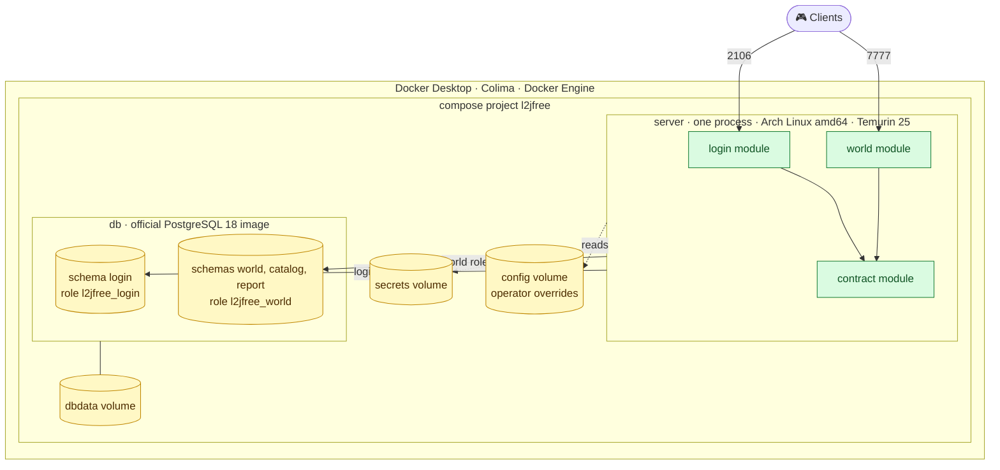
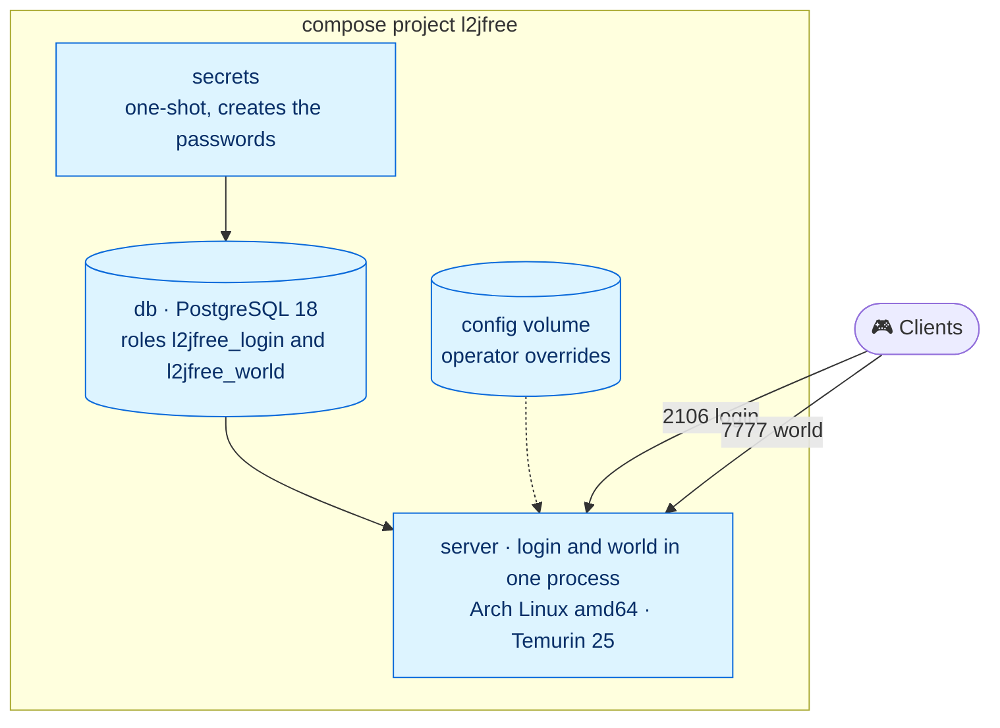
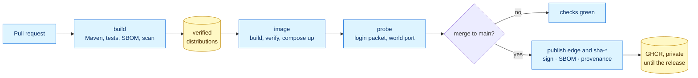
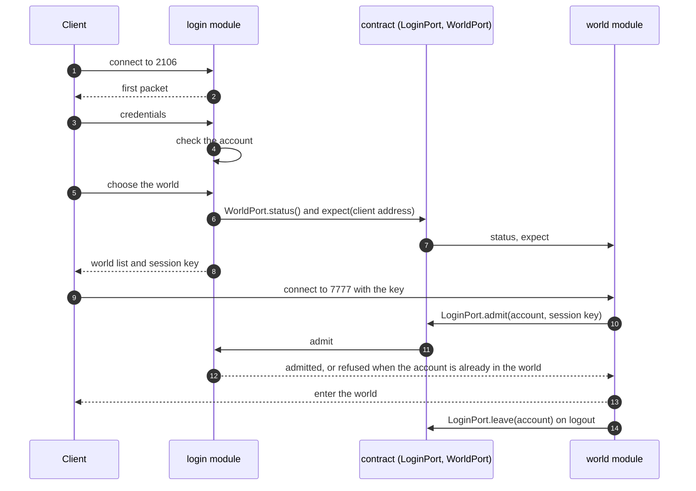

# Architecture

Five views of Platform 3.0, from the outside in. The decisions behind them are in the [decision records](adr/README.md). Views marked **target** show where the platform is going. Views marked **today** show what runs now.

## 1. Context (target)

Who and what the platform talks to.

## 2. Containers (target)

What runs in the compose stack and what it exposes. One process holds two modules that talk through the contract module: Java calls, no socket between them ([ADR-0003](adr/0003-one-process-two-modules.md)). The database has two roles, and each role owns its own schemas ([ADR-0009](adr/0009-database-roles-schemas-and-migration.md)).

## 3. Compose stack (today)

The image that the pipeline builds and publishes now, with the services and volumes of the compose file. The server starts the login module, then the world, then opens the login port. The defaults are read-only in the image under `/opt/l2jfree`, and the operator changes only single keys in the `config` volume ([ADR-0011](adr/0011-configuration-model.md)). The pipeline takes a client through a full play session, before and after a restart, with the smoke client of [deploy](../deploy/README.md).

## 4. Delivery pipeline (today)

How a change becomes an image.

## 5. Login and admission (target)

Admission is a Java call inside one process. The internal socket between login and world of the 2.x line is removed ([ADR-0003](adr/0003-one-process-two-modules.md)). The login module implements `LoginPort`, the world module implements `WorldPort`, and both ports live in the contract module.

## Reading the views

| View | Question it answers |
|---|---|
| Context | Who uses the platform and what it depends on |
| Containers | What runs, what it exposes, and where state lives |
| Compose stack | What is really delivered today |
| Delivery pipeline | How a change reaches a published image |
| Login and admission | How a player gets into the world |
