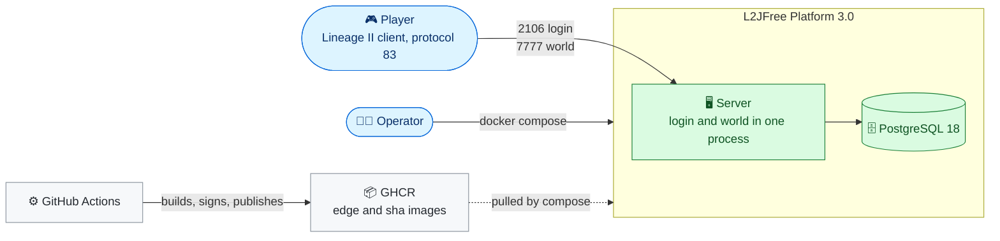
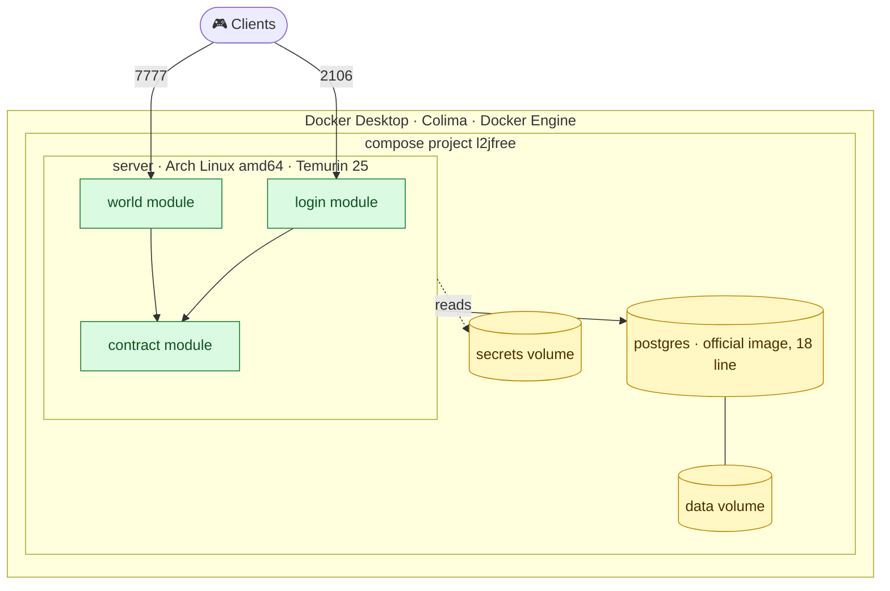
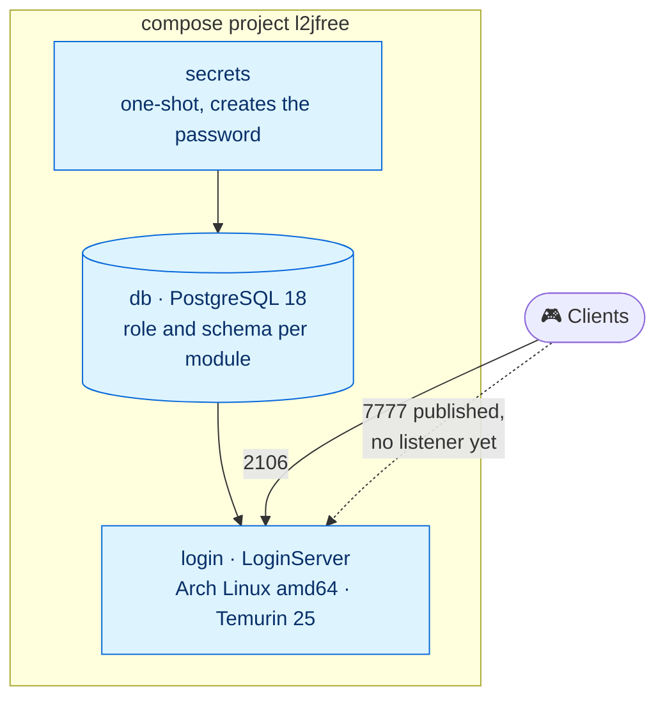
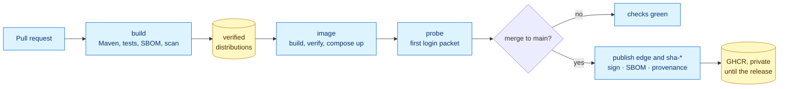
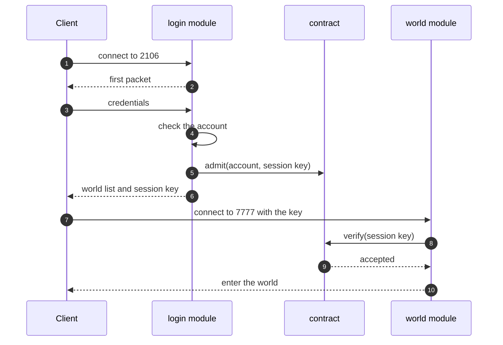

# Architecture

Five views of Platform 3.0, from the outside in. The decisions behind them are in the [decision records](adr/README.md). Views marked **target** show where the platform is going. Views marked **today** show what runs now.

## 1. Context (target)

Who and what the platform talks to.

## 2. Containers (target)

What runs in the compose stack and what it exposes.

## 3. Walking skeleton (today)

The image that the pipeline builds and publishes now. The login module runs on PostgreSQL 18. The world and the single process arrive in milestone M2.

## 4. Delivery pipeline (today)

How a change becomes an image.

## 5. Login and admission (target)

In the target, admission is a Java call inside one process. The internal socket between login and world of the 2.x line is removed ([ADR-0003](adr/0003-one-process-two-modules.md)).

## Reading the views

| View | Question it answers |
|---|---|
| Context | Who uses the platform and what it depends on |
| Containers | What runs, what it exposes, and where state lives |
| Walking skeleton | What is really delivered today |
| Delivery pipeline | How a change reaches a published image |
| Login and admission | How a player gets into the world |
