# Data dictionary: schema `catalog`

<!-- Generated from the migrated database by DataDictionaryPostgresTest. Do not edit by hand. -->

Game content from the image: item, NPC and skill templates, spawns, drops, shops, teleports. Rebuilt from the image when its revision changes; UNLOGGED; never backed up.

## Entity relationships

```mermaid
erDiagram
    armor_template ||--o{ armor_set : references
    auto_chat ||--o{ auto_chat_text : references
    buff_template ||--o{ buff_template_skill : references
    custom_merchant_shop ||--o{ custom_merchant_buylist : references
    etc_item_template ||--o{ certification_skill_tree : references
    etc_item_template ||--o{ clan_skill_tree : references
    etc_item_template ||--o{ fish : references
    etc_item_template ||--o{ fishing_skill_tree : references
    etc_item_template ||--o{ henna : references
    etc_item_template ||--o{ skill_spellbook : references
    etc_item_template ||--o{ special_skill_tree : references
    etc_item_template ||--o{ transform_skill_tree : references
    henna ||--o{ henna_class : references
    npc_template ||--o{ auto_chat : references
    npc_template ||--o{ clan_hall_siege_guard : references
    npc_template ||--o{ custom_npc_template : references
    npc_template ||--o{ fort_siege_guard : references
    npc_template ||--o{ fort_spawn : references
    npc_template ||--o{ four_sepulchers_spawn : references
    npc_template ||--o{ minion : references
    npc_template ||--o{ naia_room_spawn : references
    npc_template ||--o{ npc_template : references
    npc_template ||--o{ random_spawn : references
    npc_template ||--o{ walker_route : references
    random_spawn ||--o{ random_spawn_location : references
    weapon_template ||--o{ armor_set : references
    weapon_template ||--o{ weapon_template : references
    armor_set
    armor_template
    auto_chat
    auto_chat_text
    buff_template
    buff_template_skill
    castle_door
    castle_siege_guard
    castle_skill
    catalog_revision
    certification_skill_tree
    clan_hall_siege_guard
    clan_skill_tree
    custom_armor_template
    custom_drop
    custom_etc_item_template
    custom_merchant_buylist
    custom_merchant_shop
    custom_npc_skill
    custom_npc_template
    custom_weapon_template
    drop
    enchant_skill_tree
    etc_item_template
    fish
    fishing_skill_tree
    fort_siege_guard
    fort_skill
    fort_spawn
    fort_static_object
    four_sepulchers_spawn
    grand_boss_spawn
    henna
    henna_class
    level_up_gain
    merchant_buylist
    merchant_shop
    minion
    naia_room_door
    naia_room_spawn
    npc_skill
    npc_template
    pet_skill
    pet_stat
    player_template
    raid_boss_spawn
    random_spawn
    random_spawn_location
    skill_spellbook
    skill_trainer_class
    skill_tree
    spawn
    special_skill_tree
    starting_item
    teleport
    transform_skill_tree
    walker_route
    weapon_template
```

## Tables

| Table | Description |
|---|---|
| [`armor_set`](#armor_set) | Armor sets, keyed by the chest piece. When all set parts are worn the set skills apply. |
| [`armor_template`](#armor_template) | Armor templates (armor, jewels, accessories, sigils, pet armor). The item id is unique across the three item template tables. |
| [`auto_chat`](#auto_chat) | Chat groups: lines that every NPC of a template says on a timer (AutoChatManager). |
| [`auto_chat_text`](#auto_chat_text) | Lines of a chat group. The game says them in chat_text order unless the group is random. |
| [`buff_template`](#buff_template) | Named buff lists that NPC buffers cast. The name SupportMagic is reserved for the newbie helper. |
| [`buff_template_skill`](#buff_template_skill) | Buffs of a buff template in casting order, with the conditions a player must meet. |
| [`castle_door`](#castle_door) | Doors and walls of castles, loaded by Castle. The id is the door id; the world door upgrade table of castles refers to it. |
| [`castle_siege_guard`](#castle_siege_guard) | Guards that defend a castle owned by NPCs during a siege (SiegeGuardManager). Mercenaries hired by an owning clan are game state in world.castle_hired_guard. SiegeGuardManager.addAnyGuard adds rows; they last until the next catalog load. |
| [`castle_skill`](#castle_skill) | Skills the members of the clan owning a castle receive. |
| [`catalog_revision`](#catalog_revision) | The revision of the loaded catalog. Unlogged like the catalog, so a crash clears both together. |
| [`certification_skill_tree`](#certification_skill_tree) | Sub-class certification skills and the certificate each one needs. |
| [`clan_hall_siege_guard`](#clan_hall_siege_guard) | Guards of a contestable clan hall during its siege (ContestableHideoutGuardManager). |
| [`clan_skill_tree`](#clan_skill_tree) | Clan (pledge) skills a clan can learn and what they cost. |
| [`custom_armor_template`](#custom_armor_template) | Operator-defined armor templates; same columns as armor_template plus display_item_id. A row replaces a standard template with the same id. |
| [`custom_drop`](#custom_drop) | Server-specific drops, same columns as drop; loaded after it and added to the same NPC templates. |
| [`custom_etc_item_template`](#custom_etc_item_template) | Operator-defined templates of other items; same columns as etc_item_template plus display_item_id. A row replaces a standard template with the same id. |
| [`custom_merchant_buylist`](#custom_merchant_buylist) | Items an operator-defined shop sells; same columns as merchant_buylist. |
| [`custom_merchant_shop`](#custom_merchant_shop) | Operator-defined NPC shops; same columns as merchant_shop. |
| [`custom_npc_skill`](#custom_npc_skill) | Server-specific NPC skills, same columns as npc_skill; loaded after it. |
| [`custom_npc_template`](#custom_npc_template) | Server-specific NPC templates, same columns as npc_template; loaded after it. Ids must not collide with npc_template. Admin command edits last until the next catalog load. |
| [`custom_weapon_template`](#custom_weapon_template) | Operator-defined weapon templates; same columns as weapon_template plus display_item_id. A row replaces a standard template with the same id. |
| [`drop`](#drop) | Items an NPC drops or yields to spoil, grouped in categories. Written by AdminEditNpc; edits last until the next catalog load. |
| [`enchant_skill_tree`](#enchant_skill_tree) | Skill enchanting (level 76 and up): cost and success chance of each enchant step. The MySQL install computed these rows with stored functions; the catalog holds the resulting rows. |
| [`etc_item_template`](#etc_item_template) | Templates of all other items (materials, potions, scrolls, quest items, money). The item id is unique across the three item template tables. |
| [`fish`](#fish) | Fish that fishing can catch; the lure decides type, group and level. |
| [`fishing_skill_tree`](#fishing_skill_tree) | Skills learned from a fisherman (fishing skills) and the extra dwarven craft skills. |
| [`fort_siege_guard`](#fort_siege_guard) | Guards that defend a fortress during a siege (FortSiegeGuardManager). |
| [`fort_skill`](#fort_skill) | Skills the members of the clan owning a fort receive. |
| [`fort_spawn`](#fort_spawn) | NPCs of a fortress, loaded by FortManager: permanent NPCs, siege commanders, siege NPCs and castle envoys. |
| [`fort_static_object`](#fort_static_object) | Doors and flag poles of fortresses, loaded by Fort. The id is the door or static object id; the world door upgrade table of forts refers to it. |
| [`four_sepulchers_spawn`](#four_sepulchers_spawn) | Spawn points inside the Four Sepulchers, loaded by FourSepulchersManager. |
| [`grand_boss_spawn`](#grand_boss_spawn) | Where each grand boss handled by GrandBossSpawnManager spawns and how long it takes to come back. The respawn moment and current HP/MP are game state in world.grand_boss_state. Written by AdminSpawn; edits last until the next catalog load. |
| [`henna`](#henna) | Henna symbols: the dye they need, their price and their stat changes. |
| [`henna_class`](#henna_class) | Henna symbols each class can draw. |
| [`level_up_gain`](#level_up_gain) | Maximum HP, CP and MP of a player class and how they grow per level (Formulas.FuncMaxHpAdd and its CP/MP twins). |
| [`merchant_buylist`](#merchant_buylist) | Items a shop sells, in display order, with price and stock limit. No foreign key to merchant_shop: the shipped data has rows for shops that do not exist (the loader never reads them). |
| [`merchant_shop`](#merchant_shop) | NPC shops (buy lists), each sold by one merchant NPC or opened by a GM. |
| [`minion`](#minion) | Minions that spawn with a boss or a leader monster. |
| [`naia_room_door`](#naia_room_door) | Doors that a Tower of Naia room opens or closes before and after its fight, loaded by TowerOfNaiaRoom. |
| [`naia_room_spawn`](#naia_room_spawn) | Monsters of the Tower of Naia rooms (Hellbound), loaded by TowerOfNaiaRoom. |
| [`npc_skill`](#npc_skill) | Skills of NPC templates. Skill 4416 is not a skill: its level is the NPC race (L2NpcTemplate.Race ordinal + 1). Written by AdminEditNpc; edits last until the next catalog load. |
| [`npc_template`](#npc_template) | NPC templates: stats, looks and behavior of every NPC and monster. Admin command edits (AdminEditNpc) last until the next catalog load. |
| [`pet_skill`](#pet_skill) | Skills a pet or summon gets and the pet level from which it has them. |
| [`pet_stat`](#pet_stat) | Stats of a pet kind at each level (L2PetData). |
| [`player_template`](#player_template) | Base stats of a player class (L2PlayerTemplate). The race of the class is world.player_class.race_id. |
| [`raid_boss_spawn`](#raid_boss_spawn) | Where each raid boss spawns and how long it takes to come back. The respawn moment and current HP/MP are game state in world.raid_boss_state. Written by AdminSpawn; edits last until the next catalog load. |
| [`random_spawn`](#random_spawn) | Automatic spawn groups (AutoSpawnManager): an NPC that appears at one of its locations on a timer, for example the Seven Signs merchants. |
| [`random_spawn_location`](#random_spawn_location) | Locations of an automatic spawn group. |
| [`skill_spellbook`](#skill_spellbook) | Spellbook a player needs to learn a skill (only when Config.ALT_SP_BOOK_NEEDED is on). |
| [`skill_trainer_class`](#skill_trainer_class) | Classes a skill trainer NPC teaches. |
| [`skill_tree`](#skill_tree) | Skills a class learns from a trainer, one row per skill level. A class also learns the skills of its parent classes. |
| [`spawn`](#spawn) | NPC spawn points. spawn_group tells which code loads the row: SpawnTable (WORLD, CUSTOM), VanHalterManager, LastImperialTombSpawnlist. Written by AdminSpawn; edits last until the next catalog load. |
| [`special_skill_tree`](#special_skill_tree) | Special skills learned for items only (no SP, no level requirement). |
| [`starting_item`](#starting_item) | Items a new character receives on creation. |
| [`teleport`](#teleport) | Teleport destinations offered by gatekeepers; NPC dialogs refer to them by id. |
| [`transform_skill_tree`](#transform_skill_tree) | Transformation skills and what a player needs to learn them. |
| [`walker_route`](#walker_route) | Points of the routes that walking NPCs (L2NpcWalker) follow, loaded by NpcWalkerRoutesTable. |
| [`weapon_template`](#weapon_template) | Weapon templates (weapons, shields, fishing rods, pet weapons). The item id is shared by all three item template tables and is unique across them. |

## armor_set

Armor sets, keyed by the chest piece. When all set parts are worn the set skills apply.

| Column | Type | Null | Default | Description |
|---|---|---|---|---|
| `chest_armor_template_id` | integer | no |  | Chest piece of the set (catalog.armor_template); identifies the set. |
| `legs_armor_template_id` | integer | yes |  | Legs piece (catalog.armor_template); NULL when the set has none (full armor). |
| `head_armor_template_id` | integer | yes |  | Helmet (catalog.armor_template); NULL when the set has none. |
| `gloves_armor_template_id` | integer | yes |  | Gloves (catalog.armor_template); NULL when the set has none. |
| `feet_armor_template_id` | integer | yes |  | Boots (catalog.armor_template); NULL when the set has none. |
| `masterwork_legs_armor_template_id` | integer | yes |  | Masterwork legs piece accepted instead of the normal one (catalog.armor_template); NULL when none. |
| `masterwork_head_armor_template_id` | integer | yes |  | Masterwork helmet accepted instead of the normal one (catalog.armor_template); NULL when none. |
| `masterwork_gloves_armor_template_id` | integer | yes |  | Masterwork gloves accepted instead of the normal ones (catalog.armor_template); NULL when none. |
| `masterwork_feet_armor_template_id` | integer | yes |  | Masterwork boots accepted instead of the normal ones (catalog.armor_template); NULL when none. |
| `set_skills` | text | no | `''::text` | Skills of the complete set. Format id-level;id-level; the entry 0-0 or an empty string means none. |
| `shield_weapon_template_id` | integer | yes |  | Shield that adds the shield skill (catalog.weapon_template, shields are weapons); NULL when the set has no shield. |
| `masterwork_shield_weapon_template_id` | integer | yes |  | Masterwork shield accepted instead of the normal one (catalog.weapon_template); NULL when none. |
| `shield_skill_id` | integer | yes |  | Skill (level 1, from data/stats/skills) added when the set shield is also worn; NULL when none. |
| `enchant6_skill_id` | integer | yes |  | Skill (level 1, from data/stats/skills) added when every set part is enchanted to +6 or higher; NULL when none. |

- Foreign key: `FOREIGN KEY (chest_armor_template_id) REFERENCES armor_template(id)`
- Foreign key: `FOREIGN KEY (feet_armor_template_id) REFERENCES armor_template(id)`
- Foreign key: `FOREIGN KEY (gloves_armor_template_id) REFERENCES armor_template(id)`
- Foreign key: `FOREIGN KEY (head_armor_template_id) REFERENCES armor_template(id)`
- Foreign key: `FOREIGN KEY (legs_armor_template_id) REFERENCES armor_template(id)`
- Foreign key: `FOREIGN KEY (masterwork_feet_armor_template_id) REFERENCES armor_template(id)`
- Foreign key: `FOREIGN KEY (masterwork_gloves_armor_template_id) REFERENCES armor_template(id)`
- Foreign key: `FOREIGN KEY (masterwork_head_armor_template_id) REFERENCES armor_template(id)`
- Foreign key: `FOREIGN KEY (masterwork_legs_armor_template_id) REFERENCES armor_template(id)`
- Foreign key: `FOREIGN KEY (masterwork_shield_weapon_template_id) REFERENCES weapon_template(id)`
- Foreign key: `FOREIGN KEY (shield_weapon_template_id) REFERENCES weapon_template(id)`
- Primary key: `PRIMARY KEY (chest_armor_template_id)`
- Index: `CREATE INDEX armor_set_feet_armor_template_id_idx ON armor_set USING btree (feet_armor_template_id)`
- Index: `CREATE INDEX armor_set_gloves_armor_template_id_idx ON armor_set USING btree (gloves_armor_template_id)`
- Index: `CREATE INDEX armor_set_head_armor_template_id_idx ON armor_set USING btree (head_armor_template_id)`
- Index: `CREATE INDEX armor_set_legs_armor_template_id_idx ON armor_set USING btree (legs_armor_template_id)`
- Index: `CREATE INDEX armor_set_masterwork_feet_armor_template_id_idx ON armor_set USING btree (masterwork_feet_armor_template_id)`
- Index: `CREATE INDEX armor_set_masterwork_gloves_armor_template_id_idx ON armor_set USING btree (masterwork_gloves_armor_template_id)`
- Index: `CREATE INDEX armor_set_masterwork_head_armor_template_id_idx ON armor_set USING btree (masterwork_head_armor_template_id)`
- Index: `CREATE INDEX armor_set_masterwork_legs_armor_template_id_idx ON armor_set USING btree (masterwork_legs_armor_template_id)`
- Index: `CREATE INDEX armor_set_masterwork_shield_weapon_template_id_idx ON armor_set USING btree (masterwork_shield_weapon_template_id)`
- Index: `CREATE UNIQUE INDEX armor_set_pkey ON armor_set USING btree (chest_armor_template_id)`
- Index: `CREATE INDEX armor_set_shield_weapon_template_id_idx ON armor_set USING btree (shield_weapon_template_id)`

## armor_template

Armor templates (armor, jewels, accessories, sigils, pet armor). The item id is unique across the three item template tables.

| Column | Type | Null | Default | Description |
|---|---|---|---|---|
| `id` | integer | no |  |  |
| `name` | text | no |  | Item name for people. |
| `body_part` | text | no | `'none'::text` | Equipment slot as ItemTable parses it (its _slots map); pairs such as 'rear,lear' mean either of two slots, 'none' means not equipped. |
| `armor_type` | text | no | `'none'::text` | Armor type as ItemTable parses it (its _armorTypes map): none, light, heavy, magic, pet or sigil. |
| `is_crystallizable` | boolean | no | `false` | Whether the item can be crystallized. |
| `crystal_type` | text | no | `'none'::text` | Grade: none, d, c, b, a, s, s80 or s84 (ItemTable _crystalTypes). |
| `crystal_count` | integer | no | `0` | Number of crystals of the item grade that crystallizing the item gives. |
| `material` | text | no | `'wood'::text` | Material as ItemTable parses it (its _materials map). |
| `weight` | integer | no | `0` | Weight of one item in weight units. |
| `physical_defense` | integer | no | `0` | Physical defense. |
| `magic_defense` | integer | no | `0` | Magic defense (jewels). |
| `evasion_modifier` | integer | no | `0` | Evasion bonus (negative for a penalty). |
| `mp_bonus` | integer | no | `0` | Bonus to maximum MP while equipped. |
| `shadow_mana` | integer | yes |  | Mana of a shadow item: the number of minutes it can be worn; one point is used per minute while equipped. NULL when the item is not a shadow item. |
| `lifetime_s` | integer | yes |  | Lifetime of a time-limited item in seconds, counted from its creation. NULL when the item never expires. |
| `price` | bigint | no | `0` | Reference price in adena (used by shops without an own price and when selling to an NPC). |
| `is_sellable` | boolean | no | `false` | Whether the item can be sold to an NPC shop. |
| `is_droppable` | boolean | no | `false` | Whether the item can be dropped on the ground. |
| `is_destroyable` | boolean | no | `true` | Whether the player can destroy the item. |
| `is_tradable` | boolean | no | `false` | Whether the item can be traded between players. |
| `is_depositable` | boolean | no | `true` | Whether the item can be put into a warehouse. |
| `item_skills` | text | no | `''::text` | Skills the item gives while equipped or used. Format id-level;id-level; empty when none. |
| `enchant4_skills` | text | no | `''::text` | Skills the item gives while equipped at enchant level +4 or higher. Format id-level;id-level; empty when none. |

- Check: `CHECK ((armor_type = ANY (ARRAY['none'::text, 'light'::text, 'heavy'::text, 'magic'::text, 'pet'::text, 'sigil'::text])))`
- Check: `CHECK ((body_part = ANY (ARRAY['shirt'::text, 'lbracelet'::text, 'rbracelet'::text, 'talisman'::text, 'chest'::text, 'fullarmor'::text, 'head'::text, 'hair'::text, 'face'::text, 'hair2'::text, 'dhair'::text, 'hairall'::text, 'underwear'::text, 'back'::text, 'neck'::text, 'legs'::text, 'feet'::text, 'gloves'::text, 'chest,legs'::text, 'belt'::text, 'rhand'::text, 'lhand'::text, 'lrhand'::text, 'rear,lear'::text, 'rfinger,lfinger'::text, 'wolf'::text, 'greatwolf'::text, 'hatchling'::text, 'strider'::text, 'babypet'::text, 'none'::text])))`
- Check: `CHECK ((crystal_count >= 0))`
- Check: `CHECK ((crystal_type = ANY (ARRAY['none'::text, 'd'::text, 'c'::text, 'b'::text, 'a'::text, 's'::text, 's80'::text, 's84'::text])))`
- Check: `CHECK ((lifetime_s > 0))`
- Check: `CHECK ((material = ANY (ARRAY['paper'::text, 'wood'::text, 'liquid'::text, 'cloth'::text, 'leather'::text, 'horn'::text, 'bone'::text, 'bronze'::text, 'fine_steel'::text, 'cotton'::text, 'mithril'::text, 'silver'::text, 'gold'::text, 'adamantaite'::text, 'steel'::text, 'oriharukon'::text, 'blood_steel'::text, 'crystal'::text, 'damascus'::text, 'chrysolite'::text, 'scale_of_dragon'::text, 'dyestuff'::text, 'cobweb'::text, 'seed'::text])))`
- Check: `CHECK ((price >= 0))`
- Check: `CHECK ((shadow_mana > 0))`
- Check: `CHECK ((weight >= 0))`
- Primary key: `PRIMARY KEY (id)`
- Index: `CREATE UNIQUE INDEX armor_template_pkey ON armor_template USING btree (id)`

## auto_chat

Chat groups: lines that every NPC of a template says on a timer (AutoChatManager).

| Column | Type | Null | Default | Description |
|---|---|---|---|---|
| `id` | integer | no |  |  |
| `name` | text | no | `''::text` | Group name for people, for example Preacher of Doom; not read by the game. |
| `npc_template_id` | integer | no |  | NPC that speaks. |
| `chat_delay_s` | bigint | yes |  | Interval between lines, in seconds; NULL means the server default (ALT_AUTOCHAT_DELAY). |
| `chat_range` | integer | yes |  | Range in game units in which players hear the line; NULL means the default of 1500. |
| `is_random` | boolean | no | `false` | True when lines are picked at random, false when they are said in order. |

- Check: `CHECK ((chat_delay_s >= 0))`
- Check: `CHECK ((chat_range >= 0))`
- Foreign key: `FOREIGN KEY (npc_template_id) REFERENCES npc_template(id)`
- Primary key: `PRIMARY KEY (id)`
- Index: `CREATE INDEX auto_chat_npc_template_id_idx ON auto_chat USING btree (npc_template_id)`
- Index: `CREATE UNIQUE INDEX auto_chat_pkey ON auto_chat USING btree (id)`

## auto_chat_text

Lines of a chat group. The game says them in chat_text order unless the group is random.

| Column | Type | Null | Default | Description |
|---|---|---|---|---|
| `auto_chat_id` | integer | no |  | Chat group. |
| `chat_text` | text | no |  | Line; %player_random% and similar placeholders are replaced by AutoChatManager. |

- Foreign key: `FOREIGN KEY (auto_chat_id) REFERENCES auto_chat(id) ON DELETE CASCADE`
- Primary key: `PRIMARY KEY (auto_chat_id, chat_text)`
- Index: `CREATE UNIQUE INDEX auto_chat_text_pkey ON auto_chat_text USING btree (auto_chat_id, chat_text)`

## buff_template

Named buff lists that NPC buffers cast. The name SupportMagic is reserved for the newbie helper.

| Column | Type | Null | Default | Description |
|---|---|---|---|---|
| `id` | integer | no |  |  |
| `name` | text | no |  | Template name used in HTML links (BuffTemplateTable.getTemplateIdByName). |

- Check: `CHECK ((id > 0))`
- Primary key: `PRIMARY KEY (id)`
- Unique: `UNIQUE (name)`
- Index: `CREATE UNIQUE INDEX buff_template_name_key ON buff_template USING btree (name)`
- Index: `CREATE UNIQUE INDEX buff_template_pkey ON buff_template USING btree (id)`

## buff_template_skill

Buffs of a buff template in casting order, with the conditions a player must meet.

| Column | Type | Null | Default | Description |
|---|---|---|---|---|
| `buff_template_id` | integer | no |  | Buff template the buff belongs to. |
| `position` | smallint | no |  | Casting order within the template, starting at 1. |
| `skill_id` | integer | no |  | Buff skill (skill XML files). |
| `skill_level` | smallint | no | `1` | Level of the buff skill. |
| `skill_name` | text | yes |  | Skill name for people; NULL when not given. Not read by the code. |
| `is_force_cast` | boolean | no | `true` | Whether the buff is cast even if the same effect is already present (shows the cast animation). |
| `min_player_level` | smallint | no | `1` | Minimum player level; 0 means no minimum. |
| `max_player_level` | smallint | no | `85` | Maximum player level; 0 means no maximum. |
| `race_mask` | smallint | no | `0` | Races that get the buff, a bit mask: 16 Human, 8 Elf, 4 Dark Elf, 2 Orc, 1 Dwarf; 0 or 31 means every race. |
| `class_kind` | smallint | no | `0` | Kind of class that gets the buff: 1 fighters, 2 mages, 0 or 3 everyone. |
| `required_faction` | integer | no | `0` | Faction a player must belong to; 0 means none. The faction check is disabled in the code. |
| `price_adena` | bigint | no | `0` | Adena the player pays for the buff; 0 means free. |
| `price_faction_points` | bigint | no | `0` | Faction points the player pays; 0 means free. Not charged by the current code. |

- Check: `CHECK ((class_kind = ANY (ARRAY[0, 1, 2, 3])))`
- Check: `CHECK ((max_player_level >= 0))`
- Check: `CHECK ((min_player_level >= 0))`
- Check: `CHECK (("position" > 0))`
- Check: `CHECK ((price_adena >= 0))`
- Check: `CHECK ((price_faction_points >= 0))`
- Check: `CHECK (((race_mask >= 0) AND (race_mask <= 31)))`
- Check: `CHECK ((required_faction >= 0))`
- Check: `CHECK ((skill_level > 0))`
- Foreign key: `FOREIGN KEY (buff_template_id) REFERENCES buff_template(id)`
- Primary key: `PRIMARY KEY (buff_template_id, "position")`
- Index: `CREATE UNIQUE INDEX buff_template_skill_pkey ON buff_template_skill USING btree (buff_template_id, "position")`

## castle_door

Doors and walls of castles, loaded by Castle. The id is the door id; the world door upgrade table of castles refers to it.

| Column | Type | Null | Default | Description |
|---|---|---|---|---|
| `id` | integer | no |  |  |
| `castle_id` | smallint | no |  | Castle. |
| `name` | text | no |  | Door name, for example gludio_castle_outter_001. |
| `x` | integer | no |  | X coordinate. |
| `y` | integer | no |  | Y coordinate. |
| `z` | integer | no |  | Z coordinate. |
| `range_x_min` | integer | no | `0` | Door bounding box: lowest X. |
| `range_y_min` | integer | no | `0` | Door bounding box: lowest Y. |
| `range_z_min` | integer | no | `0` | Door bounding box: lowest Z. |
| `range_x_max` | integer | no | `0` | Door bounding box: highest X. |
| `range_y_max` | integer | no | `0` | Door bounding box: highest Y. |
| `range_z_max` | integer | no | `0` | Door bounding box: highest Z. |
| `hp` | integer | no |  | Base door HP before upgrades. |
| `p_def` | integer | no |  | Base door physical defense. |
| `m_def` | integer | no |  | Base door magic defense. |

- Check: `CHECK ((hp >= 0))`
- Check: `CHECK ((m_def >= 0))`
- Check: `CHECK ((p_def >= 0))`
- Foreign key: `FOREIGN KEY (castle_id) REFERENCES castle(id)`
- Primary key: `PRIMARY KEY (id)`
- Index: `CREATE INDEX castle_door_castle_id_idx ON castle_door USING btree (castle_id)`
- Index: `CREATE UNIQUE INDEX castle_door_pkey ON castle_door USING btree (id)`

## castle_siege_guard

Guards that defend a castle owned by NPCs during a siege (SiegeGuardManager). Mercenaries hired by an owning clan are game state in world.castle_hired_guard. SiegeGuardManager.addAnyGuard adds rows; they last until the next catalog load.

| Column | Type | Null | Default | Description |
|---|---|---|---|---|
| `id` | bigint | no |  |  |
| `castle_id` | smallint | no |  | Castle. |
| `npc_template_id` | integer | no |  | Guard NPC (catalog.npc_template.id or catalog.custom_npc_template.id); no foreign key because addAnyGuard accepts any NPC. |
| `x` | integer | no |  | Spawn X coordinate. |
| `y` | integer | no |  | Spawn Y coordinate. |
| `z` | integer | no |  | Spawn Z coordinate. |
| `heading` | integer | no | `0` | Facing direction (client heading units). |
| `respawn_delay_s` | integer | no | `0` | Delay before a killed guard respawns during the siege, in seconds. |

- Check: `CHECK ((respawn_delay_s >= 0))`
- Foreign key: `FOREIGN KEY (castle_id) REFERENCES castle(id)`
- Primary key: `PRIMARY KEY (id)`
- Index: `CREATE INDEX castle_siege_guard_castle_id_idx ON castle_siege_guard USING btree (castle_id)`
- Index: `CREATE UNIQUE INDEX castle_siege_guard_pkey ON castle_siege_guard USING btree (id)`

## castle_skill

Skills the members of the clan owning a castle receive.

| Column | Type | Null | Default | Description |
|---|---|---|---|---|
| `castle_id` | smallint | no |  | Castle that grants the skill. |
| `skill_id` | integer | no |  | Skill (skill XML files in data/stats/skills). |
| `skill_level` | smallint | no |  | Skill level given. |

- Check: `CHECK ((skill_level > 0))`
- Foreign key: `FOREIGN KEY (castle_id) REFERENCES castle(id)`
- Primary key: `PRIMARY KEY (castle_id, skill_id)`
- Index: `CREATE UNIQUE INDEX castle_skill_pkey ON castle_skill USING btree (castle_id, skill_id)`

## catalog_revision

The revision of the loaded catalog. Unlogged like the catalog, so a crash clears both together.

| Column | Type | Null | Default | Description |
|---|---|---|---|---|
| `revision` | text | no |  | SHA-256 of the catalog files. |
| `loaded_at` | timestamp with time zone | no |  | The moment the catalog was loaded. |

- Primary key: `PRIMARY KEY (revision)`
- Index: `CREATE UNIQUE INDEX catalog_revision_pkey ON catalog_revision USING btree (revision)`

## certification_skill_tree

Sub-class certification skills and the certificate each one needs.

| Column | Type | Null | Default | Description |
|---|---|---|---|---|
| `skill_id` | integer | no |  | Skill (skill XML files). |
| `skill_level` | smallint | no |  | Skill level learned. |
| `skill_name` | text | no |  | Skill name for people. |
| `required_item_template_id` | integer | no |  | Certificate item needed to learn the skill (catalog.etc_item_template). |

- Check: `CHECK ((skill_level > 0))`
- Foreign key: `FOREIGN KEY (required_item_template_id) REFERENCES etc_item_template(id)`
- Primary key: `PRIMARY KEY (skill_id, skill_level)`
- Index: `CREATE UNIQUE INDEX certification_skill_tree_pkey ON certification_skill_tree USING btree (skill_id, skill_level)`
- Index: `CREATE INDEX certification_skill_tree_required_item_template_id_idx ON certification_skill_tree USING btree (required_item_template_id)`

## clan_hall_siege_guard

Guards of a contestable clan hall during its siege (ContestableHideoutGuardManager).

| Column | Type | Null | Default | Description |
|---|---|---|---|---|
| `id` | integer | no |  |  |
| `clan_hall_id` | smallint | no |  | Clan hall. |
| `npc_template_id` | integer | no |  | Guard NPC. |
| `x` | integer | no |  | Spawn X coordinate. |
| `y` | integer | no |  | Spawn Y coordinate. |
| `z` | integer | no |  | Spawn Z coordinate. |
| `heading` | integer | no | `0` | Facing direction (client heading units). |
| `respawn_delay_s` | integer | no | `7200` | Delay before a killed guard respawns during the siege, in seconds. |

- Check: `CHECK ((respawn_delay_s >= 0))`
- Foreign key: `FOREIGN KEY (clan_hall_id) REFERENCES clan_hall(id)`
- Foreign key: `FOREIGN KEY (npc_template_id) REFERENCES npc_template(id)`
- Primary key: `PRIMARY KEY (id)`
- Index: `CREATE INDEX clan_hall_siege_guard_clan_hall_id_idx ON clan_hall_siege_guard USING btree (clan_hall_id)`
- Index: `CREATE INDEX clan_hall_siege_guard_npc_template_id_idx ON clan_hall_siege_guard USING btree (npc_template_id)`
- Index: `CREATE UNIQUE INDEX clan_hall_siege_guard_pkey ON clan_hall_siege_guard USING btree (id)`

## clan_skill_tree

Clan (pledge) skills a clan can learn and what they cost.

| Column | Type | Null | Default | Description |
|---|---|---|---|---|
| `skill_id` | integer | no |  | Skill (skill XML files). |
| `skill_level` | smallint | no |  | Skill level learned. |
| `skill_name` | text | no | `'Clan Skill'::text` | Skill name for people. |
| `min_clan_level` | smallint | no |  | Minimum clan level. |
| `description` | text | no | `''::text` | Effect of the skill for people. Not read by the current code. |
| `reputation_cost` | integer | no |  | Clan reputation points the clan pays. |
| `cost_item_template_id` | integer | no |  | Item the clan leader pays (catalog.etc_item_template). |
| `cost_item_count` | bigint | no |  | Number of cost items paid. |

- Check: `CHECK ((cost_item_count >= 0))`
- Check: `CHECK ((min_clan_level >= 0))`
- Check: `CHECK ((reputation_cost >= 0))`
- Check: `CHECK ((skill_level > 0))`
- Foreign key: `FOREIGN KEY (cost_item_template_id) REFERENCES etc_item_template(id)`
- Primary key: `PRIMARY KEY (skill_id, skill_level)`
- Index: `CREATE INDEX clan_skill_tree_cost_item_template_id_idx ON clan_skill_tree USING btree (cost_item_template_id)`
- Index: `CREATE UNIQUE INDEX clan_skill_tree_pkey ON clan_skill_tree USING btree (skill_id, skill_level)`

## custom_armor_template

Operator-defined armor templates; same columns as armor_template plus display_item_id. A row replaces a standard template with the same id.

| Column | Type | Null | Default | Description |
|---|---|---|---|---|
| `id` | integer | no |  |  |
| `display_item_id` | integer | no |  | Item id of an existing client item whose icon and name the client shows for this custom item. |
| `name` | text | no |  | Item name for people. |
| `body_part` | text | no | `'none'::text` | Equipment slot as ItemTable parses it (its _slots map); pairs such as 'rear,lear' mean either of two slots, 'none' means not equipped. |
| `armor_type` | text | no | `'none'::text` | Armor type as ItemTable parses it (its _armorTypes map): none, light, heavy, magic, pet or sigil. |
| `is_crystallizable` | boolean | no | `false` | Whether the item can be crystallized. |
| `crystal_type` | text | no | `'none'::text` | Grade: none, d, c, b, a, s, s80 or s84 (ItemTable _crystalTypes). |
| `crystal_count` | integer | no | `0` | Number of crystals of the item grade that crystallizing the item gives. |
| `material` | text | no | `'wood'::text` | Material as ItemTable parses it (its _materials map). |
| `weight` | integer | no | `0` | Weight of one item in weight units. |
| `physical_defense` | integer | no | `0` | Physical defense. |
| `magic_defense` | integer | no | `0` | Magic defense (jewels). |
| `evasion_modifier` | integer | no | `0` | Evasion bonus (negative for a penalty). |
| `mp_bonus` | integer | no | `0` | Bonus to maximum MP while equipped. |
| `shadow_mana` | integer | yes |  | Mana of a shadow item: the number of minutes it can be worn; one point is used per minute while equipped. NULL when the item is not a shadow item. |
| `lifetime_s` | integer | yes |  | Lifetime of a time-limited item in seconds, counted from its creation. NULL when the item never expires. |
| `price` | bigint | no | `0` | Reference price in adena (used by shops without an own price and when selling to an NPC). |
| `is_sellable` | boolean | no | `false` | Whether the item can be sold to an NPC shop. |
| `is_droppable` | boolean | no | `false` | Whether the item can be dropped on the ground. |
| `is_destroyable` | boolean | no | `true` | Whether the player can destroy the item. |
| `is_tradable` | boolean | no | `false` | Whether the item can be traded between players. |
| `is_depositable` | boolean | no | `true` | Whether the item can be put into a warehouse. |
| `item_skills` | text | no | `''::text` | Skills the item gives while equipped or used. Format id-level;id-level; empty when none. |
| `enchant4_skills` | text | no | `''::text` | Skills the item gives while equipped at enchant level +4 or higher. Format id-level;id-level; empty when none. |

- Check: `CHECK ((armor_type = ANY (ARRAY['none'::text, 'light'::text, 'heavy'::text, 'magic'::text, 'pet'::text, 'sigil'::text])))`
- Check: `CHECK ((body_part = ANY (ARRAY['shirt'::text, 'lbracelet'::text, 'rbracelet'::text, 'talisman'::text, 'chest'::text, 'fullarmor'::text, 'head'::text, 'hair'::text, 'face'::text, 'hair2'::text, 'dhair'::text, 'hairall'::text, 'underwear'::text, 'back'::text, 'neck'::text, 'legs'::text, 'feet'::text, 'gloves'::text, 'chest,legs'::text, 'belt'::text, 'rhand'::text, 'lhand'::text, 'lrhand'::text, 'rear,lear'::text, 'rfinger,lfinger'::text, 'wolf'::text, 'greatwolf'::text, 'hatchling'::text, 'strider'::text, 'babypet'::text, 'none'::text])))`
- Check: `CHECK ((crystal_count >= 0))`
- Check: `CHECK ((crystal_type = ANY (ARRAY['none'::text, 'd'::text, 'c'::text, 'b'::text, 'a'::text, 's'::text, 's80'::text, 's84'::text])))`
- Check: `CHECK ((lifetime_s > 0))`
- Check: `CHECK ((material = ANY (ARRAY['paper'::text, 'wood'::text, 'liquid'::text, 'cloth'::text, 'leather'::text, 'horn'::text, 'bone'::text, 'bronze'::text, 'fine_steel'::text, 'cotton'::text, 'mithril'::text, 'silver'::text, 'gold'::text, 'adamantaite'::text, 'steel'::text, 'oriharukon'::text, 'blood_steel'::text, 'crystal'::text, 'damascus'::text, 'chrysolite'::text, 'scale_of_dragon'::text, 'dyestuff'::text, 'cobweb'::text, 'seed'::text])))`
- Check: `CHECK ((price >= 0))`
- Check: `CHECK ((shadow_mana > 0))`
- Check: `CHECK ((weight >= 0))`
- Primary key: `PRIMARY KEY (id)`
- Index: `CREATE UNIQUE INDEX custom_armor_template_pkey ON custom_armor_template USING btree (id)`

## custom_drop

Server-specific drops, same columns as drop; loaded after it and added to the same NPC templates.

| Column | Type | Null | Default | Description |
|---|---|---|---|---|
| `npc_template_id` | integer | no |  | NPC that drops the item (catalog.npc_template.id or catalog.custom_npc_template.id). |
| `item_template_id` | integer | no |  | Dropped item (catalog tables weapon_template, armor_template, etc_item_template). |
| `category` | smallint | no |  | Drop category; at most one item per category drops per kill. -1 is the spoil (sweep) category. |
| `min_count` | integer | no |  | Minimum number of items dropped. |
| `max_count` | integer | no |  | Maximum number of items dropped. |
| `chance` | integer | no |  | Drop chance in millionths (1000000 = 100 %), before server rates. |

- Check: `CHECK ((category >= '-1'::integer))`
- Check: `CHECK ((chance >= 0))`
- Check: `CHECK ((max_count >= min_count))`
- Check: `CHECK ((min_count >= 0))`
- Primary key: `PRIMARY KEY (npc_template_id, item_template_id, category)`
- Index: `CREATE UNIQUE INDEX custom_drop_pkey ON custom_drop USING btree (npc_template_id, item_template_id, category)`

## custom_etc_item_template

Operator-defined templates of other items; same columns as etc_item_template plus display_item_id. A row replaces a standard template with the same id.

| Column | Type | Null | Default | Description |
|---|---|---|---|---|
| `id` | integer | no |  |  |
| `display_item_id` | integer | no |  | Item id of an existing client item whose icon and name the client shows for this custom item. |
| `name` | text | no |  | Item name for people. |
| `item_type` | text | no | `'none'::text` | Item type as ItemTable.readItem parses it; unknown values (lotto, race_ticket, dye, harvest, ticket_of_lord) load as L2EtcItemType.OTHER. |
| `consume_type` | text | no | `'normal'::text` | Stacking: normal (not stackable), stackable, or asset (money, stackable). |
| `is_crystallizable` | boolean | no | `false` | Whether the item can be crystallized. |
| `crystal_type` | text | no | `'none'::text` | Grade: none, d, c, b, a, s, s80 or s84 (ItemTable _crystalTypes). |
| `crystal_count` | integer | no | `0` | Number of crystals of the item grade that crystallizing the item gives. |
| `material` | text | no | `'wood'::text` | Material as ItemTable parses it (its _materials map). |
| `weight` | integer | no | `0` | Weight of one item in weight units. |
| `shadow_mana` | integer | yes |  | Mana of a shadow item: the number of minutes it can be worn; one point is used per minute while equipped. NULL when the item is not a shadow item. |
| `lifetime_s` | integer | yes |  | Lifetime of a time-limited item in seconds, counted from its creation. NULL when the item never expires. |
| `price` | bigint | no | `0` | Reference price in adena (used by shops without an own price and when selling to an NPC). |
| `is_sellable` | boolean | no | `false` | Whether the item can be sold to an NPC shop. |
| `is_droppable` | boolean | no | `false` | Whether the item can be dropped on the ground. |
| `is_destroyable` | boolean | no | `true` | Whether the player can destroy the item. |
| `is_tradable` | boolean | no | `false` | Whether the item can be traded between players. |
| `is_depositable` | boolean | no | `false` | Whether the item can be put into a warehouse. |
| `item_skills` | text | no | `''::text` | Skills used when the item is used. Format id-level;id-level; empty when none. |
| `handler_name` | text | yes |  | Name of the item handler class that handles using the item, for example Potions; NULL when the item has no handler. |

- Check: `CHECK ((consume_type = ANY (ARRAY['normal'::text, 'stackable'::text, 'asset'::text])))`
- Check: `CHECK ((crystal_count >= 0))`
- Check: `CHECK ((crystal_type = ANY (ARRAY['none'::text, 'd'::text, 'c'::text, 'b'::text, 'a'::text, 's'::text, 's80'::text, 's84'::text])))`
- Check: `CHECK ((item_type = ANY (ARRAY['none'::text, 'castle_guard'::text, 'material'::text, 'pet_collar'::text, 'potion'::text, 'recipe'::text, 'scroll'::text, 'seed'::text, 'shot'::text, 'spellbook'::text, 'herb'::text, 'arrow'::text, 'bolt'::text, 'quest'::text, 'lure'::text, 'lotto'::text, 'race_ticket'::text, 'dye'::text, 'harvest'::text, 'ticket_of_lord'::text])))`
- Check: `CHECK ((lifetime_s > 0))`
- Check: `CHECK ((material = ANY (ARRAY['paper'::text, 'wood'::text, 'liquid'::text, 'cloth'::text, 'leather'::text, 'horn'::text, 'bone'::text, 'bronze'::text, 'fine_steel'::text, 'cotton'::text, 'mithril'::text, 'silver'::text, 'gold'::text, 'adamantaite'::text, 'steel'::text, 'oriharukon'::text, 'blood_steel'::text, 'crystal'::text, 'damascus'::text, 'chrysolite'::text, 'scale_of_dragon'::text, 'dyestuff'::text, 'cobweb'::text, 'seed'::text])))`
- Check: `CHECK ((price >= 0))`
- Check: `CHECK ((shadow_mana > 0))`
- Check: `CHECK ((weight >= 0))`
- Primary key: `PRIMARY KEY (id)`
- Index: `CREATE UNIQUE INDEX custom_etc_item_template_pkey ON custom_etc_item_template USING btree (id)`

## custom_merchant_buylist

Items an operator-defined shop sells; same columns as merchant_buylist.

| Column | Type | Null | Default | Description |
|---|---|---|---|---|
| `merchant_shop_id` | integer | no |  | Shop (catalog.custom_merchant_shop). |
| `position` | smallint | no |  | Display order within the shop. |
| `item_template_id` | integer | no |  | Item sold (catalog tables weapon_template, armor_template, etc_item_template and their custom_ twins); rows for unknown items are skipped. |
| `price` | bigint | yes |  | Price in adena; NULL means the reference price of the item template. |
| `stock_count` | integer | yes |  | Stock of a limited item after each restock; NULL means unlimited. |
| `restock_interval_s` | integer | yes |  | Seconds between restocks of a limited item; NULL means never restocked. |

- Check: `CHECK (("position" >= 0))`
- Check: `CHECK ((price >= 0))`
- Check: `CHECK ((restock_interval_s > 0))`
- Check: `CHECK ((stock_count >= 0))`
- Foreign key: `FOREIGN KEY (merchant_shop_id) REFERENCES custom_merchant_shop(id)`
- Primary key: `PRIMARY KEY (merchant_shop_id, "position")`
- Index: `CREATE UNIQUE INDEX custom_merchant_buylist_pkey ON custom_merchant_buylist USING btree (merchant_shop_id, "position")`

## custom_merchant_shop

Operator-defined NPC shops; same columns as merchant_shop.

| Column | Type | Null | Default | Description |
|---|---|---|---|---|
| `id` | integer | no |  |  |
| `npc_template_id` | integer | yes |  | Merchant NPC template that opens the shop (catalog.npc_template); NULL for a GM shop. |

- Primary key: `PRIMARY KEY (id)`
- Index: `CREATE UNIQUE INDEX custom_merchant_shop_pkey ON custom_merchant_shop USING btree (id)`

## custom_npc_skill

Server-specific NPC skills, same columns as npc_skill; loaded after it.

| Column | Type | Null | Default | Description |
|---|---|---|---|---|
| `npc_template_id` | integer | no |  | NPC that has the skill (catalog.npc_template.id or catalog.custom_npc_template.id). |
| `skill_id` | integer | no |  | Skill, defined in the datapack skill XML files (data/stats/skills), not in a table. |
| `skill_level` | smallint | no |  | Skill level; for skill 4416 the NPC race. |

- Check: `CHECK ((skill_level >= 0))`
- Primary key: `PRIMARY KEY (npc_template_id, skill_id, skill_level)`
- Index: `CREATE UNIQUE INDEX custom_npc_skill_pkey ON custom_npc_skill USING btree (npc_template_id, skill_id, skill_level)`

## custom_npc_template

Server-specific NPC templates, same columns as npc_template; loaded after it. Ids must not collide with npc_template. Admin command edits last until the next catalog load.

| Column | Type | Null | Default | Description |
|---|---|---|---|---|
| `id` | integer | no |  |  |
| `client_template_id` | integer | no |  | NPC template whose id the client receives, which decides the model and the client-side name (catalog.npc_template.id). Equals id for ordinary NPCs. |
| `name` | text | no | `''::text` | NPC name; empty when the client shows its own name. |
| `sends_server_name` | boolean | no | `false` | True when the server sends name to the client instead of the client using its own name. |
| `title` | text | no | `''::text` | Title shown above the name; empty for none. The title Quest Monster marks quest monsters. |
| `sends_server_title` | boolean | no | `false` | True when the server sends title to the client instead of the client using its own title. |
| `client_class` | text | no |  | Client class of the NPC model, for example Monster.baium. Village masters derive the race they serve from it. |
| `collision_radius` | numeric(5,2) | no |  | Collision radius in game units. |
| `collision_height` | numeric(5,2) | no |  | Collision height in game units. |
| `level` | smallint | no |  | NPC level. |
| `sex` | text | no | `'male'::text` | Sex of the model: male, female or etc (neither). |
| `instance_type` | text | no |  | Java instance class without the Instance suffix, for example L2Monster for L2MonsterInstance. Decides the NPC behavior. |
| `attack_range` | integer | no | `0` | Base physical attack range in game units. |
| `max_hp` | integer | no |  | Base maximum HP. |
| `max_mp` | integer | no |  | Base maximum MP. |
| `hp_regen` | numeric(8,2) | yes |  | Base HP regeneration per tick; NULL means the server derives it from the level. |
| `mp_regen` | numeric(5,2) | yes |  | Base MP regeneration per tick; NULL means the server derives it from the level. |
| `strength` | smallint | no |  | Base STR; the loader clamps it to the valid stat range. |
| `constitution` | smallint | no |  | Base CON; the loader clamps it to the valid stat range. |
| `dexterity` | smallint | no |  | Base DEX; the loader clamps it to the valid stat range. |
| `intelligence` | smallint | no |  | Base INT; the loader clamps it to the valid stat range. |
| `wit` | smallint | no |  | Base WIT; the loader clamps it to the valid stat range. |
| `mental` | smallint | no |  | Base MEN (mental); the loader clamps it to the valid stat range. |
| `reward_exp` | integer | no | `0` | Experience given for a kill, before server rates. |
| `reward_sp` | integer | no | `0` | SP given for a kill, before server rates. |
| `p_atk` | integer | no | `0` | Base physical attack. |
| `p_def` | integer | no | `0` | Base physical defense. |
| `m_atk` | integer | no | `0` | Base magic attack. |
| `m_def` | integer | no | `0` | Base magic defense. |
| `p_atk_speed` | integer | no | `0` | Base physical attack speed. |
| `aggro_range` | integer | no | `0` | Range in game units in which the NPC attacks players on sight; 0 means it is not aggressive. |
| `m_atk_speed` | integer | no | `0` | Base casting speed. |
| `right_hand_item_template_id` | integer | yes |  | Item shown in the right hand (catalog tables weapon_template, armor_template, etc_item_template); NULL for none. |
| `left_hand_item_template_id` | integer | yes |  | Item shown in the left hand (catalog tables weapon_template, armor_template, etc_item_template); NULL for none. |
| `armor_item_template_id` | integer | yes |  | Armor item worn by the model (catalog tables weapon_template, armor_template, etc_item_template); NULL for none. Only displayed by admin commands. |
| `walk_speed` | integer | no | `0` | Base walk speed in game units per second. |
| `run_speed` | integer | no | `0` | Base run speed in game units per second. |
| `faction` | text | yes |  | Faction code, for example zaken_clan; NPCs of the same faction help each other. NULL means no faction. |
| `faction_range` | integer | no | `0` | Range in game units in which faction members come to help. |
| `is_undead` | boolean | no | `false` | True when the NPC counts as undead for skills and effects. |
| `absorb_level` | smallint | no | `0` | Highest soul crystal level that can absorb this NPC's soul; 0 means soul crystals cannot absorb it. |
| `absorb_type` | text | no | `'LAST_HIT'::text` | Who gets the soul crystal level-up (Java enum L2NpcTemplate.AbsorbCrystalType). |
| `soulshot_count` | smallint | no | `0` | Soulshots the NPC carries; 0 for none. |
| `blessed_spiritshot_count` | smallint | no | `0` | Blessed spiritshots the NPC carries; 0 for none. |
| `shot_chance` | smallint | no | `0` | Chance in percent that the NPC uses a shot on an attack or cast; 0 means never. |
| `ai_type` | text | no | `'FIGHTER'::text` | Combat AI (Java enum L2NpcTemplate.AIType). |
| `drops_herbs` | boolean | no | `false` | True when the NPC can drop herbs. |

- Check: `CHECK ((absorb_level >= 0))`
- Check: `CHECK ((absorb_type = ANY (ARRAY['LAST_HIT'::text, 'FULL_PARTY'::text, 'PARTY_ONE_RANDOM'::text])))`
- Check: `CHECK ((aggro_range >= 0))`
- Check: `CHECK ((ai_type = ANY (ARRAY['FIGHTER'::text, 'ARCHER'::text, 'BALANCED'::text, 'MAGE'::text, 'HEALER'::text, 'CORPSE'::text])))`
- Check: `CHECK ((attack_range >= 0))`
- Check: `CHECK ((blessed_spiritshot_count >= 0))`
- Check: `CHECK ((collision_height >= (0)::numeric))`
- Check: `CHECK ((collision_radius >= (0)::numeric))`
- Check: `CHECK ((faction_range >= 0))`
- Check: `CHECK ((level >= 0))`
- Check: `CHECK ((m_atk >= 0))`
- Check: `CHECK ((m_atk_speed >= 0))`
- Check: `CHECK ((m_def >= 0))`
- Check: `CHECK ((max_hp >= 0))`
- Check: `CHECK ((max_mp >= 0))`
- Check: `CHECK ((p_atk >= 0))`
- Check: `CHECK ((p_atk_speed >= 0))`
- Check: `CHECK ((p_def >= 0))`
- Check: `CHECK ((reward_exp >= 0))`
- Check: `CHECK ((reward_sp >= 0))`
- Check: `CHECK ((run_speed >= 0))`
- Check: `CHECK ((sex = ANY (ARRAY['male'::text, 'female'::text, 'etc'::text])))`
- Check: `CHECK ((shot_chance >= 0))`
- Check: `CHECK ((soulshot_count >= 0))`
- Check: `CHECK ((walk_speed >= 0))`
- Foreign key: `FOREIGN KEY (client_template_id) REFERENCES npc_template(id)`
- Primary key: `PRIMARY KEY (id)`
- Index: `CREATE INDEX custom_npc_template_client_template_id_idx ON custom_npc_template USING btree (client_template_id)`
- Index: `CREATE UNIQUE INDEX custom_npc_template_pkey ON custom_npc_template USING btree (id)`

## custom_weapon_template

Operator-defined weapon templates; same columns as weapon_template plus display_item_id. A row replaces a standard template with the same id.

| Column | Type | Null | Default | Description |
|---|---|---|---|---|
| `id` | integer | no |  |  |
| `display_item_id` | integer | no |  | Item id of an existing client item whose icon and name the client shows for this custom item. |
| `name` | text | no |  | Item name for people. |
| `body_part` | text | no | `'none'::text` | Equipment slot as ItemTable parses it (its _slots map); pairs such as 'rear,lear' mean either of two slots, 'none' means not equipped. |
| `weapon_type` | text | no | `'none'::text` | Weapon type as ItemTable parses it (its _weaponTypes map, for example bigsword = L2WeaponType.BIGSWORD); none is a shield. |
| `is_crystallizable` | boolean | no | `false` | Whether the item can be crystallized. |
| `crystal_type` | text | no | `'none'::text` | Grade: none, d, c, b, a, s, s80 or s84 (ItemTable _crystalTypes). |
| `crystal_count` | integer | no | `0` | Number of crystals of the item grade that crystallizing the item gives. |
| `material` | text | no | `'wood'::text` | Material as ItemTable parses it (its _materials map). |
| `weight` | integer | no | `0` | Weight of one item in weight units. |
| `soulshot_count` | smallint | no | `0` | Soulshots consumed per shot. |
| `spiritshot_count` | smallint | no | `0` | Spiritshots consumed per shot. |
| `physical_damage` | integer | no | `0` | Physical attack of the weapon. |
| `random_damage` | integer | no | `0` | Random damage spread in percent of the physical attack. |
| `magic_damage` | integer | no | `0` | Magic attack of the weapon. |
| `critical_rate` | integer | no | `0` | Critical rate of the weapon. |
| `accuracy_modifier` | integer | no | `0` | Accuracy bonus (negative for a penalty). |
| `evasion_modifier` | integer | no | `0` | Evasion bonus (negative for a penalty). |
| `shield_defense` | integer | no | `0` | Shield defense; non-zero for shields only. |
| `shield_defense_rate` | integer | no | `0` | Shield block rate in percent; non-zero for shields only. |
| `attack_speed` | integer | no | `0` | Attack speed of the weapon. |
| `mp_consumption` | integer | no | `0` | MP consumed per attack (bows and some magic weapons). |
| `shadow_mana` | integer | yes |  | Mana of a shadow item: the number of minutes it can be worn; one point is used per minute while equipped. NULL when the item is not a shadow item. |
| `lifetime_s` | integer | yes |  | Lifetime of a time-limited item in seconds, counted from its creation. NULL when the item never expires. |
| `price` | bigint | no | `0` | Reference price in adena (used by shops without an own price and when selling to an NPC). |
| `is_sellable` | boolean | no | `false` | Whether the item can be sold to an NPC shop. |
| `is_droppable` | boolean | no | `false` | Whether the item can be dropped on the ground. |
| `is_destroyable` | boolean | no | `true` | Whether the player can destroy the item. |
| `is_tradable` | boolean | no | `false` | Whether the item can be traded between players. |
| `is_depositable` | boolean | no | `false` | Whether the item can be put into a warehouse. |
| `item_skills` | text | no | `''::text` | Skills the item gives while equipped or used. Format id-level;id-level; empty when none. |
| `enchant4_skills` | text | no | `''::text` | Skills the item gives while equipped at enchant level +4 or higher. Format id-level;id-level; empty when none. |
| `on_cast_skills` | text | no | `''::text` | Skills cast on the target with a chance when the wielder casts a magic skill. Format id-level-chance;...; empty when none. |
| `on_critical_skills` | text | no | `''::text` | Skills cast on the target with a chance on a critical hit. Format id-level-chance;...; empty when none. |
| `change_weapon_template_id` | integer | yes |  | Weapon this one turns into with the change-weapon skill (catalog tables weapon_template, custom_weapon_template); NULL when it cannot be changed. |

- Check: `CHECK ((body_part = ANY (ARRAY['shirt'::text, 'lbracelet'::text, 'rbracelet'::text, 'talisman'::text, 'chest'::text, 'fullarmor'::text, 'head'::text, 'hair'::text, 'face'::text, 'hair2'::text, 'dhair'::text, 'hairall'::text, 'underwear'::text, 'back'::text, 'neck'::text, 'legs'::text, 'feet'::text, 'gloves'::text, 'chest,legs'::text, 'belt'::text, 'rhand'::text, 'lhand'::text, 'lrhand'::text, 'rear,lear'::text, 'rfinger,lfinger'::text, 'wolf'::text, 'greatwolf'::text, 'hatchling'::text, 'strider'::text, 'babypet'::text, 'none'::text])))`
- Check: `CHECK ((crystal_count >= 0))`
- Check: `CHECK ((crystal_type = ANY (ARRAY['none'::text, 'd'::text, 'c'::text, 'b'::text, 'a'::text, 's'::text, 's80'::text, 's84'::text])))`
- Check: `CHECK ((lifetime_s > 0))`
- Check: `CHECK ((material = ANY (ARRAY['paper'::text, 'wood'::text, 'liquid'::text, 'cloth'::text, 'leather'::text, 'horn'::text, 'bone'::text, 'bronze'::text, 'fine_steel'::text, 'cotton'::text, 'mithril'::text, 'silver'::text, 'gold'::text, 'adamantaite'::text, 'steel'::text, 'oriharukon'::text, 'blood_steel'::text, 'crystal'::text, 'damascus'::text, 'chrysolite'::text, 'scale_of_dragon'::text, 'dyestuff'::text, 'cobweb'::text, 'seed'::text])))`
- Check: `CHECK ((mp_consumption >= 0))`
- Check: `CHECK ((price >= 0))`
- Check: `CHECK ((shadow_mana > 0))`
- Check: `CHECK ((soulshot_count >= 0))`
- Check: `CHECK ((spiritshot_count >= 0))`
- Check: `CHECK ((weapon_type = ANY (ARRAY['blunt'::text, 'bow'::text, 'dagger'::text, 'dual'::text, 'dualfist'::text, 'etc'::text, 'fist'::text, 'none'::text, 'pole'::text, 'sword'::text, 'bigsword'::text, 'pet'::text, 'rod'::text, 'bigblunt'::text, 'crossbow'::text, 'rapier'::text, 'ancient'::text, 'dualdagger'::text])))`
- Check: `CHECK ((weight >= 0))`
- Primary key: `PRIMARY KEY (id)`
- Index: `CREATE UNIQUE INDEX custom_weapon_template_pkey ON custom_weapon_template USING btree (id)`

## drop

Items an NPC drops or yields to spoil, grouped in categories. Written by AdminEditNpc; edits last until the next catalog load.

| Column | Type | Null | Default | Description |
|---|---|---|---|---|
| `npc_template_id` | integer | no |  | NPC that drops the item (catalog.npc_template.id or catalog.custom_npc_template.id); no foreign key because admin commands may add drops for custom NPCs. |
| `item_template_id` | integer | no |  | Dropped item (catalog tables weapon_template, armor_template, etc_item_template). |
| `category` | smallint | no |  | Drop category; at most one item per category drops per kill. -1 is the spoil (sweep) category. |
| `min_count` | integer | no |  | Minimum number of items dropped. |
| `max_count` | integer | no |  | Maximum number of items dropped. |
| `chance` | integer | no |  | Drop chance in millionths (1000000 = 100 %), before server rates. |

- Check: `CHECK ((category >= '-1'::integer))`
- Check: `CHECK ((chance >= 0))`
- Check: `CHECK ((max_count >= min_count))`
- Check: `CHECK ((min_count >= 0))`
- Primary key: `PRIMARY KEY (npc_template_id, item_template_id, category)`
- Index: `CREATE UNIQUE INDEX drop_pkey ON drop USING btree (npc_template_id, item_template_id, category)`

## enchant_skill_tree

Skill enchanting (level 76 and up): cost and success chance of each enchant step. The MySQL install computed these rows with stored functions; the catalog holds the resulting rows.

| Column | Type | Null | Default | Description |
|---|---|---|---|---|
| `skill_id` | integer | no |  | Skill (skill XML files). |
| `level` | smallint | no |  | Enchanted skill level: route * 100 + enchant step, for example 101 is route 1, +1. |
| `base_level` | smallint | no |  | Highest normal level of the skill, to which it returns when the enchant is removed. |
| `min_skill_level` | smallint | no |  | Skill level required before this enchant step. |
| `sp` | integer | no |  | SP the player pays. |
| `exp` | bigint | no |  | Experience the player pays. |
| `success_rate_76` | smallint | no |  | Success chance in percent for a level 76 player. |
| `success_rate_77` | smallint | no |  | Success chance in percent for a level 77 player. |
| `success_rate_78` | smallint | no |  | Success chance in percent for a level 78 player. |
| `success_rate_79` | smallint | no |  | Success chance in percent for a level 79 player. |
| `success_rate_80` | smallint | no |  | Success chance in percent for a level 80 player. |
| `success_rate_81` | smallint | no |  | Success chance in percent for a level 81 player. |
| `success_rate_82` | smallint | no |  | Success chance in percent for a level 82 player. |
| `success_rate_83` | smallint | no |  | Success chance in percent for a level 83 player. |
| `success_rate_84` | smallint | no |  | Success chance in percent for a level 84 player. |
| `success_rate_85` | smallint | no |  | Success chance in percent for a level 85 player. |

- Check: `CHECK ((base_level > 0))`
- Check: `CHECK ((exp >= 0))`
- Check: `CHECK ((level > 100))`
- Check: `CHECK ((min_skill_level > 0))`
- Check: `CHECK ((sp >= 0))`
- Check: `CHECK (((success_rate_76 >= 0) AND (success_rate_76 <= 100)))`
- Check: `CHECK (((success_rate_77 >= 0) AND (success_rate_77 <= 100)))`
- Check: `CHECK (((success_rate_78 >= 0) AND (success_rate_78 <= 100)))`
- Check: `CHECK (((success_rate_79 >= 0) AND (success_rate_79 <= 100)))`
- Check: `CHECK (((success_rate_80 >= 0) AND (success_rate_80 <= 100)))`
- Check: `CHECK (((success_rate_81 >= 0) AND (success_rate_81 <= 100)))`
- Check: `CHECK (((success_rate_82 >= 0) AND (success_rate_82 <= 100)))`
- Check: `CHECK (((success_rate_83 >= 0) AND (success_rate_83 <= 100)))`
- Check: `CHECK (((success_rate_84 >= 0) AND (success_rate_84 <= 100)))`
- Check: `CHECK (((success_rate_85 >= 0) AND (success_rate_85 <= 100)))`
- Primary key: `PRIMARY KEY (skill_id, level)`
- Index: `CREATE UNIQUE INDEX enchant_skill_tree_pkey ON enchant_skill_tree USING btree (skill_id, level)`

## etc_item_template

Templates of all other items (materials, potions, scrolls, quest items, money). The item id is unique across the three item template tables.

| Column | Type | Null | Default | Description |
|---|---|---|---|---|
| `id` | integer | no |  |  |
| `name` | text | no |  | Item name for people. |
| `item_type` | text | no | `'none'::text` | Item type as ItemTable.readItem parses it; unknown values (lotto, race_ticket, dye, harvest, ticket_of_lord) load as L2EtcItemType.OTHER. |
| `consume_type` | text | no | `'normal'::text` | Stacking: normal (not stackable), stackable, or asset (money, stackable). |
| `is_crystallizable` | boolean | no | `false` | Whether the item can be crystallized. |
| `crystal_type` | text | no | `'none'::text` | Grade: none, d, c, b, a, s, s80 or s84 (ItemTable _crystalTypes). |
| `crystal_count` | integer | no | `0` | Number of crystals of the item grade that crystallizing the item gives. |
| `material` | text | no | `'wood'::text` | Material as ItemTable parses it (its _materials map). |
| `weight` | integer | no | `0` | Weight of one item in weight units. |
| `shadow_mana` | integer | yes |  | Mana of a shadow item: the number of minutes it can be worn; one point is used per minute while equipped. NULL when the item is not a shadow item. |
| `lifetime_s` | integer | yes |  | Lifetime of a time-limited item in seconds, counted from its creation. NULL when the item never expires. |
| `price` | bigint | no | `0` | Reference price in adena (used by shops without an own price and when selling to an NPC). |
| `is_sellable` | boolean | no | `false` | Whether the item can be sold to an NPC shop. |
| `is_droppable` | boolean | no | `false` | Whether the item can be dropped on the ground. |
| `is_destroyable` | boolean | no | `true` | Whether the player can destroy the item. |
| `is_tradable` | boolean | no | `false` | Whether the item can be traded between players. |
| `is_depositable` | boolean | no | `false` | Whether the item can be put into a warehouse. |
| `item_skills` | text | no | `''::text` | Skills used when the item is used. Format id-level;id-level; empty when none. |
| `handler_name` | text | yes |  | Name of the item handler class that handles using the item, for example Potions; NULL when the item has no handler. |

- Check: `CHECK ((consume_type = ANY (ARRAY['normal'::text, 'stackable'::text, 'asset'::text])))`
- Check: `CHECK ((crystal_count >= 0))`
- Check: `CHECK ((crystal_type = ANY (ARRAY['none'::text, 'd'::text, 'c'::text, 'b'::text, 'a'::text, 's'::text, 's80'::text, 's84'::text])))`
- Check: `CHECK ((item_type = ANY (ARRAY['none'::text, 'castle_guard'::text, 'material'::text, 'pet_collar'::text, 'potion'::text, 'recipe'::text, 'scroll'::text, 'seed'::text, 'shot'::text, 'spellbook'::text, 'herb'::text, 'arrow'::text, 'bolt'::text, 'quest'::text, 'lure'::text, 'lotto'::text, 'race_ticket'::text, 'dye'::text, 'harvest'::text, 'ticket_of_lord'::text])))`
- Check: `CHECK ((lifetime_s > 0))`
- Check: `CHECK ((material = ANY (ARRAY['paper'::text, 'wood'::text, 'liquid'::text, 'cloth'::text, 'leather'::text, 'horn'::text, 'bone'::text, 'bronze'::text, 'fine_steel'::text, 'cotton'::text, 'mithril'::text, 'silver'::text, 'gold'::text, 'adamantaite'::text, 'steel'::text, 'oriharukon'::text, 'blood_steel'::text, 'crystal'::text, 'damascus'::text, 'chrysolite'::text, 'scale_of_dragon'::text, 'dyestuff'::text, 'cobweb'::text, 'seed'::text])))`
- Check: `CHECK ((price >= 0))`
- Check: `CHECK ((shadow_mana > 0))`
- Check: `CHECK ((weight >= 0))`
- Primary key: `PRIMARY KEY (id)`
- Index: `CREATE UNIQUE INDEX etc_item_template_pkey ON etc_item_template USING btree (id)`

## fish

Fish that fishing can catch; the lure decides type, group and level.

| Column | Type | Null | Default | Description |
|---|---|---|---|---|
| `item_template_id` | integer | no |  | Fish item the player receives (catalog.etc_item_template). |
| `level` | smallint | no |  | Fish level (fishing skill level range 1 to 27). |
| `name` | text | no |  | Fish name for people. |
| `hp` | integer | no |  | Fish HP the player must reduce to zero in the fishing fight. |
| `hp_regeneration` | integer | no | `5` | HP the fish regains per second of the fight. |
| `fish_type` | smallint | no |  | Fish kind that a lure attracts, for example 0 fat, 1 nimble, 2 ugly; L2Player chooses it from the lure item. |
| `fish_group` | smallint | no |  | Difficulty group: 0 easy, 1 normal, 2 hard (FishTable). |
| `guts` | integer | no |  | Guts (fighting spirit) of the fish, passed to the look-for-fish task and the fishing fight. |
| `guts_check_interval_ms` | integer | no |  | Base interval of the guts check in milliseconds before the lure modifier. |
| `bite_wait_ms` | integer | no |  | Time until the fish bites, in milliseconds. |
| `combat_duration_ms` | integer | no |  | Length of the fishing fight in milliseconds. |

- Check: `CHECK ((bite_wait_ms > 0))`
- Check: `CHECK ((combat_duration_ms > 0))`
- Check: `CHECK ((fish_group = ANY (ARRAY[0, 1, 2])))`
- Check: `CHECK ((fish_type >= 0))`
- Check: `CHECK ((guts >= 0))`
- Check: `CHECK ((guts_check_interval_ms > 0))`
- Check: `CHECK ((hp > 0))`
- Check: `CHECK ((level > 0))`
- Foreign key: `FOREIGN KEY (item_template_id) REFERENCES etc_item_template(id)`
- Primary key: `PRIMARY KEY (item_template_id)`
- Index: `CREATE UNIQUE INDEX fish_pkey ON fish USING btree (item_template_id)`

## fishing_skill_tree

Skills learned from a fisherman (fishing skills) and the extra dwarven craft skills.

| Column | Type | Null | Default | Description |
|---|---|---|---|---|
| `skill_id` | integer | no |  | Skill (skill XML files). |
| `skill_level` | smallint | no |  | Skill level learned. |
| `skill_name` | text | no |  | Skill name for people. |
| `sp` | integer | no | `0` | SP the player pays. |
| `min_level` | smallint | no |  | Minimum player level. |
| `cost_item_template_id` | integer | no |  | Item the player pays (catalog.etc_item_template). |
| `cost_item_count` | integer | no |  | Number of cost items the player pays. |
| `is_dwarven_craft` | boolean | no | `false` | Whether this is an expanded dwarven craft skill (dwarves only) rather than a fishing skill. |

- Check: `CHECK ((cost_item_count >= 0))`
- Check: `CHECK ((min_level > 0))`
- Check: `CHECK ((skill_level > 0))`
- Check: `CHECK ((sp >= 0))`
- Foreign key: `FOREIGN KEY (cost_item_template_id) REFERENCES etc_item_template(id)`
- Primary key: `PRIMARY KEY (skill_id, skill_level)`
- Index: `CREATE INDEX fishing_skill_tree_cost_item_template_id_idx ON fishing_skill_tree USING btree (cost_item_template_id)`
- Index: `CREATE UNIQUE INDEX fishing_skill_tree_pkey ON fishing_skill_tree USING btree (skill_id, skill_level)`

## fort_siege_guard

Guards that defend a fortress during a siege (FortSiegeGuardManager).

| Column | Type | Null | Default | Description |
|---|---|---|---|---|
| `id` | integer | no |  |  |
| `fort_id` | smallint | no |  | Fortress. |
| `npc_template_id` | integer | no |  | Guard NPC. |
| `x` | integer | no |  | Spawn X coordinate. |
| `y` | integer | no |  | Spawn Y coordinate. |
| `z` | integer | no |  | Spawn Z coordinate. |
| `heading` | integer | no | `0` | Facing direction (client heading units). |
| `respawn_delay_s` | integer | no | `0` | Delay before a killed guard respawns during the siege, in seconds. |

- Check: `CHECK ((respawn_delay_s >= 0))`
- Foreign key: `FOREIGN KEY (fort_id) REFERENCES fort(id)`
- Foreign key: `FOREIGN KEY (npc_template_id) REFERENCES npc_template(id)`
- Primary key: `PRIMARY KEY (id)`
- Index: `CREATE INDEX fort_siege_guard_fort_id_idx ON fort_siege_guard USING btree (fort_id)`
- Index: `CREATE INDEX fort_siege_guard_npc_template_id_idx ON fort_siege_guard USING btree (npc_template_id)`
- Index: `CREATE UNIQUE INDEX fort_siege_guard_pkey ON fort_siege_guard USING btree (id)`

## fort_skill

Skills the members of the clan owning a fort receive.

| Column | Type | Null | Default | Description |
|---|---|---|---|---|
| `fort_id` | smallint | no |  | Fort that grants the skill. |
| `skill_id` | integer | no |  | Skill (skill XML files in data/stats/skills). |
| `skill_level` | smallint | no |  | Skill level given. |

- Check: `CHECK ((skill_level > 0))`
- Foreign key: `FOREIGN KEY (fort_id) REFERENCES fort(id)`
- Primary key: `PRIMARY KEY (fort_id, skill_id)`
- Index: `CREATE UNIQUE INDEX fort_skill_pkey ON fort_skill USING btree (fort_id, skill_id)`

## fort_spawn

NPCs of a fortress, loaded by FortManager: permanent NPCs, siege commanders, siege NPCs and castle envoys.

| Column | Type | Null | Default | Description |
|---|---|---|---|---|
| `id` | integer | no |  |  |
| `fort_id` | smallint | no |  | Fortress. |
| `spawn_type` | text | no |  | Role of the NPC: NPC (always present), COMMANDER (siege commander), SIEGE_NPC (present during a siege), SPECIAL_ENVOY (castle envoy after a capture); MySQL spawnType 0 to 3. |
| `npc_template_id` | integer | no |  | Spawned NPC. |
| `x` | integer | no |  | Spawn X coordinate. |
| `y` | integer | no |  | Spawn Y coordinate. |
| `z` | integer | no |  | Spawn Z coordinate. |
| `heading` | integer | no | `0` | Facing direction (client heading units). |
| `castle_id` | smallint | yes |  | Castle the envoy represents; NULL for every type except SPECIAL_ENVOY. |

- Check: `CHECK (((castle_id IS NOT NULL) = (spawn_type = 'SPECIAL_ENVOY'::text)))`
- Check: `CHECK ((spawn_type = ANY (ARRAY['NPC'::text, 'COMMANDER'::text, 'SIEGE_NPC'::text, 'SPECIAL_ENVOY'::text])))`
- Foreign key: `FOREIGN KEY (castle_id) REFERENCES castle(id)`
- Foreign key: `FOREIGN KEY (fort_id) REFERENCES fort(id)`
- Foreign key: `FOREIGN KEY (npc_template_id) REFERENCES npc_template(id)`
- Primary key: `PRIMARY KEY (id)`
- Index: `CREATE INDEX fort_spawn_castle_id_idx ON fort_spawn USING btree (castle_id)`
- Index: `CREATE INDEX fort_spawn_fort_id_spawn_type_idx ON fort_spawn USING btree (fort_id, spawn_type)`
- Index: `CREATE INDEX fort_spawn_npc_template_id_idx ON fort_spawn USING btree (npc_template_id)`
- Index: `CREATE UNIQUE INDEX fort_spawn_pkey ON fort_spawn USING btree (id)`

## fort_static_object

Doors and flag poles of fortresses, loaded by Fort. The id is the door or static object id; the world door upgrade table of forts refers to it.

| Column | Type | Null | Default | Description |
|---|---|---|---|---|
| `id` | integer | no |  |  |
| `fort_id` | smallint | no |  | Fortress. |
| `object_type` | text | no |  | DOOR or FLAG_POLE (MySQL objectType 0 or 1). Flag poles use only name and position. |
| `name` | text | no |  | Object name, for example the door name used in logs and scripts. |
| `x` | integer | no |  | X coordinate. |
| `y` | integer | no |  | Y coordinate. |
| `z` | integer | no |  | Z coordinate. |
| `range_x_min` | integer | no | `0` | Door bounding box: lowest X. |
| `range_y_min` | integer | no | `0` | Door bounding box: lowest Y. |
| `range_z_min` | integer | no | `0` | Door bounding box: lowest Z. |
| `range_x_max` | integer | no | `0` | Door bounding box: highest X. |
| `range_y_max` | integer | no | `0` | Door bounding box: highest Y. |
| `range_z_max` | integer | no | `0` | Door bounding box: highest Z. |
| `hp` | integer | no | `0` | Base door HP before upgrades; 0 for flag poles. |
| `p_def` | integer | no | `0` | Base door physical defense. |
| `m_def` | integer | no | `0` | Base door magic defense. |
| `is_unlockable` | boolean | no | `false` | True when players can unlock the door with a skill or key (MySQL openType). |
| `starts_open` | boolean | no | `false` | True when the door is open after it spawns (MySQL commanderDoor; the loader passes it to DoorTable as the start-open flag). |

- Check: `CHECK ((hp >= 0))`
- Check: `CHECK ((m_def >= 0))`
- Check: `CHECK ((object_type = ANY (ARRAY['DOOR'::text, 'FLAG_POLE'::text])))`
- Check: `CHECK ((p_def >= 0))`
- Foreign key: `FOREIGN KEY (fort_id) REFERENCES fort(id)`
- Primary key: `PRIMARY KEY (id)`
- Index: `CREATE INDEX fort_static_object_fort_id_object_type_idx ON fort_static_object USING btree (fort_id, object_type)`
- Index: `CREATE UNIQUE INDEX fort_static_object_pkey ON fort_static_object USING btree (id)`

## four_sepulchers_spawn

Spawn points inside the Four Sepulchers, loaded by FourSepulchersManager.

| Column | Type | Null | Default | Description |
|---|---|---|---|---|
| `id` | integer | no |  |  |
| `spawn_type` | text | no |  | What the row spawns: MYSTERIOUS_BOX, PHYSICAL_MONSTER, MAGICAL_MONSTER, DUKE_FINAL_MONSTER or EMPEROR_GRAVE_MONSTER (MySQL spawntype 0, 1, 2, 5, 6). |
| `key_npc_template_id` | integer | no |  | NPC that groups these spawns: FourSepulchersManager looks the spawns up by this NPC (the key box or room NPC that triggers them). |
| `npc_template_id` | integer | no |  | Spawned NPC. |
| `npc_count` | integer | no | `1` | Number of NPCs spawned at this point. |
| `x` | integer | no |  | Spawn X coordinate. |
| `y` | integer | no |  | Spawn Y coordinate. |
| `z` | integer | no |  | Spawn Z coordinate. |
| `heading` | integer | no | `0` | Facing direction (client heading units). |
| `respawn_delay_s` | integer | no | `0` | Delay before a killed NPC respawns, in seconds. |

- Check: `CHECK ((npc_count >= 0))`
- Check: `CHECK ((respawn_delay_s >= 0))`
- Check: `CHECK ((spawn_type = ANY (ARRAY['MYSTERIOUS_BOX'::text, 'PHYSICAL_MONSTER'::text, 'MAGICAL_MONSTER'::text, 'DUKE_FINAL_MONSTER'::text, 'EMPEROR_GRAVE_MONSTER'::text])))`
- Foreign key: `FOREIGN KEY (key_npc_template_id) REFERENCES npc_template(id)`
- Foreign key: `FOREIGN KEY (npc_template_id) REFERENCES npc_template(id)`
- Primary key: `PRIMARY KEY (id)`
- Index: `CREATE INDEX four_sepulchers_spawn_key_npc_template_id_spawn_type_idx ON four_sepulchers_spawn USING btree (key_npc_template_id, spawn_type)`
- Index: `CREATE INDEX four_sepulchers_spawn_npc_template_id_idx ON four_sepulchers_spawn USING btree (npc_template_id)`
- Index: `CREATE UNIQUE INDEX four_sepulchers_spawn_pkey ON four_sepulchers_spawn USING btree (id)`

## grand_boss_spawn

Where each grand boss handled by GrandBossSpawnManager spawns and how long it takes to come back. The respawn moment and current HP/MP are game state in world.grand_boss_state. Written by AdminSpawn; edits last until the next catalog load.

| Column | Type | Null | Default | Description |
|---|---|---|---|---|
| `npc_template_id` | integer | no |  | Grand boss (catalog.npc_template.id or catalog.custom_npc_template.id); no foreign key because admins may place custom bosses. |
| `x` | integer | no |  | Spawn X coordinate. |
| `y` | integer | no |  | Spawn Y coordinate. |
| `z` | integer | no |  | Spawn Z coordinate. |
| `heading` | integer | no | `0` | Facing direction (client heading units). |
| `respawn_min_delay_s` | integer | no | `86400` | Shortest delay between death and respawn, in seconds. |
| `respawn_max_delay_s` | integer | no | `129600` | Longest delay between death and respawn, in seconds; the actual delay is random in between. |

- Check: `CHECK ((respawn_max_delay_s >= respawn_min_delay_s))`
- Check: `CHECK ((respawn_min_delay_s >= 0))`
- Primary key: `PRIMARY KEY (npc_template_id)`
- Index: `CREATE UNIQUE INDEX grand_boss_spawn_pkey ON grand_boss_spawn USING btree (npc_template_id)`

## henna

Henna symbols: the dye they need, their price and their stat changes.

| Column | Type | Null | Default | Description |
|---|---|---|---|---|
| `id` | smallint | no |  |  |
| `name` | text | no |  | Symbol name for people. |
| `dye_item_template_id` | integer | no |  | Dye item consumed when drawing the symbol (catalog.etc_item_template). |
| `dye_count` | integer | no | `10` | Number of dyes consumed when drawing; removing the symbol returns half. |
| `price` | bigint | no |  | Adena paid for drawing; removing the symbol costs a fifth. |
| `intelligence_bonus` | smallint | no | `0` | Change of INT (negative for a penalty). |
| `strength_bonus` | smallint | no | `0` | Change of STR (negative for a penalty). |
| `constitution_bonus` | smallint | no | `0` | Change of CON (negative for a penalty). |
| `mental_bonus` | smallint | no | `0` | Change of MEN (negative for a penalty). |
| `dexterity_bonus` | smallint | no | `0` | Change of DEX (negative for a penalty). |
| `wit_bonus` | smallint | no | `0` | Change of WIT (negative for a penalty). |

- Check: `CHECK ((dye_count > 0))`
- Check: `CHECK ((price >= 0))`
- Foreign key: `FOREIGN KEY (dye_item_template_id) REFERENCES etc_item_template(id)`
- Primary key: `PRIMARY KEY (id)`
- Index: `CREATE INDEX henna_dye_item_template_id_idx ON henna USING btree (dye_item_template_id)`
- Index: `CREATE UNIQUE INDEX henna_pkey ON henna USING btree (id)`

## henna_class

Henna symbols each class can draw.

| Column | Type | Null | Default | Description |
|---|---|---|---|---|
| `player_class_id` | smallint | no |  | Class (world.player_class). |
| `henna_id` | smallint | no |  | Symbol the class can draw. |

- Foreign key: `FOREIGN KEY (henna_id) REFERENCES henna(id)`
- Foreign key: `FOREIGN KEY (player_class_id) REFERENCES player_class(id)`
- Primary key: `PRIMARY KEY (player_class_id, henna_id)`
- Index: `CREATE INDEX henna_class_henna_id_idx ON henna_class USING btree (henna_id)`
- Index: `CREATE UNIQUE INDEX henna_class_pkey ON henna_class USING btree (player_class_id, henna_id)`

## level_up_gain

Maximum HP, CP and MP of a player class and how they grow per level (Formulas.FuncMaxHpAdd and its CP/MP twins).

| Column | Type | Null | Default | Description |
|---|---|---|---|---|
| `player_class_id` | smallint | no |  | Player class (world.player_class). |
| `class_base_level` | smallint | no |  | Level at which the class starts (1, 20, 40 or 76); growth counts from this level. |
| `base_hp_max` | numeric(5,1) | no |  | Maximum HP at the class base level. |
| `hp_per_level` | numeric(4,2) | no |  | Maximum HP added per level above the base level. |
| `hp_per_level_increment` | numeric(4,2) | no |  | Amount by which hp_per_level grows with every further level. |
| `base_cp_max` | numeric(5,1) | no |  | Maximum CP at the class base level. |
| `cp_per_level` | numeric(4,2) | no |  | Maximum CP added per level above the base level. |
| `cp_per_level_increment` | numeric(4,2) | no |  | Amount by which cp_per_level grows with every further level. |
| `base_mp_max` | numeric(5,1) | no |  | Maximum MP at the class base level. |
| `mp_per_level` | numeric(4,2) | no |  | Maximum MP added per level above the base level. |
| `mp_per_level_increment` | numeric(4,2) | no |  | Amount by which mp_per_level grows with every further level. |

- Check: `CHECK ((class_base_level > 0))`
- Foreign key: `FOREIGN KEY (player_class_id) REFERENCES player_class(id)`
- Primary key: `PRIMARY KEY (player_class_id)`
- Index: `CREATE UNIQUE INDEX level_up_gain_pkey ON level_up_gain USING btree (player_class_id)`

## merchant_buylist

Items a shop sells, in display order, with price and stock limit. No foreign key to merchant_shop: the shipped data has rows for shops that do not exist (the loader never reads them).

| Column | Type | Null | Default | Description |
|---|---|---|---|---|
| `merchant_shop_id` | integer | no |  | Shop (catalog.merchant_shop.id). |
| `position` | smallint | no |  | Display order within the shop. |
| `item_template_id` | integer | no |  | Item sold (catalog tables weapon_template, armor_template, etc_item_template); rows for unknown items are skipped. |
| `price` | bigint | yes |  | Price in adena; NULL means the reference price of the item template. |
| `stock_count` | integer | yes |  | Stock of a limited item after each restock; NULL means unlimited. |
| `restock_interval_s` | integer | yes |  | Seconds between restocks of a limited item; NULL means never restocked. |

- Check: `CHECK (("position" >= 0))`
- Check: `CHECK ((price >= 0))`
- Check: `CHECK ((restock_interval_s > 0))`
- Check: `CHECK ((stock_count >= 0))`
- Primary key: `PRIMARY KEY (merchant_shop_id, "position")`
- Index: `CREATE UNIQUE INDEX merchant_buylist_pkey ON merchant_buylist USING btree (merchant_shop_id, "position")`

## merchant_shop

NPC shops (buy lists), each sold by one merchant NPC or opened by a GM.

| Column | Type | Null | Default | Description |
|---|---|---|---|---|
| `id` | integer | no |  |  |
| `npc_template_id` | integer | yes |  | Merchant NPC template that opens the shop (catalog.npc_template); NULL for a GM shop. |

- Primary key: `PRIMARY KEY (id)`
- Index: `CREATE UNIQUE INDEX merchant_shop_pkey ON merchant_shop USING btree (id)`

## minion

Minions that spawn with a boss or a leader monster.

| Column | Type | Null | Default | Description |
|---|---|---|---|---|
| `boss_npc_template_id` | integer | no |  | Leader NPC. |
| `minion_npc_template_id` | integer | no |  | Minion NPC. |
| `min_count` | integer | no |  | Minimum number of minions of this kind. |
| `max_count` | integer | no |  | Maximum number of minions of this kind. |

- Check: `CHECK ((max_count >= min_count))`
- Check: `CHECK ((min_count >= 0))`
- Foreign key: `FOREIGN KEY (boss_npc_template_id) REFERENCES npc_template(id)`
- Foreign key: `FOREIGN KEY (minion_npc_template_id) REFERENCES npc_template(id)`
- Primary key: `PRIMARY KEY (boss_npc_template_id, minion_npc_template_id)`
- Index: `CREATE INDEX minion_minion_npc_template_id_idx ON minion USING btree (minion_npc_template_id)`
- Index: `CREATE UNIQUE INDEX minion_pkey ON minion USING btree (boss_npc_template_id, minion_npc_template_id)`

## naia_room_door

Doors that a Tower of Naia room opens or closes before and after its fight, loaded by TowerOfNaiaRoom.

| Column | Type | Null | Default | Description |
|---|---|---|---|---|
| `room_number` | smallint | no |  | Room of the tower, 1 to 12. |
| `door_id` | integer | no |  | Instance door, defined in the datapack door data (data/door.csv or the instance files in data/instances), not in a table. |
| `door_action` | text | no |  | What happens to the door: PRE_OPEN or PRE_CLOSE when the room is prepared, POST_OPEN or POST_CLOSE when it is cleared (MySQL action_order 0 to 3). |

- Check: `CHECK ((door_action = ANY (ARRAY['PRE_OPEN'::text, 'PRE_CLOSE'::text, 'POST_OPEN'::text, 'POST_CLOSE'::text])))`
- Check: `CHECK ((room_number >= 1))`
- Primary key: `PRIMARY KEY (room_number, door_id, door_action)`
- Index: `CREATE UNIQUE INDEX naia_room_door_pkey ON naia_room_door USING btree (room_number, door_id, door_action)`

## naia_room_spawn

Monsters of the Tower of Naia rooms (Hellbound), loaded by TowerOfNaiaRoom.

| Column | Type | Null | Default | Description |
|---|---|---|---|---|
| `room_number` | smallint | no |  | Room of the tower, 1 to 12. |
| `npc_template_id` | integer | no |  | Spawned NPC; the room controller (Ingenious Contraption) is one of them. |
| `x` | integer | no |  | Spawn X coordinate. |
| `y` | integer | no |  | Spawn Y coordinate. |
| `z` | integer | no |  | Spawn Z coordinate. |
| `heading` | integer | no | `0` | Facing direction (client heading units). |
| `respawn_delay_s` | integer | yes |  | Delay before a killed NPC respawns, in seconds; NULL means it does not respawn. |

- Check: `CHECK ((respawn_delay_s >= 0))`
- Check: `CHECK ((room_number >= 1))`
- Foreign key: `FOREIGN KEY (npc_template_id) REFERENCES npc_template(id)`
- Primary key: `PRIMARY KEY (room_number, npc_template_id, x, y, z)`
- Index: `CREATE INDEX naia_room_spawn_npc_template_id_idx ON naia_room_spawn USING btree (npc_template_id)`
- Index: `CREATE UNIQUE INDEX naia_room_spawn_pkey ON naia_room_spawn USING btree (room_number, npc_template_id, x, y, z)`

## npc_skill

Skills of NPC templates. Skill 4416 is not a skill: its level is the NPC race (L2NpcTemplate.Race ordinal + 1). Written by AdminEditNpc; edits last until the next catalog load.

| Column | Type | Null | Default | Description |
|---|---|---|---|---|
| `npc_template_id` | integer | no |  | NPC that has the skill (catalog.npc_template.id or catalog.custom_npc_template.id); no foreign key because the shipped data has skills for NPC ids without a template, which the loader skips. |
| `skill_id` | integer | no |  | Skill, defined in the datapack skill XML files (data/stats/skills), not in a table. |
| `skill_level` | smallint | no |  | Skill level; for skill 4416 the NPC race. |

- Check: `CHECK ((skill_level >= 0))`
- Primary key: `PRIMARY KEY (npc_template_id, skill_id, skill_level)`
- Index: `CREATE UNIQUE INDEX npc_skill_pkey ON npc_skill USING btree (npc_template_id, skill_id, skill_level)`

## npc_template

NPC templates: stats, looks and behavior of every NPC and monster. Admin command edits (AdminEditNpc) last until the next catalog load.

| Column | Type | Null | Default | Description |
|---|---|---|---|---|
| `id` | integer | no |  |  |
| `client_template_id` | integer | no |  | NPC template whose id the client receives, which decides the model and the client-side name (catalog.npc_template.id). Equals id for ordinary NPCs. |
| `name` | text | no | `''::text` | NPC name; empty when the client shows its own name. |
| `sends_server_name` | boolean | no | `false` | True when the server sends name to the client instead of the client using its own name. |
| `title` | text | no | `''::text` | Title shown above the name; empty for none. The title Quest Monster marks quest monsters. |
| `sends_server_title` | boolean | no | `false` | True when the server sends title to the client instead of the client using its own title. |
| `client_class` | text | no |  | Client class of the NPC model, for example Monster.baium. Village masters derive the race they serve from it. |
| `collision_radius` | numeric(5,2) | no |  | Collision radius in game units. |
| `collision_height` | numeric(5,2) | no |  | Collision height in game units. |
| `level` | smallint | no |  | NPC level. |
| `sex` | text | no | `'male'::text` | Sex of the model: male, female or etc (neither). |
| `instance_type` | text | no |  | Java instance class without the Instance suffix, for example L2Monster for L2MonsterInstance. Decides the NPC behavior. |
| `attack_range` | integer | no | `0` | Base physical attack range in game units. |
| `max_hp` | integer | no |  | Base maximum HP. |
| `max_mp` | integer | no |  | Base maximum MP. |
| `hp_regen` | numeric(8,2) | yes |  | Base HP regeneration per tick; NULL means the server derives it from the level. |
| `mp_regen` | numeric(5,2) | yes |  | Base MP regeneration per tick; NULL means the server derives it from the level. |
| `strength` | smallint | no |  | Base STR; the loader clamps it to the valid stat range. |
| `constitution` | smallint | no |  | Base CON; the loader clamps it to the valid stat range. |
| `dexterity` | smallint | no |  | Base DEX; the loader clamps it to the valid stat range. |
| `intelligence` | smallint | no |  | Base INT; the loader clamps it to the valid stat range. |
| `wit` | smallint | no |  | Base WIT; the loader clamps it to the valid stat range. |
| `mental` | smallint | no |  | Base MEN (mental); the loader clamps it to the valid stat range. |
| `reward_exp` | integer | no | `0` | Experience given for a kill, before server rates. |
| `reward_sp` | integer | no | `0` | SP given for a kill, before server rates. |
| `p_atk` | integer | no | `0` | Base physical attack. |
| `p_def` | integer | no | `0` | Base physical defense. |
| `m_atk` | integer | no | `0` | Base magic attack. |
| `m_def` | integer | no | `0` | Base magic defense. |
| `p_atk_speed` | integer | no | `0` | Base physical attack speed. |
| `aggro_range` | integer | no | `0` | Range in game units in which the NPC attacks players on sight; 0 means it is not aggressive. |
| `m_atk_speed` | integer | no | `0` | Base casting speed. |
| `right_hand_item_template_id` | integer | yes |  | Item shown in the right hand (catalog tables weapon_template, armor_template, etc_item_template); NULL for none. |
| `left_hand_item_template_id` | integer | yes |  | Item shown in the left hand (catalog tables weapon_template, armor_template, etc_item_template); NULL for none. |
| `armor_item_template_id` | integer | yes |  | Armor item worn by the model (catalog tables weapon_template, armor_template, etc_item_template); NULL for none. Only displayed by admin commands. |
| `walk_speed` | integer | no | `0` | Base walk speed in game units per second. |
| `run_speed` | integer | no | `0` | Base run speed in game units per second. |
| `faction` | text | yes |  | Faction code, for example zaken_clan; NPCs of the same faction help each other. NULL means no faction. |
| `faction_range` | integer | no | `0` | Range in game units in which faction members come to help. |
| `is_undead` | boolean | no | `false` | True when the NPC counts as undead for skills and effects. |
| `absorb_level` | smallint | no | `0` | Highest soul crystal level that can absorb this NPC's soul; 0 means soul crystals cannot absorb it. |
| `absorb_type` | text | no | `'LAST_HIT'::text` | Who gets the soul crystal level-up (Java enum L2NpcTemplate.AbsorbCrystalType). |
| `soulshot_count` | smallint | no | `0` | Soulshots the NPC carries; 0 for none. |
| `blessed_spiritshot_count` | smallint | no | `0` | Blessed spiritshots the NPC carries; 0 for none. |
| `shot_chance` | smallint | no | `0` | Chance in percent that the NPC uses a shot on an attack or cast; 0 means never. |
| `ai_type` | text | no | `'FIGHTER'::text` | Combat AI (Java enum L2NpcTemplate.AIType). |
| `drops_herbs` | boolean | no | `false` | True when the NPC can drop herbs. |

- Check: `CHECK ((absorb_level >= 0))`
- Check: `CHECK ((absorb_type = ANY (ARRAY['LAST_HIT'::text, 'FULL_PARTY'::text, 'PARTY_ONE_RANDOM'::text])))`
- Check: `CHECK ((aggro_range >= 0))`
- Check: `CHECK ((ai_type = ANY (ARRAY['FIGHTER'::text, 'ARCHER'::text, 'BALANCED'::text, 'MAGE'::text, 'HEALER'::text, 'CORPSE'::text])))`
- Check: `CHECK ((attack_range >= 0))`
- Check: `CHECK ((blessed_spiritshot_count >= 0))`
- Check: `CHECK ((collision_height >= (0)::numeric))`
- Check: `CHECK ((collision_radius >= (0)::numeric))`
- Check: `CHECK ((faction_range >= 0))`
- Check: `CHECK ((level >= 0))`
- Check: `CHECK ((m_atk >= 0))`
- Check: `CHECK ((m_atk_speed >= 0))`
- Check: `CHECK ((m_def >= 0))`
- Check: `CHECK ((max_hp >= 0))`
- Check: `CHECK ((max_mp >= 0))`
- Check: `CHECK ((p_atk >= 0))`
- Check: `CHECK ((p_atk_speed >= 0))`
- Check: `CHECK ((p_def >= 0))`
- Check: `CHECK ((reward_exp >= 0))`
- Check: `CHECK ((reward_sp >= 0))`
- Check: `CHECK ((run_speed >= 0))`
- Check: `CHECK ((sex = ANY (ARRAY['male'::text, 'female'::text, 'etc'::text])))`
- Check: `CHECK ((shot_chance >= 0))`
- Check: `CHECK ((soulshot_count >= 0))`
- Check: `CHECK ((walk_speed >= 0))`
- Foreign key: `FOREIGN KEY (client_template_id) REFERENCES npc_template(id)`
- Primary key: `PRIMARY KEY (id)`
- Index: `CREATE INDEX npc_template_client_template_id_idx ON npc_template USING btree (client_template_id)`
- Index: `CREATE UNIQUE INDEX npc_template_pkey ON npc_template USING btree (id)`

## pet_skill

Skills a pet or summon gets and the pet level from which it has them.

| Column | Type | Null | Default | Description |
|---|---|---|---|---|
| `npc_template_id` | integer | no |  | Pet or summon NPC template (catalog.npc_template). |
| `skill_id` | integer | no |  | Skill (skill XML files). |
| `skill_level` | smallint | no |  | Skill level; 0 means the level follows the pet level (L2PetSkillLearn). |
| `min_level` | smallint | no |  | Minimum pet level. |

- Check: `CHECK ((min_level >= 0))`
- Check: `CHECK ((skill_level >= 0))`
- Primary key: `PRIMARY KEY (npc_template_id, skill_id, skill_level)`
- Index: `CREATE UNIQUE INDEX pet_skill_pkey ON pet_skill USING btree (npc_template_id, skill_id, skill_level)`

## pet_stat

Stats of a pet kind at each level (L2PetData).

| Column | Type | Null | Default | Description |
|---|---|---|---|---|
| `npc_template_id` | integer | no |  | Pet NPC template (catalog.npc_template). |
| `level` | smallint | no |  | Pet level. |
| `pet_name` | text | no |  | Pet kind for people, for example wolf. Not read by the code. |
| `max_exp` | bigint | no |  | Experience at which the pet reaches the next level. |
| `max_hp` | integer | no |  | Maximum HP. |
| `max_mp` | integer | no |  | Maximum MP. |
| `physical_attack` | integer | no |  | Physical attack. |
| `physical_defense` | integer | no |  | Physical defense. |
| `magic_attack` | integer | no |  | Magic attack. |
| `magic_defense` | integer | no |  | Magic defense. |
| `accuracy` | integer | no |  | Accuracy. |
| `evasion` | integer | no |  | Evasion. |
| `critical_rate` | integer | no |  | Critical rate. |
| `run_speed` | integer | no |  | Run speed. |
| `attack_speed` | integer | no |  | Physical attack speed. |
| `casting_speed` | integer | no |  | Casting speed. |
| `max_feed` | integer | no |  | Maximum food meter. |
| `feed_battle` | integer | no |  | Food used per feeding tick while fighting. |
| `feed_normal` | integer | no |  | Food used per feeding tick while not fighting. |
| `max_load` | integer | no |  | Weight limit of the pet inventory in weight units. |
| `hp_regeneration` | integer | no |  | HP regeneration. |
| `mp_regeneration` | integer | no |  | MP regeneration. |
| `owner_exp_share` | numeric(3,2) | no |  | Share of the experience the pet earns that goes to the owner, 0 to 1. |

- Check: `CHECK ((feed_battle >= 0))`
- Check: `CHECK ((feed_normal >= 0))`
- Check: `CHECK ((level > 0))`
- Check: `CHECK ((max_exp >= 0))`
- Check: `CHECK ((max_feed >= 0))`
- Check: `CHECK ((max_load >= 0))`
- Check: `CHECK (((owner_exp_share >= (0)::numeric) AND (owner_exp_share <= (1)::numeric)))`
- Primary key: `PRIMARY KEY (npc_template_id, level)`
- Index: `CREATE UNIQUE INDEX pet_stat_pkey ON pet_stat USING btree (npc_template_id, level)`

## player_template

Base stats of a player class (L2PlayerTemplate). The race of the class is world.player_class.race_id.

| Column | Type | Null | Default | Description |
|---|---|---|---|---|
| `player_class_id` | smallint | no |  | Player class (world.player_class). |
| `class_name` | text | no |  | Class name as the template shows it, for example Human Fighter; world.player_class.name is the short name. |
| `base_strength` | smallint | no |  | Base STR (strength). |
| `base_constitution` | smallint | no |  | Base CON (constitution). |
| `base_dexterity` | smallint | no |  | Base DEX (dexterity). |
| `base_intelligence` | smallint | no |  | Base INT (intelligence). |
| `base_wit` | smallint | no |  | Base WIT (wit). |
| `base_mental` | smallint | no |  | Base MEN (mental strength). |
| `base_physical_attack` | integer | no |  | Base physical attack without equipment. |
| `base_physical_defense` | integer | no |  | Base physical defense without equipment. |
| `base_magic_attack` | integer | no |  | Base magic attack without equipment. |
| `base_magic_defense` | integer | no |  | Base magic defense without equipment. |
| `base_attack_speed` | integer | no |  | Base physical attack speed. |
| `base_casting_speed` | integer | no |  | Base casting (magic attack) speed. |
| `base_accuracy` | integer | no |  | Base accuracy. Not read by the current code. |
| `base_critical_rate` | integer | no |  | Base critical rate in tenths; the code divides it by 10. |
| `base_evasion` | integer | no |  | Base evasion. Not read by the current code. |
| `base_run_speed` | integer | no |  | Base run speed before Config.RATE_RUN_SPEED is applied. |
| `base_max_load` | integer | no |  | Base weight limit in weight units. Not read by the current code. |
| `can_craft` | boolean | no | `false` | Whether the class can craft (dwarves). Not read by the current code. |
| `male_collision_radius` | numeric(3,1) | no |  | Collision radius of a male character. |
| `male_collision_height` | numeric(4,1) | no |  | Collision height of a male character. |
| `female_collision_radius` | numeric(3,1) | no |  | Collision radius of a female character. |
| `female_collision_height` | numeric(4,1) | no |  | Collision height of a female character. |

- Check: `CHECK ((base_max_load >= 0))`
- Foreign key: `FOREIGN KEY (player_class_id) REFERENCES player_class(id)`
- Primary key: `PRIMARY KEY (player_class_id)`
- Index: `CREATE UNIQUE INDEX player_template_pkey ON player_template USING btree (player_class_id)`

## raid_boss_spawn

Where each raid boss spawns and how long it takes to come back. The respawn moment and current HP/MP are game state in world.raid_boss_state. Written by AdminSpawn; edits last until the next catalog load.

| Column | Type | Null | Default | Description |
|---|---|---|---|---|
| `npc_template_id` | integer | no |  | Raid boss (catalog.npc_template.id or catalog.custom_npc_template.id); no foreign key because admins may place custom raid bosses. |
| `npc_count` | integer | no | `1` | Number of boss NPCs spawned (always 1 in the shipped data). |
| `x` | integer | no |  | Spawn X coordinate. |
| `y` | integer | no |  | Spawn Y coordinate. |
| `z` | integer | no |  | Spawn Z coordinate. |
| `heading` | integer | no | `0` | Facing direction (client heading units). |
| `respawn_min_delay_s` | integer | no | `43200` | Shortest delay between death and respawn, in seconds. |
| `respawn_max_delay_s` | integer | no | `129600` | Longest delay between death and respawn, in seconds; the actual delay is random in between. |

- Check: `CHECK ((respawn_max_delay_s >= respawn_min_delay_s))`
- Check: `CHECK ((npc_count >= 0))`
- Check: `CHECK ((respawn_min_delay_s >= 0))`
- Primary key: `PRIMARY KEY (npc_template_id)`
- Index: `CREATE UNIQUE INDEX raid_boss_spawn_pkey ON raid_boss_spawn USING btree (npc_template_id)`

## random_spawn

Automatic spawn groups (AutoSpawnManager): an NPC that appears at one of its locations on a timer, for example the Seven Signs merchants.

| Column | Type | Null | Default | Description |
|---|---|---|---|---|
| `id` | integer | no |  |  |
| `npc_template_id` | integer | no |  | Spawned NPC. |
| `npc_count` | integer | no | `1` | Number of NPCs spawned each time. |
| `initial_delay_ms` | bigint | yes |  | Delay before the first spawn after startup, in milliseconds; NULL means the server default. |
| `respawn_delay_ms` | bigint | yes |  | Interval between spawns, in milliseconds; NULL means the server default. |
| `despawn_delay_ms` | bigint | yes |  | Time the NPC stays before it despawns, in milliseconds; 0 means it stays, NULL means the server default. |
| `broadcasts_spawn` | boolean | no | `false` | True when players are told where the NPC appeared. |
| `uses_random_location` | boolean | no | `true` | True when each spawn picks a random location of the group; false cycles through them in order. |

- Check: `CHECK ((despawn_delay_ms >= 0))`
- Check: `CHECK ((initial_delay_ms >= 0))`
- Check: `CHECK ((npc_count >= 0))`
- Check: `CHECK ((respawn_delay_ms >= 0))`
- Foreign key: `FOREIGN KEY (npc_template_id) REFERENCES npc_template(id)`
- Primary key: `PRIMARY KEY (id)`
- Index: `CREATE INDEX random_spawn_npc_template_id_idx ON random_spawn USING btree (npc_template_id)`
- Index: `CREATE UNIQUE INDEX random_spawn_pkey ON random_spawn USING btree (id)`

## random_spawn_location

Locations of an automatic spawn group.

| Column | Type | Null | Default | Description |
|---|---|---|---|---|
| `random_spawn_id` | integer | no |  | Spawn group. |
| `x` | integer | no |  | Spawn X coordinate. |
| `y` | integer | no |  | Spawn Y coordinate. |
| `z` | integer | no |  | Spawn Z coordinate. |
| `heading` | integer | yes |  | Facing direction (client heading units); NULL means a random heading. |

- Foreign key: `FOREIGN KEY (random_spawn_id) REFERENCES random_spawn(id) ON DELETE CASCADE`
- Primary key: `PRIMARY KEY (random_spawn_id, x, y, z)`
- Index: `CREATE UNIQUE INDEX random_spawn_location_pkey ON random_spawn_location USING btree (random_spawn_id, x, y, z)`

## skill_spellbook

Spellbook a player needs to learn a skill (only when Config.ALT_SP_BOOK_NEEDED is on).

| Column | Type | Null | Default | Description |
|---|---|---|---|---|
| `skill_id` | integer | no |  | Skill (skill XML files). |
| `item_template_id` | integer | no |  | Spellbook item consumed when learning the skill (catalog.etc_item_template). |

- Foreign key: `FOREIGN KEY (item_template_id) REFERENCES etc_item_template(id)`
- Primary key: `PRIMARY KEY (skill_id)`
- Index: `CREATE INDEX skill_spellbook_item_template_id_idx ON skill_spellbook USING btree (item_template_id)`
- Index: `CREATE UNIQUE INDEX skill_spellbook_pkey ON skill_spellbook USING btree (skill_id)`

## skill_trainer_class

Classes a skill trainer NPC teaches.

| Column | Type | Null | Default | Description |
|---|---|---|---|---|
| `npc_template_id` | integer | no |  | Trainer NPC template (catalog.npc_template). |
| `player_class_id` | smallint | no |  | Class the trainer teaches (world.player_class). |

- Foreign key: `FOREIGN KEY (player_class_id) REFERENCES player_class(id)`
- Primary key: `PRIMARY KEY (npc_template_id, player_class_id)`
- Index: `CREATE UNIQUE INDEX skill_trainer_class_pkey ON skill_trainer_class USING btree (npc_template_id, player_class_id)`
- Index: `CREATE INDEX skill_trainer_class_player_class_id_idx ON skill_trainer_class USING btree (player_class_id)`

## skill_tree

Skills a class learns from a trainer, one row per skill level. A class also learns the skills of its parent classes.

| Column | Type | Null | Default | Description |
|---|---|---|---|---|
| `player_class_id` | smallint | no |  | Class that learns the skill (world.player_class). |
| `skill_id` | integer | no |  | Skill (skill XML files). |
| `skill_level` | smallint | no |  | Skill level learned. |
| `skill_name` | text | no |  | Skill name for people. |
| `sp` | integer | no | `0` | SP the player pays. |
| `min_level` | smallint | no |  | Minimum player level. |

- Check: `CHECK ((min_level > 0))`
- Check: `CHECK ((skill_level > 0))`
- Check: `CHECK ((sp >= 0))`
- Foreign key: `FOREIGN KEY (player_class_id) REFERENCES player_class(id)`
- Primary key: `PRIMARY KEY (player_class_id, skill_id, skill_level)`
- Index: `CREATE UNIQUE INDEX skill_tree_pkey ON skill_tree USING btree (player_class_id, skill_id, skill_level)`

## spawn

NPC spawn points. spawn_group tells which code loads the row: SpawnTable (WORLD, CUSTOM), VanHalterManager, LastImperialTombSpawnlist. Written by AdminSpawn; edits last until the next catalog load.

| Column | Type | Null | Default | Description |
|---|---|---|---|---|
| `spawn_group` | text | no |  | Spawn list the row belongs to: WORLD (spawned at startup), CUSTOM (server-specific, spawned at startup), VAN_HALTER (High Priestess van Halter event), LAST_IMPERIAL_TOMB (Frintezza instance). |
| `id` | integer | no |  | Spawn number, unique within spawn_group. SpawnTable assigns the next number when an admin stores a new spawn. |
| `npc_template_id` | integer | no |  | Spawned NPC (catalog.npc_template.id or catalog.custom_npc_template.id); no foreign key because admins may spawn custom NPCs. |
| `npc_count` | integer | no | `1` | Number of NPCs kept alive at this point. |
| `x` | integer | no |  | Spawn X coordinate. |
| `y` | integer | no |  | Spawn Y coordinate. |
| `z` | integer | no |  | Spawn Z coordinate. |
| `heading` | integer | no | `0` | Facing direction (client heading units). |
| `respawn_delay_s` | integer | no | `0` | Delay before a killed NPC respawns, in seconds. |
| `period_of_day` | text | no | `'ALWAYS'::text` | When the NPC is present: ALWAYS, only by DAY or only at NIGHT (game time). Used by the WORLD and CUSTOM groups. |
| `area_code` | integer | yes |  | Spawn area code kept on the spawn (L2Spawn.getLocation) but not used by game logic; NULL for none. |
| `area_name` | text | yes |  | Area name for people, for example Kamael Island; not read by the game. NULL when unknown. |

- Check: `CHECK ((npc_count >= 0))`
- Check: `CHECK ((period_of_day = ANY (ARRAY['ALWAYS'::text, 'DAY'::text, 'NIGHT'::text])))`
- Check: `CHECK ((respawn_delay_s >= 0))`
- Check: `CHECK ((spawn_group = ANY (ARRAY['WORLD'::text, 'CUSTOM'::text, 'VAN_HALTER'::text, 'LAST_IMPERIAL_TOMB'::text])))`
- Primary key: `PRIMARY KEY (spawn_group, id)`
- Index: `CREATE UNIQUE INDEX spawn_pkey ON spawn USING btree (spawn_group, id)`

## special_skill_tree

Special skills learned for items only (no SP, no level requirement).

| Column | Type | Null | Default | Description |
|---|---|---|---|---|
| `skill_id` | integer | no |  | Skill (skill XML files). |
| `skill_level` | smallint | no |  | Skill level learned. |
| `skill_name` | text | no |  | Skill name for people. |
| `cost_item_template_id` | integer | no |  | Item the player pays (catalog.etc_item_template). |
| `cost_item_count` | integer | no |  | Number of cost items the player pays. |

- Check: `CHECK ((cost_item_count >= 0))`
- Check: `CHECK ((skill_level > 0))`
- Foreign key: `FOREIGN KEY (cost_item_template_id) REFERENCES etc_item_template(id)`
- Primary key: `PRIMARY KEY (skill_id, skill_level)`
- Index: `CREATE INDEX special_skill_tree_cost_item_template_id_idx ON special_skill_tree USING btree (cost_item_template_id)`
- Index: `CREATE UNIQUE INDEX special_skill_tree_pkey ON special_skill_tree USING btree (skill_id, skill_level)`

## starting_item

Items a new character receives on creation.

| Column | Type | Null | Default | Description |
|---|---|---|---|---|
| `id` | bigint | no |  |  |
| `player_class_id` | smallint | yes |  | Starting class that receives the item (world.player_class); NULL means every class. |
| `item_template_id` | integer | no |  | Item template (catalog tables weapon_template, armor_template, etc_item_template). |
| `amount` | integer | no | `1` | Number of items given. |
| `is_equipped` | boolean | no | `false` | Whether the item is equipped on the new character. |

- Check: `CHECK ((amount > 0))`
- Foreign key: `FOREIGN KEY (player_class_id) REFERENCES player_class(id)`
- Primary key: `PRIMARY KEY (id)`
- Unique: `UNIQUE NULLS NOT DISTINCT (player_class_id, item_template_id)`
- Index: `CREATE UNIQUE INDEX starting_item_pkey ON starting_item USING btree (id)`
- Index: `CREATE UNIQUE INDEX starting_item_player_class_id_item_template_id_key ON starting_item USING btree (player_class_id, item_template_id) NULLS NOT DISTINCT`

## teleport

Teleport destinations offered by gatekeepers; NPC dialogs refer to them by id.

| Column | Type | Null | Default | Description |
|---|---|---|---|---|
| `id` | integer | no |  |  |
| `description` | text | no |  | Destination for people, for example The Village of Gludin -> Talking Island; not read by the game. |
| `x` | integer | no |  | Destination X coordinate. |
| `y` | integer | no |  | Destination Y coordinate. |
| `z` | integer | no |  | Destination Z coordinate. |
| `price` | integer | no | `0` | Price in adena, or in noble gate passes when is_noble_only; ignored when free teleports are configured. |
| `is_noble_only` | boolean | no | `false` | True when only nobles may use the destination. |

- Check: `CHECK ((price >= 0))`
- Primary key: `PRIMARY KEY (id)`
- Index: `CREATE UNIQUE INDEX teleport_pkey ON teleport USING btree (id)`

## transform_skill_tree

Transformation skills and what a player needs to learn them.

| Column | Type | Null | Default | Description |
|---|---|---|---|---|
| `id` | bigint | no |  |  |
| `race_id` | smallint | yes |  | Race that can learn the skill (world.race); NULL means every race. |
| `skill_id` | integer | no |  | Skill (skill XML files). |
| `skill_level` | smallint | no |  | Skill level learned. |
| `skill_name` | text | no |  | Skill name for people. |
| `required_item_template_id` | integer | no |  | Item (transformation sealbook) needed to learn the skill (catalog.etc_item_template). |
| `sp` | integer | no | `0` | SP the player pays. |
| `min_level` | smallint | no |  | Minimum player level. |

- Check: `CHECK ((min_level > 0))`
- Check: `CHECK ((skill_level > 0))`
- Check: `CHECK ((sp >= 0))`
- Foreign key: `FOREIGN KEY (race_id) REFERENCES race(id)`
- Foreign key: `FOREIGN KEY (required_item_template_id) REFERENCES etc_item_template(id)`
- Primary key: `PRIMARY KEY (id)`
- Unique: `UNIQUE NULLS NOT DISTINCT (race_id, skill_id, skill_level)`
- Index: `CREATE UNIQUE INDEX transform_skill_tree_pkey ON transform_skill_tree USING btree (id)`
- Index: `CREATE UNIQUE INDEX transform_skill_tree_race_id_skill_id_skill_level_key ON transform_skill_tree USING btree (race_id, skill_id, skill_level) NULLS NOT DISTINCT`
- Index: `CREATE INDEX transform_skill_tree_required_item_template_id_idx ON transform_skill_tree USING btree (required_item_template_id)`

## walker_route

Points of the routes that walking NPCs (L2NpcWalker) follow, loaded by NpcWalkerRoutesTable.

| Column | Type | Null | Default | Description |
|---|---|---|---|---|
| `route_number` | integer | no |  | Route number; groups the points of one route. |
| `npc_template_id` | integer | no |  | Walking NPC. |
| `point_number` | integer | no |  | Order of the point on the route. |
| `x` | integer | no |  | Point X coordinate. |
| `y` | integer | no |  | Point Y coordinate. |
| `z` | integer | no |  | Point Z coordinate. |
| `delay_s` | integer | no | `0` | Time the NPC waits at the point, in seconds. |
| `is_running` | boolean | no | `false` | True when the NPC runs to the point, false when it walks. |
| `chat_text` | text | yes |  | Text the NPC says at the point; NULL for none. |

- Check: `CHECK ((delay_s >= 0))`
- Foreign key: `FOREIGN KEY (npc_template_id) REFERENCES npc_template(id)`
- Primary key: `PRIMARY KEY (route_number, npc_template_id, point_number)`
- Index: `CREATE INDEX walker_route_npc_template_id_idx ON walker_route USING btree (npc_template_id)`
- Index: `CREATE UNIQUE INDEX walker_route_pkey ON walker_route USING btree (route_number, npc_template_id, point_number)`

## weapon_template

Weapon templates (weapons, shields, fishing rods, pet weapons). The item id is shared by all three item template tables and is unique across them.

| Column | Type | Null | Default | Description |
|---|---|---|---|---|
| `id` | integer | no |  |  |
| `name` | text | no |  | Item name for people. |
| `body_part` | text | no | `'none'::text` | Equipment slot as ItemTable parses it (its _slots map); pairs such as 'rear,lear' mean either of two slots, 'none' means not equipped. |
| `weapon_type` | text | no | `'none'::text` | Weapon type as ItemTable parses it (its _weaponTypes map, for example bigsword = L2WeaponType.BIGSWORD); none is a shield. |
| `is_crystallizable` | boolean | no | `false` | Whether the item can be crystallized. |
| `crystal_type` | text | no | `'none'::text` | Grade: none, d, c, b, a, s, s80 or s84 (ItemTable _crystalTypes). |
| `crystal_count` | integer | no | `0` | Number of crystals of the item grade that crystallizing the item gives. |
| `material` | text | no | `'wood'::text` | Material as ItemTable parses it (its _materials map). |
| `weight` | integer | no | `0` | Weight of one item in weight units. |
| `soulshot_count` | smallint | no | `0` | Soulshots consumed per shot. |
| `spiritshot_count` | smallint | no | `0` | Spiritshots consumed per shot. |
| `physical_damage` | integer | no | `0` | Physical attack of the weapon. |
| `random_damage` | integer | no | `0` | Random damage spread in percent of the physical attack. |
| `magic_damage` | integer | no | `0` | Magic attack of the weapon. |
| `critical_rate` | integer | no | `0` | Critical rate of the weapon. |
| `accuracy_modifier` | integer | no | `0` | Accuracy bonus (negative for a penalty). |
| `evasion_modifier` | integer | no | `0` | Evasion bonus (negative for a penalty). |
| `shield_defense` | integer | no | `0` | Shield defense; non-zero for shields only. |
| `shield_defense_rate` | integer | no | `0` | Shield block rate in percent; non-zero for shields only. |
| `attack_speed` | integer | no | `0` | Attack speed of the weapon. |
| `mp_consumption` | integer | no | `0` | MP consumed per attack (bows and some magic weapons). |
| `shadow_mana` | integer | yes |  | Mana of a shadow item: the number of minutes it can be worn; one point is used per minute while equipped. NULL when the item is not a shadow item. |
| `lifetime_s` | integer | yes |  | Lifetime of a time-limited item in seconds, counted from its creation. NULL when the item never expires. |
| `price` | bigint | no | `0` | Reference price in adena (used by shops without an own price and when selling to an NPC). |
| `is_sellable` | boolean | no | `false` | Whether the item can be sold to an NPC shop. |
| `is_droppable` | boolean | no | `false` | Whether the item can be dropped on the ground. |
| `is_destroyable` | boolean | no | `true` | Whether the player can destroy the item. |
| `is_tradable` | boolean | no | `false` | Whether the item can be traded between players. |
| `is_depositable` | boolean | no | `false` | Whether the item can be put into a warehouse. |
| `item_skills` | text | no | `''::text` | Skills the item gives while equipped or used. Format id-level;id-level; empty when none. |
| `enchant4_skills` | text | no | `''::text` | Skills the item gives while equipped at enchant level +4 or higher. Format id-level;id-level; empty when none. |
| `on_cast_skills` | text | no | `''::text` | Skills cast on the target with a chance when the wielder casts a magic skill. Format id-level-chance;...; empty when none. |
| `on_critical_skills` | text | no | `''::text` | Skills cast on the target with a chance on a critical hit. Format id-level-chance;...; empty when none. |
| `change_weapon_template_id` | integer | yes |  | Weapon this one turns into with the change-weapon skill (catalog.weapon_template); NULL when it cannot be changed. |

- Check: `CHECK ((body_part = ANY (ARRAY['shirt'::text, 'lbracelet'::text, 'rbracelet'::text, 'talisman'::text, 'chest'::text, 'fullarmor'::text, 'head'::text, 'hair'::text, 'face'::text, 'hair2'::text, 'dhair'::text, 'hairall'::text, 'underwear'::text, 'back'::text, 'neck'::text, 'legs'::text, 'feet'::text, 'gloves'::text, 'chest,legs'::text, 'belt'::text, 'rhand'::text, 'lhand'::text, 'lrhand'::text, 'rear,lear'::text, 'rfinger,lfinger'::text, 'wolf'::text, 'greatwolf'::text, 'hatchling'::text, 'strider'::text, 'babypet'::text, 'none'::text])))`
- Check: `CHECK ((crystal_count >= 0))`
- Check: `CHECK ((crystal_type = ANY (ARRAY['none'::text, 'd'::text, 'c'::text, 'b'::text, 'a'::text, 's'::text, 's80'::text, 's84'::text])))`
- Check: `CHECK ((lifetime_s > 0))`
- Check: `CHECK ((material = ANY (ARRAY['paper'::text, 'wood'::text, 'liquid'::text, 'cloth'::text, 'leather'::text, 'horn'::text, 'bone'::text, 'bronze'::text, 'fine_steel'::text, 'cotton'::text, 'mithril'::text, 'silver'::text, 'gold'::text, 'adamantaite'::text, 'steel'::text, 'oriharukon'::text, 'blood_steel'::text, 'crystal'::text, 'damascus'::text, 'chrysolite'::text, 'scale_of_dragon'::text, 'dyestuff'::text, 'cobweb'::text, 'seed'::text])))`
- Check: `CHECK ((mp_consumption >= 0))`
- Check: `CHECK ((price >= 0))`
- Check: `CHECK ((shadow_mana > 0))`
- Check: `CHECK ((soulshot_count >= 0))`
- Check: `CHECK ((spiritshot_count >= 0))`
- Check: `CHECK ((weapon_type = ANY (ARRAY['blunt'::text, 'bow'::text, 'dagger'::text, 'dual'::text, 'dualfist'::text, 'etc'::text, 'fist'::text, 'none'::text, 'pole'::text, 'sword'::text, 'bigsword'::text, 'pet'::text, 'rod'::text, 'bigblunt'::text, 'crossbow'::text, 'rapier'::text, 'ancient'::text, 'dualdagger'::text])))`
- Check: `CHECK ((weight >= 0))`
- Foreign key: `FOREIGN KEY (change_weapon_template_id) REFERENCES weapon_template(id)`
- Primary key: `PRIMARY KEY (id)`
- Index: `CREATE INDEX weapon_template_change_weapon_template_id_idx ON weapon_template USING btree (change_weapon_template_id)`
- Index: `CREATE UNIQUE INDEX weapon_template_pkey ON weapon_template USING btree (id)`

