# Data dictionary: schema `world`

<!-- Generated from the migrated database by DataDictionaryPostgresTest. Do not edit by hand. -->

Game state: players, items, clans, sieges and events. Managed by Flyway; this schema is the backup.

## Entity relationships

```mermaid
erDiagram
    castle ||--o{ castle_function : references
    castle ||--o{ castle_manor_procure : references
    castle ||--o{ castle_manor_production : references
    castle ||--o{ castle_siege_clan : references
    castle ||--o{ castle_trap_upgrade : references
    castle ||--o{ clan : references
    castle ||--o{ fort : references
    clan ||--o{ castle_siege_clan : references
    clan ||--o{ clan : references
    clan ||--o{ clan_hall : references
    clan ||--o{ clan_hall_auction_bid : references
    clan ||--o{ clan_hall_siege_clan : references
    clan ||--o{ clan_notice : references
    clan ||--o{ clan_rank_privilege : references
    clan ||--o{ clan_skill : references
    clan ||--o{ clan_subpledge : references
    clan ||--o{ clan_war : references
    clan ||--o{ fort : references
    clan ||--o{ fort_siege_clan : references
    clan ||--o{ forum : references
    clan ||--o{ item : references
    clan ||--o{ player : references
    clan_hall ||--o{ clan_hall_auction : references
    clan_hall ||--o{ clan_hall_function : references
    clan_hall ||--o{ clan_hall_siege : references
    clan_hall ||--o{ clan_hall_siege_clan : references
    clan_hall_auction ||--o{ clan : references
    clan_hall_auction ||--o{ clan_hall_auction_bid : references
    fort ||--o{ fort_door_upgrade : references
    fort ||--o{ fort_function : references
    fort ||--o{ fort_siege_clan : references
    forum ||--o{ forum : references
    forum ||--o{ forum_topic : references
    forum_topic ||--o{ forum_post : references
    item ||--o{ item_attribute : references
    item ||--o{ offline_store_item : references
    item ||--o{ pet : references
    offline_store ||--o{ offline_store_item : references
    pet ||--o{ item : references
    player ||--o{ clan : references
    player ||--o{ clan_hall_auction : references
    player ||--o{ clan_subpledge : references
    player ||--o{ couple : references
    player ||--o{ cursed_weapon : references
    player ||--o{ forum : references
    player ||--o{ forum_post : references
    player ||--o{ forum_topic : references
    player ||--o{ hero : references
    player ||--o{ item : references
    player ||--o{ leaderboard_entry : references
    player ||--o{ offline_store : references
    player ||--o{ olympiad_noble : references
    player ||--o{ olympiad_noble_month_end : references
    player ||--o{ player : references
    player ||--o{ player_birthday : references
    player ||--o{ player_block : references
    player ||--o{ player_effect : references
    player ||--o{ player_friendship : references
    player ||--o{ player_henna : references
    player ||--o{ player_instance_reentry : references
    player ||--o{ player_macro : references
    player ||--o{ player_mail : references
    player ||--o{ player_name_title_color : references
    player ||--o{ player_quest_global_variable : references
    player ||--o{ player_quest_variable : references
    player ||--o{ player_raid_score : references
    player ||--o{ player_recipe : references
    player ||--o{ player_recommendation : references
    player ||--o{ player_recommendation_status : references
    player ||--o{ player_restriction : references
    player ||--o{ player_shortcut : references
    player ||--o{ player_skill : references
    player ||--o{ player_skill_reuse : references
    player ||--o{ player_subclass : references
    player ||--o{ player_subclass_certification : references
    player ||--o{ player_teleport_bookmark : references
    player ||--o{ seven_signs_player : references
    player_class ||--o{ hero : references
    player_class ||--o{ olympiad_noble : references
    player_class ||--o{ olympiad_noble_month_end : references
    player_class ||--o{ player : references
    player_class ||--o{ player_class : references
    player_class ||--o{ player_subclass : references
    race ||--o{ player : references
    race ||--o{ player_class : references
    race ||--o{ vip_event_route : references
    shortcut_type ||--o{ player_shortcut : references
    admin_teleport_bookmark
    announcement
    auto_announcement
    castle
    castle_door_upgrade
    castle_function
    castle_hired_guard
    castle_manor_procure
    castle_manor_production
    castle_siege_clan
    castle_trap_upgrade
    changelog_entry
    clan
    clan_hall
    clan_hall_auction
    clan_hall_auction_bid
    clan_hall_function
    clan_hall_siege
    clan_hall_siege_clan
    clan_notice
    clan_rank_privilege
    clan_skill
    clan_subpledge
    clan_war
    couple
    crest
    ctf_event
    ctf_event_team
    cursed_weapon
    dm_event
    fort
    fort_door_upgrade
    fort_function
    fort_siege_clan
    forum
    forum_post
    forum_topic
    game_clock
    global_task
    gm_audit
    gm_audit_default
    grand_boss_state
    ground_item
    hellbound_variable
    hero
    item
    item_attribute
    leaderboard_entry
    lottery_round
    merchant_restock
    merchant_stock
    offline_store
    offline_store_item
    olympiad_noble
    olympiad_noble_month_end
    olympiad_state
    online_record
    pet
    player
    player_birthday
    player_block
    player_class
    player_effect
    player_friendship
    player_henna
    player_instance_reentry
    player_macro
    player_mail
    player_name_title_color
    player_quest_global_variable
    player_quest_variable
    player_raid_score
    player_recipe
    player_recommendation
    player_recommendation_status
    player_restriction
    player_shortcut
    player_skill
    player_skill_reuse
    player_subclass
    player_subclass_certification
    player_teleport_bookmark
    quest_global_variable
    race
    raid_boss_state
    seven_signs_festival
    seven_signs_player
    seven_signs_status
    shortcut_type
    tvt_event
    tvt_event_team
    vip_event_route
```

## Tables

| Table | Description |
|---|---|
| [`admin_teleport_bookmark`](#admin_teleport_bookmark) | Teleport bookmarks shared by all GMs (//bookmark, //delbookmark in AdminTeleport). |
| [`announcement`](#announcement) | Announcements shown to every player who enters the world (Announcements), edited with //announce_menu. The game replaces all rows on every change. |
| [`auto_announcement`](#auto_announcement) | Announcements the server repeats automatically (AutoAnnouncements). Written by admins, not by the game. |
| [`castle`](#castle) | Castles. The owner is stored in clan.castle_id. The treasury is updated on every taxed purchase, hence fillfactor 80. |
| [`castle_door_upgrade`](#castle_door_upgrade) | Door reinforcements bought by the castle owner; removed when the castle changes hands. |
| [`castle_function`](#castle_function) | Paid functions the castle owner activated in the castle residence. |
| [`castle_hired_guard`](#castle_hired_guard) | Mercenary posts: a mercenary ticket the castle owner placed on the castle ground. The castle is found from the position. |
| [`castle_manor_procure`](#castle_manor_procure) | Manor crops the castle buys, per manor period. Updated on every crop sale. |
| [`castle_manor_production`](#castle_manor_production) | Manor seeds the castle sells, per manor period. Updated on every seed purchase. |
| [`castle_siege_clan`](#castle_siege_clan) | Clans registered for the next siege of a castle. The owner clan is not stored; it defends automatically. |
| [`castle_trap_upgrade`](#castle_trap_upgrade) | Siege danger zone (trap) upgrades bought by the castle owner, per side of the castle. |
| [`changelog_entry`](#changelog_entry) | Server changelog shown on the community board update page, newest id first. Written by admins, not by the game. |
| [`clan`](#clan) | Player clans. The row of an alliance leader clan (alliance_id = id) also holds the authoritative alliance name and crest. |
| [`clan_hall`](#clan_hall) | Clan halls. Town halls are rented and sold in auctions (clan_hall_auction); contestable halls are won in sieges. |
| [`clan_hall_auction`](#clan_hall_auction) | Running clan hall auctions. The id is the id of the clan hall on sale, so a hall has at most one auction. Sold by NPCs (free halls) or by the owner clan. |
| [`clan_hall_auction_bid`](#clan_hall_auction_bid) | Bids in clan hall auctions, one per bidding clan and auction. Authoritative for clan.clan_hall_auction_id. |
| [`clan_hall_function`](#clan_hall_function) | Paid functions the clan hall owner activated. |
| [`clan_hall_siege`](#clan_hall_siege) | Siege schedule of the contestable clan halls that use the common siege code (Devastated Castle, Fortress of the Dead). |
| [`clan_hall_siege_clan`](#clan_hall_siege_clan) | Clans registered to attack a contestable clan hall in its next siege. |
| [`clan_notice`](#clan_notice) | Clan notice shown to members when they enter the game. |
| [`clan_rank_privilege`](#clan_rank_privilege) | Privileges that a clan grants to the members of one pledge rank. |
| [`clan_skill`](#clan_skill) | Clan skills learned by a clan; they apply to its members. |
| [`clan_subpledge`](#clan_subpledge) | Sub-units of a clan: the academy, royal guards and orders of knights. |
| [`clan_war`](#clan_war) | War declared by one clan on another. The war is directed: a mutual war is two rows, one for each direction. |
| [`couple`](#couple) | Engaged or married pairs of players (wedding mod). The id comes from the IdFactory object id space. |
| [`crest`](#crest) | Crest images that clans and alliances upload (CrestCache). The id comes from the IdFactory object id space; clan.crest_id, clan.large_crest_id and clan.alliance_crest_id refer to it. A new image gets a new id, so clients that cached the old one ask again. |
| [`ctf_event`](#ctf_event) | Capture the Flag event settings saved by a GM (class CTF). At most one row (id 0); the GM save replaces it. |
| [`ctf_event_team`](#ctf_event_team) | Teams of the Capture the Flag event, saved together with ctf_event. |
| [`cursed_weapon`](#cursed_weapon) | Cursed weapons (Zariche, Akamanah) that a player currently holds. A weapon that no one holds has no row. |
| [`dm_event`](#dm_event) | Deathmatch event settings saved by a GM (class DM). At most one row (id 0); the GM save replaces it. |
| [`fort`](#fort) | Fortresses. |
| [`fort_door_upgrade`](#fort_door_upgrade) | Door reinforcements bought by the fortress owner; removed when the fortress changes hands. |
| [`fort_function`](#fort_function) | Paid functions the fortress owner activated. |
| [`fort_siege_clan`](#fort_siege_clan) | Clans registered to attack a fortress in its next siege. |
| [`forum`](#forum) | Community board forums: four roots and one child forum per clan (clan forum), per player (mail) or per account (memo). The id is assigned by ForumsBBSManager. |
| [`forum_post`](#forum_post) | Posts of a community board topic, in post_number order. |
| [`forum_topic`](#forum_topic) | Topics of a community board forum. Topic numbers count up per forum (TopicBBSManager.getMaxID). |
| [`game_clock`](#game_clock) | In-game calendar time (GameTimeManager), saved every in-game minute when SaveDate is on. At most one row (id 0); without it the game starts at 5 June 1281, 23:45. |
| [`global_task`](#global_task) | Server tasks that TaskManager schedules at startup (restart, Olympiad save, Seven Signs update, ...). |
| [`gm_audit`](#gm_audit) | Log of GM actions (GMAudit): admin commands, GM item drops and transfers, telnet enchants. Partitioned by month on created_at; writes use synchronous_commit off. |
| [`gm_audit_default`](#gm_audit_default) | Default partition of gm_audit: rows for which no monthly partition exists yet. |
| [`grand_boss_state`](#grand_boss_state) | Runtime state of grand bosses. Script-managed bosses (Antharas, Valakas, ...) use state; bosses spawned by GrandBossSpawnManager (spawn in catalog.grand_boss_spawn) use current_hp and current_mp. |
| [`ground_item`](#ground_item) | Items lying on the ground, saved at shutdown and put back into the world at startup when SaveDroppedItem is enabled. The table is rewritten as a whole on every save. |
| [`hellbound_variable`](#hellbound_variable) | Hellbound island progress, one row per variable (HellboundManager). |
| [`hero`](#hero) | Players who have been Olympiad heroes. |
| [`item`](#item) | Item instances stored in the game: a stack or a single piece in a player inventory, warehouse or freight, a clan warehouse, or a pet inventory. Items on the ground are in ground_item; items that no one owns are not stored. |
| [`item_attribute`](#item_attribute) | Augmentation and elemental attribute of an item. A row exists only while the item has at least one of the two. |
| [`leaderboard_entry`](#leaderboard_entry) | Players of the current round of the arena (ArenaManager) and fishing (FishermanManager) leaderboards. The game replaces a board on every save and empties it when it rewards the winner. |
| [`lottery_round`](#lottery_round) | Rounds of the adena lottery (Lottery). The id is the round number the game shows. |
| [`merchant_restock`](#merchant_restock) | Next restock moment of limited merchant goods, one row per restock interval used in catalog.merchant_buylist. Every item with that interval is refilled to its catalog count at that moment. |
| [`merchant_stock`](#merchant_stock) | Remaining stock of limited merchant goods (catalog.merchant_buylist rows with a limited count). A row exists only while the stock is below the initial count; without a row the item has its full catalog count. |
| [`offline_store`](#offline_store) | Private stores of players who went offline while trading. Written at shutdown and read at startup, when the players come back as offline traders. |
| [`offline_store_item`](#offline_store_item) | Lines of an offline store: items offered for sale, items the player wants to buy, or recipes offered for crafting, depending on the store type. |
| [`olympiad_noble`](#olympiad_noble) | Olympiad statistics of a noble in the current cycle. |
| [`olympiad_noble_month_end`](#olympiad_noble_month_end) | Copy of olympiad_noble taken at the end of the last Olympiad cycle; ranks and hero candidates are read from it. |
| [`olympiad_state`](#olympiad_state) | State of the Grand Olympiad. At most one row (id 0); without it the Olympiad starts at cycle 1 in the competition period. |
| [`online_record`](#online_record) | History of the maximum number of players online; a row is added whenever the record is broken (RecordTable). |
| [`pet`](#pet) | Pets. A pet is identified by its control item (the collar or flute in the owner inventory); deleting the control item deletes the pet and everything the pet carries. |
| [`player`](#player) | Player characters. Level, exp and sp are those of the base class; subclass progress is in player_subclass. Updated on every save, hence fillfactor 80. |
| [`player_birthday`](#player_birthday) | Character creation date, used for the yearly birthday gift. |
| [`player_block`](#player_block) | Block list: players whose messages a player does not receive. |
| [`player_class`](#player_class) | Player classes (professions) and the class each one advances from. |
| [`player_effect`](#player_effect) | Buffs and other effects active at logout, restored at login (Config STORE_EFFECTS). |
| [`player_friendship`](#player_friendship) | Friendships. A friendship is mutual and stored once, with the lower player id in player_id. |
| [`player_henna`](#player_henna) | Hennas (dyes) drawn on a player, up to three per class slot. |
| [`player_instance_reentry`](#player_instance_reentry) | Instance zones a player may not enter again yet. |
| [`player_macro`](#player_macro) | Chat and action macros a player defined. |
| [`player_mail`](#player_mail) | Community board mail. Sending a letter stores one copy in the inbox of every recipient and one copy in the sentbox of the sender. |
| [`player_name_title_color`](#player_name_title_color) | Custom name and title colors; a player without a row uses the default colors. |
| [`player_quest_global_variable`](#player_quest_global_variable) | Per-player variables shared by all quests, for example one-time rewards already given. |
| [`player_quest_variable`](#player_quest_variable) | Quest progress: one row per variable of a quest the player has started. The variable <state> holds the quest state name. |
| [`player_raid_score`](#player_raid_score) | Raid points a player earned per raid boss; cleared when the raid ranking is reset. |
| [`player_recipe`](#player_recipe) | Recipes in a player's recipe books. Common recipes are shared by all classes (class_index 0); dwarven recipes are kept per class slot. |
| [`player_recommendation`](#player_recommendation) | Players recommended since the last daily reset (only with Config ALT_RECOMMEND); the table is emptied at each reset. |
| [`player_recommendation_status`](#player_recommendation_status) | Recommendation counters of a player. They are refreshed at the daily recommendation reset (13:00). |
| [`player_restriction`](#player_restriction) | Restrictions imposed on players, for example a chat ban (ObjectRestrictions). The game replaces all rows on every save. |
| [`player_shortcut`](#player_shortcut) | Shortcut bar entries of a player, per class slot. |
| [`player_skill`](#player_skill) | Skills a player has learned, per class slot. |
| [`player_skill_reuse`](#player_skill_reuse) | Skill cooldowns that were still running at logout (only those longer than 10 seconds are stored). |
| [`player_subclass`](#player_subclass) | Subclasses of a player. The base class is not here; it is player.base_class_id with class_index 0. |
| [`player_subclass_certification`](#player_subclass_certification) | Subclass certifications received per subclass slot. Kept when the subclass in the slot is changed; cleared as a whole when the certification skills are reset. |
| [`player_teleport_bookmark`](#player_teleport_bookmark) | Saved teleport locations (My Teleports). |
| [`quest_global_variable`](#quest_global_variable) | Quest variables that belong to no player (Quest.saveGlobalQuestVar). |
| [`race`](#race) | Playable races. |
| [`raid_boss_state`](#raid_boss_state) | Runtime state of raid bosses; the spawn itself is catalog.raid_boss_spawn. No row means the boss spawns at full HP and MP. |
| [`seven_signs_festival`](#seven_signs_festival) | Best result of each Festival of Darkness level, per cabal and festival cycle. |
| [`seven_signs_player`](#seven_signs_player) | A player's participation in the current Seven Signs cycle. The row is created when the player joins a cabal and reset at the start of each cycle. |
| [`seven_signs_status`](#seven_signs_status) | State of the Seven Signs competition. Exactly one row (id 0). Cabal codes: 0 none, 1 dusk, 2 dawn (SevenSigns.CABAL_* constants). |
| [`shortcut_type`](#shortcut_type) | Kinds of shortcut bar entries; ids are the client protocol values (Java constants L2ShortCut.TYPE_*). |
| [`tvt_event`](#tvt_event) | Team versus Team event settings saved by a GM (class TvT). At most one row (id 0); the GM save replaces it. |
| [`tvt_event_team`](#tvt_event_team) | Teams of the Team versus Team event, saved together with tvt_event. |
| [`vip_event_route`](#vip_event_route) | Start and goal points of the VIP escort event for each race whose players can be the VIP team (class VIP). |

## admin_teleport_bookmark

Teleport bookmarks shared by all GMs (//bookmark, //delbookmark in AdminTeleport).

| Column | Type | Null | Default | Description |
|---|---|---|---|---|
| `name` | text | no |  | Name of the bookmark, one word: the GM menu passes it as a bypass argument. |
| `saved_order` | bigint | no |  | Increases with every save; the menu lists bookmarks in this order. |
| `x` | integer | no |  | World X coordinate. |
| `y` | integer | no |  | World Y coordinate. |
| `z` | integer | no |  | World Z coordinate. |

- Primary key: `PRIMARY KEY (name)`
- Index: `CREATE UNIQUE INDEX admin_teleport_bookmark_pkey ON admin_teleport_bookmark USING btree (name)`

## announcement

Announcements shown to every player who enters the world (Announcements), edited with //announce_menu. The game replaces all rows on every change.

| Column | Type | Null | Default | Description |
|---|---|---|---|---|
| `position` | integer | no |  | Place in the list, from 0; the GM menu deletes by this number. |
| `message` | text | no |  | Text of the announcement. |

- Check: `CHECK (("position" >= 0))`
- Primary key: `PRIMARY KEY ("position")`
- Index: `CREATE UNIQUE INDEX announcement_pkey ON announcement USING btree ("position")`

## auto_announcement

Announcements the server repeats automatically (AutoAnnouncements). Written by admins, not by the game.

| Column | Type | Null | Default | Description |
|---|---|---|---|---|
| `id` | integer | no |  |  |
| `initial_delay_s` | bigint | no |  | Delay after server start before the first announcement, in seconds. |
| `interval_s` | bigint | no |  | Time between announcements, in seconds. |
| `repeat_count` | integer | no |  | How many times to announce; 0 means forever. |
| `message` | text | no |  | Announcement text; each line is announced separately. |

- Check: `CHECK ((initial_delay_s >= 0))`
- Check: `CHECK ((interval_s > 0))`
- Check: `CHECK ((repeat_count >= 0))`
- Primary key: `PRIMARY KEY (id)`
- Index: `CREATE UNIQUE INDEX auto_announcement_pkey ON auto_announcement USING btree (id)`

## castle

Castles. The owner is stored in clan.castle_id. The treasury is updated on every taxed purchase, hence fillfactor 80.

| Column | Type | Null | Default | Description |
|---|---|---|---|---|
| `id` | smallint | no |  |  |
| `name` | text | no |  | Castle name, for example Gludio. |
| `tax_percent` | smallint | no | `0` | Tax rate in percent that applies now. |
| `pending_tax_percent` | smallint | no | `0` | Tax rate in percent the owner set with a delayed change; it applies at the next midnight after tax_set_at. 0 means no pending change. |
| `tax_set_at` | timestamp with time zone | yes |  | Moment the owner set pending_tax_percent; NULL when the last change applied at once. |
| `treasury` | bigint | no | `0` | Adena in the castle treasury. |
| `siege_at` | timestamp with time zone | yes |  | Start of the next siege; NULL when no siege was ever scheduled (the game then computes the next date). |
| `is_registration_over` | boolean | no | `true` | Whether registration for the next siege is closed. |
| `registration_end_at` | timestamp with time zone | yes |  | Moment siege registration closes; NULL when it was never scheduled. |

- Check: `CHECK ((pending_tax_percent >= 0))`
- Check: `CHECK ((tax_percent >= 0))`
- Check: `CHECK ((treasury >= 0))`
- Primary key: `PRIMARY KEY (id)`
- Unique: `UNIQUE (name)`
- Index: `CREATE UNIQUE INDEX castle_name_key ON castle USING btree (name)`
- Index: `CREATE UNIQUE INDEX castle_pkey ON castle USING btree (id)`

## castle_door_upgrade

Door reinforcements bought by the castle owner; removed when the castle changes hands.

| Column | Type | Null | Default | Description |
|---|---|---|---|---|
| `door_id` | integer | no |  | Castle door (catalog table castle_door, which also gives the castle). |
| `hp` | integer | no | `0` | HP added to the door maximum HP. |
| `physical_defense` | integer | no | `0` | Physical defense added to the door. |
| `magic_defense` | integer | no | `0` | Magic defense added to the door. |

- Check: `CHECK ((hp >= 0))`
- Check: `CHECK ((magic_defense >= 0))`
- Check: `CHECK ((physical_defense >= 0))`
- Primary key: `PRIMARY KEY (door_id)`
- Index: `CREATE UNIQUE INDEX castle_door_upgrade_pkey ON castle_door_upgrade USING btree (door_id)`

## castle_function

Paid functions the castle owner activated in the castle residence.

| Column | Type | Null | Default | Description |
|---|---|---|---|---|
| `castle_id` | smallint | no |  | Castle that has the function. |
| `function_type` | smallint | no |  | Function, one of the Castle.FUNC_* constants: 1 teleport, 2 restore HP, 3 restore MP, 4 restore exp, 5 support, 9 security. |
| `level` | smallint | no |  | Function level (for restore functions the percentage). |
| `lease` | integer | no |  | Adena taken from the clan warehouse for each period. |
| `rate_ms` | bigint | no |  | Length of one paid period in milliseconds. |
| `end_at` | timestamp with time zone | yes |  | Moment the paid period ends and the next fee is due; NULL when no period has been paid yet. |

- Check: `CHECK ((lease >= 0))`
- Check: `CHECK ((level >= 0))`
- Check: `CHECK ((rate_ms >= 0))`
- Foreign key: `FOREIGN KEY (castle_id) REFERENCES castle(id) ON DELETE CASCADE`
- Primary key: `PRIMARY KEY (castle_id, function_type)`
- Index: `CREATE UNIQUE INDEX castle_function_pkey ON castle_function USING btree (castle_id, function_type)`

## castle_hired_guard

Mercenary posts: a mercenary ticket the castle owner placed on the castle ground. The castle is found from the position.

| Column | Type | Null | Default | Description |
|---|---|---|---|---|
| `x` | integer | no |  | Post position, x coordinate. |
| `y` | integer | no |  | Post position, y coordinate. |
| `z` | integer | no |  | Post position, z coordinate. |
| `item_template_id` | integer | no |  | Mercenary ticket item template (catalog table etc_item_template); it decides the mercenary NPC. |
| `heading` | integer | no |  | Direction the mercenary faces. |

- Primary key: `PRIMARY KEY (x, y, z)`
- Index: `CREATE UNIQUE INDEX castle_hired_guard_pkey ON castle_hired_guard USING btree (x, y, z)`

## castle_manor_procure

Manor crops the castle buys, per manor period. Updated on every crop sale.

| Column | Type | Null | Default | Description |
|---|---|---|---|---|
| `castle_id` | smallint | no |  | Castle whose manor buys the crop. |
| `crop_item_template_id` | integer | no |  | Crop item template (catalog table etc_item_template). |
| `period` | smallint | no |  | Manor period, CastleManorManager.PERIOD_*: 0 current, 1 next. |
| `remaining_amount` | bigint | no | `0` | Crops the manor still buys in this period. |
| `start_amount` | bigint | no | `0` | Crops the manor wanted to buy at the start of the period. |
| `price` | bigint | no | `0` | Price paid for one crop in adena. |
| `reward_type` | smallint | no | `0` | Which of the two reward items of the crop (catalog manor data) the seller receives: 1 or 2; 0 when not chosen. |

- Check: `CHECK ((period = ANY (ARRAY[0, 1])))`
- Check: `CHECK ((price >= 0))`
- Check: `CHECK ((remaining_amount >= 0))`
- Check: `CHECK ((start_amount >= 0))`
- Foreign key: `FOREIGN KEY (castle_id) REFERENCES castle(id) ON DELETE CASCADE`
- Primary key: `PRIMARY KEY (castle_id, crop_item_template_id, period)`
- Index: `CREATE UNIQUE INDEX castle_manor_procure_pkey ON castle_manor_procure USING btree (castle_id, crop_item_template_id, period)`

## castle_manor_production

Manor seeds the castle sells, per manor period. Updated on every seed purchase.

| Column | Type | Null | Default | Description |
|---|---|---|---|---|
| `castle_id` | smallint | no |  | Castle whose manor sells the seed. |
| `seed_item_template_id` | integer | no |  | Seed item template (catalog table etc_item_template). |
| `period` | smallint | no |  | Manor period, CastleManorManager.PERIOD_*: 0 current, 1 next. |
| `remaining_amount` | bigint | no | `0` | Seeds still for sale in this period. |
| `start_amount` | bigint | no | `0` | Seeds offered at the start of the period. |
| `price` | bigint | no | `0` | Price of one seed in adena. |

- Check: `CHECK ((period = ANY (ARRAY[0, 1])))`
- Check: `CHECK ((price >= 0))`
- Check: `CHECK ((remaining_amount >= 0))`
- Check: `CHECK ((start_amount >= 0))`
- Foreign key: `FOREIGN KEY (castle_id) REFERENCES castle(id) ON DELETE CASCADE`
- Primary key: `PRIMARY KEY (castle_id, seed_item_template_id, period)`
- Index: `CREATE UNIQUE INDEX castle_manor_production_pkey ON castle_manor_production USING btree (castle_id, seed_item_template_id, period)`

## castle_siege_clan

Clans registered for the next siege of a castle. The owner clan is not stored; it defends automatically.

| Column | Type | Null | Default | Description |
|---|---|---|---|---|
| `castle_id` | smallint | no |  | Castle of the siege. |
| `clan_id` | integer | no |  | Registered clan. |
| `siege_role` | text | no |  | Side of the clan, a L2SiegeClan.SiegeClanType name: DEFENDER, ATTACKER, or DEFENDER_PENDING (waiting for the owner's approval). |

- Check: `CHECK ((siege_role = ANY (ARRAY['DEFENDER'::text, 'ATTACKER'::text, 'DEFENDER_PENDING'::text])))`
- Foreign key: `FOREIGN KEY (castle_id) REFERENCES castle(id) ON DELETE CASCADE`
- Foreign key: `FOREIGN KEY (clan_id) REFERENCES clan(id) ON DELETE CASCADE`
- Primary key: `PRIMARY KEY (castle_id, clan_id)`
- Index: `CREATE INDEX castle_siege_clan_clan_id_idx ON castle_siege_clan USING btree (clan_id)`
- Index: `CREATE UNIQUE INDEX castle_siege_clan_pkey ON castle_siege_clan USING btree (castle_id, clan_id)`

## castle_trap_upgrade

Siege danger zone (trap) upgrades bought by the castle owner, per side of the castle.

| Column | Type | Null | Default | Description |
|---|---|---|---|---|
| `castle_id` | smallint | no |  | Castle that has the upgrade. |
| `side` | smallint | no |  | Side of the castle: 1 east or inner zones, 2 west or outer zones. |
| `level` | smallint | no |  | Number of upgraded danger zone cells on this side. |

- Check: `CHECK ((level >= 0))`
- Check: `CHECK ((side = ANY (ARRAY[1, 2])))`
- Foreign key: `FOREIGN KEY (castle_id) REFERENCES castle(id) ON DELETE CASCADE`
- Primary key: `PRIMARY KEY (castle_id, side)`
- Index: `CREATE UNIQUE INDEX castle_trap_upgrade_pkey ON castle_trap_upgrade USING btree (castle_id, side)`

## changelog_entry

Server changelog shown on the community board update page, newest id first. Written by admins, not by the game.

| Column | Type | Null | Default | Description |
|---|---|---|---|---|
| `id` | bigint | no |  |  |
| `published_on` | date | no |  | Day of the change. |
| `introduction` | text | no |  | Short summary line. |
| `body` | text | no |  | Full text of the entry. |
| `author` | text | no |  | Name of the author. |

- Primary key: `PRIMARY KEY (id)`
- Index: `CREATE UNIQUE INDEX changelog_entry_pkey ON changelog_entry USING btree (id)`

## clan

Player clans. The row of an alliance leader clan (alliance_id = id) also holds the authoritative alliance name and crest.

| Column | Type | Null | Default | Description |
|---|---|---|---|---|
| `id` | integer | no |  |  |
| `name` | citext | no |  | Clan name, unique without regard to case. |
| `level` | smallint | no | `0` | Clan level, 0 for a new clan. |
| `leader_player_id` | integer | no |  | Player who leads the clan. A clan leader cannot be deleted. |
| `reputation_score` | integer | no | `0` | Clan reputation points; can be negative, which deactivates the clan skills. |
| `crest_id` | integer | yes |  | Clan crest the client shows, crest.id of kind clan (id from the object id space); NULL when the clan has no crest. |
| `large_crest_id` | integer | yes |  | Large clan crest the client shows, crest.id of kind clan_large; NULL when the clan has no large crest. |
| `castle_id` | smallint | yes |  | Castle the clan owns (castle.id; the foreign key is added by the residence migration); NULL when it owns none. This is the only place castle ownership is stored. |
| `clan_hall_auction_id` | integer | yes |  | Clan hall auction the clan currently bids at (the foreign key is added by the residence migration); NULL when it bids at none. Duplicates the auction bid rows, which are authoritative. |
| `alliance_id` | integer | yes |  | Alliance of the clan, identified by the id of its leader clan; NULL when the clan is in no alliance. |
| `alliance_name` | citext | yes |  | Alliance name, copied to every member clan; the leader clan row is authoritative and unique among alliances. NULL when the clan is in no alliance. |
| `alliance_crest_id` | integer | yes |  | Alliance crest the client shows, crest.id of kind alliance, copied to every member clan; the leader clan row is authoritative. NULL when there is no alliance crest. |
| `alliance_penalty_expire_at` | timestamp with time zone | yes |  | Moment the alliance penalty of the clan ends; NULL when there is no penalty. |
| `alliance_penalty_type` | text | yes |  | Kind of alliance penalty, named after the L2Clan.PENALTY_TYPE_* constants: CLAN_LEAVED, CLAN_DISMISSED (this clan cannot join an alliance), DISMISS_CLAN (the leader clan cannot accept a clan), DISSOLVE_ALLY (cannot create an alliance). NULL when there is no penalty. |
| `member_penalty_expire_at` | timestamp with time zone | yes |  | Moment set when the clan dismisses a member; the clan cannot accept new members for the configured number of days. NULL when there is no penalty. |
| `dissolve_at` | timestamp with time zone | yes |  | Moment the clan is dissolved after its leader requested it; NULL when no dissolution is pending. |

- Check: `CHECK ((alliance_penalty_type = ANY (ARRAY['CLAN_LEAVED'::text, 'CLAN_DISMISSED'::text, 'DISMISS_CLAN'::text, 'DISSOLVE_ALLY'::text])))`
- Check: `CHECK ((level >= 0))`
- Foreign key: `FOREIGN KEY (alliance_id) REFERENCES clan(id) ON DELETE SET NULL`
- Foreign key: `FOREIGN KEY (castle_id) REFERENCES castle(id) ON DELETE SET NULL`
- Foreign key: `FOREIGN KEY (clan_hall_auction_id) REFERENCES clan_hall_auction(id) ON DELETE SET NULL`
- Foreign key: `FOREIGN KEY (leader_player_id) REFERENCES player(id)`
- Primary key: `PRIMARY KEY (id)`
- Unique: `UNIQUE (castle_id)`
- Unique: `UNIQUE (name)`
- Index: `CREATE INDEX clan_alliance_id_idx ON clan USING btree (alliance_id)`
- Index: `CREATE UNIQUE INDEX clan_alliance_name_idx ON clan USING btree (alliance_name) WHERE (alliance_id = id)`
- Index: `CREATE UNIQUE INDEX clan_castle_id_key ON clan USING btree (castle_id)`
- Index: `CREATE INDEX clan_clan_hall_auction_id_idx ON clan USING btree (clan_hall_auction_id)`
- Index: `CREATE INDEX clan_leader_player_id_idx ON clan USING btree (leader_player_id)`
- Index: `CREATE UNIQUE INDEX clan_name_key ON clan USING btree (name)`
- Index: `CREATE UNIQUE INDEX clan_pkey ON clan USING btree (id)`

## clan_hall

Clan halls. Town halls are rented and sold in auctions (clan_hall_auction); contestable halls are won in sieges.

| Column | Type | Null | Default | Description |
|---|---|---|---|---|
| `id` | smallint | no |  |  |
| `name` | text | no |  | Clan hall name; not unique (several towns have an Onyx Hall). |
| `town_name` | text | no |  | Town the hall belongs to, as the Java Town name spells it, for example Gludio. |
| `description` | text | no | `''::text` | Description shown by the auctioneer. |
| `grade` | smallint | no | `0` | Hall grade (1 to 3 for town halls); decides which functions and levels are available. |
| `lease` | integer | no | `0` | Rent in adena taken from the owner clan warehouse each rent period; 0 for contestable halls. |
| `owner_clan_id` | integer | yes |  | Clan that owns the hall; NULL when it is free. |
| `paid_until_at` | timestamp with time zone | yes |  | Moment the paid rent runs out; infinity for a hall won in a siege (no rent); NULL when the hall is free. |
| `is_paid` | boolean | no | `false` | Whether the last rent was paid; false while the owner is overdue. |

- Check: `CHECK ((grade >= 0))`
- Check: `CHECK ((lease >= 0))`
- Foreign key: `FOREIGN KEY (owner_clan_id) REFERENCES clan(id) ON DELETE SET NULL`
- Primary key: `PRIMARY KEY (id)`
- Index: `CREATE INDEX clan_hall_owner_clan_id_idx ON clan_hall USING btree (owner_clan_id)`
- Index: `CREATE UNIQUE INDEX clan_hall_pkey ON clan_hall USING btree (id)`

## clan_hall_auction

Running clan hall auctions. The id is the id of the clan hall on sale, so a hall has at most one auction. Sold by NPCs (free halls) or by the owner clan.

| Column | Type | Null | Default | Description |
|---|---|---|---|---|
| `id` | smallint | no |  |  |
| `item_type` | text | no | `'ClanHall'::text` | Kind of thing on sale, an Auction.ItemTypeEnum name; only ClanHall exists. |
| `item_name` | text | no |  | Name of the clan hall on sale, copied from clan_hall.name. |
| `item_quantity` | integer | no | `0` | Number of things on sale; 1 for the shipped NPC auctions, 0 for auctions started by a clan (the code does not use it). |
| `seller_player_id` | integer | yes |  | Leader of the selling clan who started the auction; NULL when NPCs sell the hall. |
| `seller_name` | text | no | `'NPC'::text` | Name of the seller at the start of the auction; NPC for NPC auctions. |
| `seller_clan_name` | text | no | `''::text` | Name of the selling clan, which receives the winning bid; NPC Clan for NPC auctions. |
| `starting_bid` | bigint | no |  | Minimum first bid in adena. |
| `current_bid` | bigint | no | `0` | Written as 0 and not used; the highest bid is the highest clan_hall_auction_bid.max_bid. |
| `end_at` | timestamp with time zone | no |  | Moment the auction ends. An ended NPC auction without bids restarts for 7 days. |

- Check: `CHECK ((current_bid >= 0))`
- Check: `CHECK ((item_quantity >= 0))`
- Check: `CHECK ((item_type = 'ClanHall'::text))`
- Check: `CHECK ((starting_bid >= 0))`
- Foreign key: `FOREIGN KEY (id) REFERENCES clan_hall(id) ON DELETE CASCADE`
- Foreign key: `FOREIGN KEY (seller_player_id) REFERENCES player(id) ON DELETE SET NULL`
- Primary key: `PRIMARY KEY (id)`
- Index: `CREATE UNIQUE INDEX clan_hall_auction_pkey ON clan_hall_auction USING btree (id)`
- Index: `CREATE INDEX clan_hall_auction_seller_player_id_idx ON clan_hall_auction USING btree (seller_player_id)`

## clan_hall_auction_bid

Bids in clan hall auctions, one per bidding clan and auction. Authoritative for clan.clan_hall_auction_id.

| Column | Type | Null | Default | Description |
|---|---|---|---|---|
| `clan_hall_auction_id` | smallint | no |  | Auction the bid is in. |
| `clan_id` | integer | no |  | Bidding clan; the adena comes from its warehouse. |
| `bidder_name` | text | no |  | Name of the player who placed the bid (the clan leader after a raise). |
| `clan_name` | text | no |  | Name of the bidding clan at the time of the bid; the code finds the clan by this name to refund it. |
| `max_bid` | bigint | no |  | Bid in adena. |
| `bid_at` | timestamp with time zone | no |  | Moment of the last bid of the clan. |

- Check: `CHECK ((max_bid >= 0))`
- Foreign key: `FOREIGN KEY (clan_hall_auction_id) REFERENCES clan_hall_auction(id) ON DELETE CASCADE`
- Foreign key: `FOREIGN KEY (clan_id) REFERENCES clan(id) ON DELETE CASCADE`
- Primary key: `PRIMARY KEY (clan_hall_auction_id, clan_id)`
- Index: `CREATE INDEX clan_hall_auction_bid_clan_id_idx ON clan_hall_auction_bid USING btree (clan_id)`
- Index: `CREATE UNIQUE INDEX clan_hall_auction_bid_pkey ON clan_hall_auction_bid USING btree (clan_hall_auction_id, clan_id)`

## clan_hall_function

Paid functions the clan hall owner activated.

| Column | Type | Null | Default | Description |
|---|---|---|---|---|
| `clan_hall_id` | smallint | no |  | Clan hall that has the function. |
| `function_type` | smallint | no |  | Function, one of the ClanHall.FUNC_* constants: 1 teleport, 2 item creation, 3 restore HP, 4 restore MP, 5 restore exp, 6 support, 7 front platform decoration, 8 curtain decoration. |
| `level` | smallint | no |  | Function level (for restore functions the percentage). |
| `lease` | integer | no |  | Adena taken from the clan warehouse for each period. |
| `rate_ms` | bigint | no |  | Length of one paid period in milliseconds. |
| `end_at` | timestamp with time zone | yes |  | Moment the paid period ends and the next fee is due; NULL when no period has been paid yet. |

- Check: `CHECK ((lease >= 0))`
- Check: `CHECK ((level >= 0))`
- Check: `CHECK ((rate_ms >= 0))`
- Foreign key: `FOREIGN KEY (clan_hall_id) REFERENCES clan_hall(id) ON DELETE CASCADE`
- Primary key: `PRIMARY KEY (clan_hall_id, function_type)`
- Index: `CREATE UNIQUE INDEX clan_hall_function_pkey ON clan_hall_function USING btree (clan_hall_id, function_type)`

## clan_hall_siege

Siege schedule of the contestable clan halls that use the common siege code (Devastated Castle, Fortress of the Dead).

| Column | Type | Null | Default | Description |
|---|---|---|---|---|
| `clan_hall_id` | smallint | no |  | Contestable clan hall. |
| `siege_at` | timestamp with time zone | yes |  | Start of the next siege; NULL when no siege was ever scheduled (the game then computes the next date). |
| `is_registration_over` | boolean | no | `true` | Whether registration for the next siege is closed. |
| `registration_end_at` | timestamp with time zone | yes |  | Moment siege registration closes; NULL when it was never scheduled. |

- Foreign key: `FOREIGN KEY (clan_hall_id) REFERENCES clan_hall(id) ON DELETE CASCADE`
- Primary key: `PRIMARY KEY (clan_hall_id)`
- Index: `CREATE UNIQUE INDEX clan_hall_siege_pkey ON clan_hall_siege USING btree (clan_hall_id)`

## clan_hall_siege_clan

Clans registered to attack a contestable clan hall in its next siege.

| Column | Type | Null | Default | Description |
|---|---|---|---|---|
| `clan_hall_id` | smallint | no |  | Contestable clan hall of the siege. |
| `clan_id` | integer | no |  | Registered attacking clan. |

- Foreign key: `FOREIGN KEY (clan_hall_id) REFERENCES clan_hall(id) ON DELETE CASCADE`
- Foreign key: `FOREIGN KEY (clan_id) REFERENCES clan(id) ON DELETE CASCADE`
- Primary key: `PRIMARY KEY (clan_hall_id, clan_id)`
- Index: `CREATE INDEX clan_hall_siege_clan_clan_id_idx ON clan_hall_siege_clan USING btree (clan_id)`
- Index: `CREATE UNIQUE INDEX clan_hall_siege_clan_pkey ON clan_hall_siege_clan USING btree (clan_hall_id, clan_id)`

## clan_notice

Clan notice shown to members when they enter the game.

| Column | Type | Null | Default | Description |
|---|---|---|---|---|
| `clan_id` | integer | no |  | Clan the notice belongs to. |
| `notice` | text | no |  | Notice text; line breaks are stored as  . |
| `is_enabled` | boolean | no | `false` | Whether the notice is shown to members on entering the game. |

- Foreign key: `FOREIGN KEY (clan_id) REFERENCES clan(id) ON DELETE CASCADE`
- Primary key: `PRIMARY KEY (clan_id)`
- Index: `CREATE UNIQUE INDEX clan_notice_pkey ON clan_notice USING btree (clan_id)`

## clan_rank_privilege

Privileges that a clan grants to the members of one pledge rank.

| Column | Type | Null | Default | Description |
|---|---|---|---|---|
| `clan_id` | integer | no |  | Clan that grants the privileges. |
| `pledge_rank` | smallint | no |  | Pledge rank (power grade) of the members, 1 to 9; rows with -1 from older versions are ignored. |
| `privileges` | integer | no | `0` | Bit mask of L2Clan.CP_* privileges (for example 2 = invite members, 16777214 = all). |

- Foreign key: `FOREIGN KEY (clan_id) REFERENCES clan(id) ON DELETE CASCADE`
- Primary key: `PRIMARY KEY (clan_id, pledge_rank)`
- Index: `CREATE UNIQUE INDEX clan_rank_privilege_pkey ON clan_rank_privilege USING btree (clan_id, pledge_rank)`

## clan_skill

Clan skills learned by a clan; they apply to its members.

| Column | Type | Null | Default | Description |
|---|---|---|---|---|
| `clan_id` | integer | no |  | Clan that learned the skill. |
| `skill_id` | integer | no |  | Skill id (skills are defined in the datapack XML files under data/stats/skills). |
| `skill_level` | smallint | no |  | Learned level of the skill. |

- Check: `CHECK ((skill_level > 0))`
- Foreign key: `FOREIGN KEY (clan_id) REFERENCES clan(id) ON DELETE CASCADE`
- Primary key: `PRIMARY KEY (clan_id, skill_id)`
- Index: `CREATE UNIQUE INDEX clan_skill_pkey ON clan_skill USING btree (clan_id, skill_id)`

## clan_subpledge

Sub-units of a clan: the academy, royal guards and orders of knights.

| Column | Type | Null | Default | Description |
|---|---|---|---|---|
| `clan_id` | integer | no |  | Clan the sub-unit belongs to. |
| `subpledge_type` | smallint | no |  | Sub-unit type, the L2Clan.SUBUNIT_* value sent to the client: -1 academy, 100 and 200 royal guards, 1001, 1002, 2001, 2002 orders of knights. |
| `name` | text | no |  | Sub-unit name chosen by the clan leader. |
| `leader_player_id` | integer | yes |  | Player who leads the sub-unit; NULL for the academy or when the unit has no leader. |

- Check: `CHECK ((subpledge_type = ANY (ARRAY['-1'::integer, 100, 200, 1001, 1002, 2001, 2002])))`
- Foreign key: `FOREIGN KEY (clan_id) REFERENCES clan(id) ON DELETE CASCADE`
- Foreign key: `FOREIGN KEY (leader_player_id) REFERENCES player(id) ON DELETE SET NULL`
- Primary key: `PRIMARY KEY (clan_id, subpledge_type)`
- Index: `CREATE INDEX clan_subpledge_leader_player_id_idx ON clan_subpledge USING btree (leader_player_id)`
- Index: `CREATE UNIQUE INDEX clan_subpledge_pkey ON clan_subpledge USING btree (clan_id, subpledge_type)`

## clan_war

War declared by one clan on another. The war is directed: a mutual war is two rows, one for each direction.

| Column | Type | Null | Default | Description |
|---|---|---|---|---|
| `declaring_clan_id` | integer | no |  | Clan that declared the war. |
| `target_clan_id` | integer | no |  | Clan the war is declared on. |

- Foreign key: `FOREIGN KEY (declaring_clan_id) REFERENCES clan(id) ON DELETE CASCADE`
- Foreign key: `FOREIGN KEY (target_clan_id) REFERENCES clan(id) ON DELETE CASCADE`
- Primary key: `PRIMARY KEY (declaring_clan_id, target_clan_id)`
- Index: `CREATE UNIQUE INDEX clan_war_pkey ON clan_war USING btree (declaring_clan_id, target_clan_id)`
- Index: `CREATE INDEX clan_war_target_clan_id_idx ON clan_war USING btree (target_clan_id)`

## couple

Engaged or married pairs of players (wedding mod). The id comes from the IdFactory object id space.

| Column | Type | Null | Default | Description |
|---|---|---|---|---|
| `id` | integer | no |  |  |
| `player1_id` | integer | no |  | Player who proposed. |
| `player2_id` | integer | no |  | Player who accepted. |
| `is_married` | boolean | no | `false` | True after the wedding ceremony; false while only engaged. |
| `engaged_at` | timestamp with time zone | no |  | Moment of the engagement. |
| `married_at` | timestamp with time zone | yes |  | Moment of the wedding; NULL while only engaged. |

- Foreign key: `FOREIGN KEY (player1_id) REFERENCES player(id) ON DELETE CASCADE`
- Foreign key: `FOREIGN KEY (player2_id) REFERENCES player(id) ON DELETE CASCADE`
- Primary key: `PRIMARY KEY (id)`
- Index: `CREATE UNIQUE INDEX couple_pkey ON couple USING btree (id)`
- Index: `CREATE INDEX couple_player1_id_idx ON couple USING btree (player1_id)`
- Index: `CREATE INDEX couple_player2_id_idx ON couple USING btree (player2_id)`

## crest

Crest images that clans and alliances upload (CrestCache). The id comes from the IdFactory object id space; clan.crest_id, clan.large_crest_id and clan.alliance_crest_id refer to it. A new image gets a new id, so clients that cached the old one ask again.

| Column | Type | Null | Default | Description |
|---|---|---|---|---|
| `id` | integer | no |  | Crest id the client asks for. |
| `kind` | text | no |  | clan: 16x12 clan crest; clan_large: large clan crest; alliance: 8x12 alliance crest. |
| `image` | bytea | no |  | Image as the client uploaded it (BMP or DDS bytes); the server does not decode it. |

- Check: `CHECK ((kind = ANY (ARRAY['clan'::text, 'clan_large'::text, 'alliance'::text])))`
- Primary key: `PRIMARY KEY (id)`
- Index: `CREATE UNIQUE INDEX crest_pkey ON crest USING btree (id)`

## ctf_event

Capture the Flag event settings saved by a GM (class CTF). At most one row (id 0); the GM save replaces it.

| Column | Type | Null | Default | Description |
|---|---|---|---|---|
| `id` | smallint | no | `0` |  |
| `name` | text | no | `''::text` | Event name shown to players. |
| `description` | text | no | `''::text` | Event description shown to players. |
| `joining_location_name` | text | no | `''::text` | Name of the place where players register, shown in announcements. |
| `min_level` | smallint | no | `0` | Lowest player level allowed to join. |
| `max_level` | smallint | no | `0` | Highest player level allowed to join. |
| `npc_template_id` | integer | no | `0` | Registration NPC template (catalog.npc_template.id); 0 when not configured. |
| `npc_x` | integer | no | `0` | X of the registration NPC. |
| `npc_y` | integer | no | `0` | Y of the registration NPC. |
| `npc_z` | integer | no | `0` | Z of the registration NPC. |
| `npc_heading` | integer | no | `0` | Heading of the registration NPC. |
| `reward_item_template_id` | integer | no | `0` | Reward item template (catalog tables weapon_template, armor_template, etc_item_template); 0 when not configured. |
| `reward_count` | integer | no | `0` | Number of reward items per winner. |
| `join_duration_s` | integer | no | `0` | Length of the registration phase in seconds. |
| `event_duration_s` | integer | no | `0` | Length of the fight in seconds. |
| `min_players` | integer | no | `0` | Players needed to start the event. |
| `max_players` | integer | no | `0` | Largest number of registered players. |

- Check: `CHECK ((event_duration_s >= 0))`
- Check: `CHECK ((id = 0))`
- Check: `CHECK ((join_duration_s >= 0))`
- Check: `CHECK ((max_level >= 0))`
- Check: `CHECK ((max_players >= 0))`
- Check: `CHECK ((min_level >= 0))`
- Check: `CHECK ((min_players >= 0))`
- Check: `CHECK ((reward_count >= 0))`
- Primary key: `PRIMARY KEY (id)`
- Index: `CREATE UNIQUE INDEX ctf_event_pkey ON ctf_event USING btree (id)`

## ctf_event_team

Teams of the Capture the Flag event, saved together with ctf_event.

| Column | Type | Null | Default | Description |
|---|---|---|---|---|
| `team_number` | smallint | no |  | Team index, starting at 0. |
| `name` | text | no |  | Team name. |
| `x` | integer | no |  | X of the team start point. |
| `y` | integer | no |  | Y of the team start point. |
| `z` | integer | no |  | Z of the team start point. |
| `name_color` | integer | no | `0` | Name color of team members as the client encodes it (0xBBGGRR). |
| `flag_x` | integer | no |  | X of the team flag. |
| `flag_y` | integer | no |  | Y of the team flag. |
| `flag_z` | integer | no |  | Z of the team flag. |

- Check: `CHECK ((team_number >= 0))`
- Primary key: `PRIMARY KEY (team_number)`
- Index: `CREATE UNIQUE INDEX ctf_event_team_pkey ON ctf_event_team USING btree (team_number)`

## cursed_weapon

Cursed weapons (Zariche, Akamanah) that a player currently holds. A weapon that no one holds has no row.

| Column | Type | Null | Default | Description |
|---|---|---|---|---|
| `item_template_id` | integer | no |  | Item template of the cursed weapon (catalog table weapon_template). |
| `player_id` | integer | no |  | Player who holds the weapon. |
| `previous_karma` | integer | no |  | Karma the player had before picking the weapon up; given back when the weapon leaves them. |
| `previous_pk_kills` | integer | no |  | PK count the player had before picking the weapon up; given back when the weapon leaves them. |
| `kill_count` | integer | no | `0` | Players killed with the weapon; it decides the weapon skill level. |
| `end_at` | timestamp with time zone | yes |  | Moment the weapon disappears; each kill moves it earlier. NULL when no end was set (a weapon given by a GM), and such a weapon ends at the next startup. |

- Check: `CHECK ((kill_count >= 0))`
- Check: `CHECK ((previous_karma >= 0))`
- Check: `CHECK ((previous_pk_kills >= 0))`
- Foreign key: `FOREIGN KEY (player_id) REFERENCES player(id) ON DELETE CASCADE`
- Primary key: `PRIMARY KEY (item_template_id)`
- Index: `CREATE UNIQUE INDEX cursed_weapon_pkey ON cursed_weapon USING btree (item_template_id)`
- Index: `CREATE INDEX cursed_weapon_player_id_idx ON cursed_weapon USING btree (player_id)`

## dm_event

Deathmatch event settings saved by a GM (class DM). At most one row (id 0); the GM save replaces it.

| Column | Type | Null | Default | Description |
|---|---|---|---|---|
| `id` | smallint | no | `0` |  |
| `name` | text | no | `''::text` | Event name shown to players. |
| `description` | text | no | `''::text` | Event description shown to players. |
| `joining_location_name` | text | no | `''::text` | Name of the place where players register, shown in announcements. |
| `min_level` | smallint | no | `0` | Lowest player level allowed to join. |
| `max_level` | smallint | no | `0` | Highest player level allowed to join. |
| `npc_template_id` | integer | no | `0` | Registration NPC template (catalog.npc_template.id); 0 when not configured. |
| `npc_x` | integer | no | `0` | X of the registration NPC. |
| `npc_y` | integer | no | `0` | Y of the registration NPC. |
| `npc_z` | integer | no | `0` | Z of the registration NPC. |
| `reward_item_template_id` | integer | no | `0` | Reward item template (catalog tables weapon_template, armor_template, etc_item_template); 0 when not configured. |
| `reward_count` | integer | no | `0` | Number of reward items for the winner. |
| `name_color` | integer | no | `0` | Name color of participants as the client encodes it (0xBBGGRR). |
| `player_x` | integer | no | `0` | X of the fight start point. |
| `player_y` | integer | no | `0` | Y of the fight start point. |
| `player_z` | integer | no | `0` | Z of the fight start point. |

- Check: `CHECK ((id = 0))`
- Check: `CHECK ((max_level >= 0))`
- Check: `CHECK ((min_level >= 0))`
- Check: `CHECK ((reward_count >= 0))`
- Primary key: `PRIMARY KEY (id)`
- Index: `CREATE UNIQUE INDEX dm_event_pkey ON dm_event USING btree (id)`

## fort

Fortresses.

| Column | Type | Null | Default | Description |
|---|---|---|---|---|
| `id` | smallint | no |  |  |
| `name` | text | no |  | Fortress name, for example Shanty. |
| `is_large` | boolean | no | `false` | Whether the fortress is large (4 commanders and a control room, 5 barracks) rather than small (3 commanders, 3 barracks). |
| `owner_clan_id` | integer | yes |  | Clan that owns the fortress; NULL when NPCs hold it. |
| `owned_since_at` | timestamp with time zone | yes |  | Moment the current owner took the fortress; the blood oath reward counts from it. NULL when NPCs hold it. |
| `siege_at` | timestamp with time zone | yes |  | Start of the next siege; NULL when none is scheduled. |
| `contract_state` | smallint | no | `0` | Relation to the nearby castle chosen at the envoy: 0 not chosen yet, 1 independent, 2 contracted to contract_castle_id. |
| `contract_castle_id` | smallint | yes |  | Castle the fortress is contracted to; NULL unless contract_state is 2. |
| `blood_oath_count` | integer | no | `0` | Blood oath rewards the owner clan has earned while holding the fortress. |

- Check: `CHECK ((blood_oath_count >= 0))`
- Foreign key: `FOREIGN KEY (contract_castle_id) REFERENCES castle(id) ON DELETE SET NULL`
- Foreign key: `FOREIGN KEY (owner_clan_id) REFERENCES clan(id) ON DELETE SET NULL`
- Primary key: `PRIMARY KEY (id)`
- Unique: `UNIQUE (name)`
- Index: `CREATE INDEX fort_contract_castle_id_idx ON fort USING btree (contract_castle_id)`
- Index: `CREATE UNIQUE INDEX fort_name_key ON fort USING btree (name)`
- Index: `CREATE INDEX fort_owner_clan_id_idx ON fort USING btree (owner_clan_id)`
- Index: `CREATE UNIQUE INDEX fort_pkey ON fort USING btree (id)`

## fort_door_upgrade

Door reinforcements bought by the fortress owner; removed when the fortress changes hands.

| Column | Type | Null | Default | Description |
|---|---|---|---|---|
| `door_id` | integer | no |  | Fortress door (catalog fortress static objects of type door). |
| `fort_id` | smallint | no |  | Fortress the door belongs to. |
| `hp` | integer | no | `0` | HP added to the door maximum HP. |
| `physical_defense` | integer | no | `0` | Physical defense added to the door. |
| `magic_defense` | integer | no | `0` | Magic defense added to the door. |

- Check: `CHECK ((hp >= 0))`
- Check: `CHECK ((magic_defense >= 0))`
- Check: `CHECK ((physical_defense >= 0))`
- Foreign key: `FOREIGN KEY (fort_id) REFERENCES fort(id) ON DELETE CASCADE`
- Primary key: `PRIMARY KEY (door_id)`
- Index: `CREATE INDEX fort_door_upgrade_fort_id_idx ON fort_door_upgrade USING btree (fort_id)`
- Index: `CREATE UNIQUE INDEX fort_door_upgrade_pkey ON fort_door_upgrade USING btree (door_id)`

## fort_function

Paid functions the fortress owner activated.

| Column | Type | Null | Default | Description |
|---|---|---|---|---|
| `fort_id` | smallint | no |  | Fortress that has the function. |
| `function_type` | smallint | no |  | Function, one of the Fort.FUNC_* constants: 1 teleport, 2 restore HP, 3 restore MP, 4 restore exp, 5 support. |
| `level` | smallint | no |  | Function level (for restore functions the percentage). |
| `lease` | integer | no |  | Adena taken from the clan warehouse for each period. |
| `rate_ms` | bigint | no |  | Length of one paid period in milliseconds. |
| `end_at` | timestamp with time zone | yes |  | Moment the paid period ends and the next fee is due; NULL when no period has been paid yet. |

- Check: `CHECK ((lease >= 0))`
- Check: `CHECK ((level >= 0))`
- Check: `CHECK ((rate_ms >= 0))`
- Foreign key: `FOREIGN KEY (fort_id) REFERENCES fort(id) ON DELETE CASCADE`
- Primary key: `PRIMARY KEY (fort_id, function_type)`
- Index: `CREATE UNIQUE INDEX fort_function_pkey ON fort_function USING btree (fort_id, function_type)`

## fort_siege_clan

Clans registered to attack a fortress in its next siege.

| Column | Type | Null | Default | Description |
|---|---|---|---|---|
| `fort_id` | smallint | no |  | Fortress of the siege. |
| `clan_id` | integer | no |  | Registered attacking clan. |

- Foreign key: `FOREIGN KEY (clan_id) REFERENCES clan(id) ON DELETE CASCADE`
- Foreign key: `FOREIGN KEY (fort_id) REFERENCES fort(id) ON DELETE CASCADE`
- Primary key: `PRIMARY KEY (fort_id, clan_id)`
- Index: `CREATE INDEX fort_siege_clan_clan_id_idx ON fort_siege_clan USING btree (clan_id)`
- Index: `CREATE UNIQUE INDEX fort_siege_clan_pkey ON fort_siege_clan USING btree (fort_id, clan_id)`

## forum

Community board forums: four roots and one child forum per clan (clan forum), per player (mail) or per account (memo). The id is assigned by ForumsBBSManager.

| Column | Type | Null | Default | Description |
|---|---|---|---|---|
| `id` | integer | no |  |  |
| `name` | text | no |  | Forum name: the root name, or the clan, player or account name of a child forum. |
| `parent_forum_id` | integer | yes |  | Parent forum; NULL for a root forum. |
| `kind` | smallint | no |  | Forum kind: 0 root, 1 normal, 2 clan, 3 memo, 4 mail (Forum.ROOT ... Forum.MAIL). |
| `access` | smallint | no |  | Who may read it: 0 invisible, 1 all, 2 clan members only, 3 owner only (Forum.INVISIBLE ... Forum.OWNERONLY). |
| `owner_player_id` | integer | yes |  | Owning player of a mail or memo forum; NULL for root and clan forums. |
| `owner_clan_id` | integer | yes |  | Owning clan of a clan forum; NULL for other forums. |

- Check: `CHECK (((access >= 0) AND (access <= 3)))`
- Check: `CHECK (((owner_player_id IS NULL) OR (owner_clan_id IS NULL)))`
- Check: `CHECK (((kind >= 0) AND (kind <= 4)))`
- Foreign key: `FOREIGN KEY (owner_clan_id) REFERENCES clan(id) ON DELETE CASCADE`
- Foreign key: `FOREIGN KEY (owner_player_id) REFERENCES player(id) ON DELETE CASCADE`
- Foreign key: `FOREIGN KEY (parent_forum_id) REFERENCES forum(id) ON DELETE CASCADE`
- Primary key: `PRIMARY KEY (id)`
- Index: `CREATE INDEX forum_owner_clan_id_idx ON forum USING btree (owner_clan_id)`
- Index: `CREATE INDEX forum_owner_player_id_idx ON forum USING btree (owner_player_id)`
- Index: `CREATE INDEX forum_parent_forum_id_idx ON forum USING btree (parent_forum_id)`
- Index: `CREATE UNIQUE INDEX forum_pkey ON forum USING btree (id)`

## forum_post

Posts of a community board topic, in post_number order.

| Column | Type | Null | Default | Description |
|---|---|---|---|---|
| `forum_id` | integer | no |  | Forum of the topic. |
| `topic_number` | integer | no |  | Topic the post belongs to (forum_topic.topic_number). |
| `post_number` | integer | no |  | Post number inside the topic, starting at 0 for the opening post. |
| `author_name` | text | no |  | Name of the author at the time of writing. |
| `author_player_id` | integer | yes |  | Author; NULL after the author was deleted. |
| `posted_at` | timestamp with time zone | no |  | Moment the post was written. |
| `body` | text | no |  | Post text. |

- Check: `CHECK ((post_number >= 0))`
- Foreign key: `FOREIGN KEY (author_player_id) REFERENCES player(id) ON DELETE SET NULL`
- Foreign key: `FOREIGN KEY (forum_id, topic_number) REFERENCES forum_topic(forum_id, topic_number) ON DELETE CASCADE`
- Primary key: `PRIMARY KEY (forum_id, topic_number, post_number)`
- Index: `CREATE INDEX forum_post_author_player_id_idx ON forum_post USING btree (author_player_id)`
- Index: `CREATE UNIQUE INDEX forum_post_pkey ON forum_post USING btree (forum_id, topic_number, post_number)`

## forum_topic

Topics of a community board forum. Topic numbers count up per forum (TopicBBSManager.getMaxID).

| Column | Type | Null | Default | Description |
|---|---|---|---|---|
| `forum_id` | integer | no |  | Forum the topic is in. |
| `topic_number` | integer | no |  | Topic number inside the forum, starting at 1. |
| `name` | text | no |  | Topic title. |
| `created_at` | timestamp with time zone | no |  | Moment the topic was created. |
| `author_name` | text | no |  | Name of the author at the time of writing. |
| `author_player_id` | integer | yes |  | Author; NULL after the author was deleted. |
| `kind` | smallint | no |  | Topic kind: 0 normal, 1 memo (Topic.MORMAL, Topic.MEMO). |

- Check: `CHECK ((kind = ANY (ARRAY[0, 1])))`
- Check: `CHECK ((topic_number >= 1))`
- Foreign key: `FOREIGN KEY (author_player_id) REFERENCES player(id) ON DELETE SET NULL`
- Foreign key: `FOREIGN KEY (forum_id) REFERENCES forum(id) ON DELETE CASCADE`
- Primary key: `PRIMARY KEY (forum_id, topic_number)`
- Index: `CREATE INDEX forum_topic_author_player_id_idx ON forum_topic USING btree (author_player_id)`
- Index: `CREATE UNIQUE INDEX forum_topic_pkey ON forum_topic USING btree (forum_id, topic_number)`

## game_clock

In-game calendar time (GameTimeManager), saved every in-game minute when SaveDate is on. At most one row (id 0); without it the game starts at 5 June 1281, 23:45.

| Column | Type | Null | Default | Description |
|---|---|---|---|---|
| `id` | smallint | no | `0` |  |
| `game_time_millis` | bigint | no |  | Game time as milliseconds since 1970 (negative: game years are around 1281), read back into a GregorianCalendar in the JVM time zone like the former clock.dat. |

- Check: `CHECK ((id = 0))`
- Primary key: `PRIMARY KEY (id)`
- Index: `CREATE UNIQUE INDEX game_clock_pkey ON game_clock USING btree (id)`

## global_task

Server tasks that TaskManager schedules at startup (restart, Olympiad save, Seven Signs update, ...).

| Column | Type | Null | Default | Description |
|---|---|---|---|---|
| `id` | bigint | no |  |  |
| `task_name` | text | no |  | Name of the task handler (TaskHandler.getName, for example OlympiadSave). |
| `schedule_type` | text | no |  | How the task is scheduled, the name of the Java enum TaskTypes. |
| `last_run_at` | timestamp with time zone | yes |  | Moment the task last ran; NULL when it never ran. |
| `parameter1` | text | no | `''::text` | First schedule parameter; meaning depends on schedule_type (delay in ms, a date, or the day interval); empty when unused. |
| `parameter2` | text | no | `''::text` | Second schedule parameter (repeat interval in ms, or HH:MM:SS); empty when unused. |
| `parameter3` | text | no | `''::text` | Third schedule parameter; empty when unused. |

- Check: `CHECK ((schedule_type = ANY (ARRAY['TYPE_NONE'::text, 'TYPE_TIME'::text, 'TYPE_SHEDULED'::text, 'TYPE_FIXED_SHEDULED'::text, 'TYPE_GLOBAL_TASK'::text, 'TYPE_STARTUP'::text, 'TYPE_SPECIAL'::text])))`
- Primary key: `PRIMARY KEY (id)`
- Index: `CREATE UNIQUE INDEX global_task_pkey ON global_task USING btree (id)`
- Index: `CREATE INDEX global_task_task_name_idx ON global_task USING btree (task_name)`

## gm_audit

Log of GM actions (GMAudit): admin commands, GM item drops and transfers, telnet enchants. Partitioned by month on created_at; writes use synchronous_commit off.

| Column | Type | Null | Default | Description |
|---|---|---|---|---|
| `id` | bigint | no |  |  |
| `created_at` | timestamp with time zone | no | `now()` | Moment of the action. |
| `gm_name` | text | no |  | Acting GM as "account - player name", or the telnet client IP for telnet actions. |
| `target` | text | no |  | Target as "object id - name", or the text null when the GM had no target. |
| `action_type` | text | no |  | Kind of action: admincommand, dropitem, transferitem, telnet-enchant. |
| `action` | text | no |  | The admin command, or the process that moved the item. |
| `parameters` | text | no | `''::text` | Command parameters or item details; empty when none. |

- Primary key: `PRIMARY KEY (id, created_at)`
- Index: `CREATE UNIQUE INDEX gm_audit_pkey ON ONLY gm_audit USING btree (id, created_at)`

## gm_audit_default

Default partition of gm_audit: rows for which no monthly partition exists yet.

| Column | Type | Null | Default | Description |
|---|---|---|---|---|
| `id` | bigint | no |  |  |
| `created_at` | timestamp with time zone | no | `now()` | Moment of the action. |
| `gm_name` | text | no |  | Acting GM as "account - player name", or the telnet client IP for telnet actions. |
| `target` | text | no |  | Target as "object id - name", or the text null when the GM had no target. |
| `action_type` | text | no |  | Kind of action: admincommand, dropitem, transferitem, telnet-enchant. |
| `action` | text | no |  | The admin command, or the process that moved the item. |
| `parameters` | text | no | `''::text` | Command parameters or item details; empty when none. |

- Primary key: `PRIMARY KEY (id, created_at)`
- Index: `CREATE UNIQUE INDEX gm_audit_default_pkey ON gm_audit_default USING btree (id, created_at)`

## grand_boss_state

Runtime state of grand bosses. Script-managed bosses (Antharas, Valakas, ...) use state; bosses spawned by GrandBossSpawnManager (spawn in catalog.grand_boss_spawn) use current_hp and current_mp.

| Column | Type | Null | Default | Description |
|---|---|---|---|---|
| `npc_template_id` | integer | no |  | Boss NPC template (catalog.npc_template.id). |
| `state` | text | yes |  | Script state, the name of the Java enum GrandBossState.StateEnum; NULL for bosses spawned by GrandBossSpawnManager. |
| `respawn_at` | timestamp with time zone | yes |  | Moment the boss may appear again; NULL when it is not waiting for a respawn. |
| `current_hp` | double precision | yes |  | HP of the living boss at the last save; NULL for script-managed bosses. |
| `current_mp` | double precision | yes |  | MP of the living boss at the last save; NULL for script-managed bosses. |

- Check: `CHECK (((current_hp IS NULL) = (current_mp IS NULL)))`
- Check: `CHECK ((current_hp >= (0)::double precision))`
- Check: `CHECK ((current_mp >= (0)::double precision))`
- Check: `CHECK ((state = ANY (ARRAY['NOTSPAWN'::text, 'ALIVE'::text, 'DEAD'::text, 'INTERVAL'::text])))`
- Primary key: `PRIMARY KEY (npc_template_id)`
- Index: `CREATE UNIQUE INDEX grand_boss_state_pkey ON grand_boss_state USING btree (npc_template_id)`

## ground_item

Items lying on the ground, saved at shutdown and put back into the world at startup when SaveDroppedItem is enabled. The table is rewritten as a whole on every save.

| Column | Type | Null | Default | Description |
|---|---|---|---|---|
| `id` | integer | no |  |  |
| `item_template_id` | integer | no |  | Item template (catalog tables weapon_template, armor_template, etc_item_template). |
| `count` | bigint | no |  | Number of pieces in the stack. |
| `enchant_level` | integer | no | `0` | Enchant level. |
| `x` | integer | no |  | World X coordinate. |
| `y` | integer | no |  | World Y coordinate. |
| `z` | integer | no |  | World Z coordinate. |
| `dropped_at` | timestamp with time zone | yes |  | Moment the item was dropped; the auto-destroy timer counts from it. NULL when the item is protected or was never given a drop time, so it is never auto-destroyed. |
| `is_protected` | boolean | no | `false` | True when the item is protected from auto-destroy (a player drop while DestroyPlayerDroppedItem was off). |
| `is_equipable` | boolean | no | `false` | True when the item can be equipped; copied from the template so the startup recycle of protected items can skip equipment without reading the catalog. |

- Check: `CHECK ((count > 0))`
- Check: `CHECK ((enchant_level >= 0))`
- Primary key: `PRIMARY KEY (id)`
- Index: `CREATE UNIQUE INDEX ground_item_pkey ON ground_item USING btree (id)`

## hellbound_variable

Hellbound island progress, one row per variable (HellboundManager).

| Column | Type | Null | Default | Description |
|---|---|---|---|---|
| `name` | text | no |  | Variable name as HellboundManager writes it. |
| `value` | text | no |  | Value as text: trust_points and warpgates_energy are integers, warpgatesLastcheck is epoch milliseconds. |

- Check: `CHECK ((name = ANY (ARRAY['trust_points'::text, 'warpgates_energy'::text, 'warpgatesLastcheck'::text])))`
- Primary key: `PRIMARY KEY (name)`
- Index: `CREATE UNIQUE INDEX hellbound_variable_pkey ON hellbound_variable USING btree (name)`

## hero

Players who have been Olympiad heroes.

| Column | Type | Null | Default | Description |
|---|---|---|---|---|
| `player_id` | integer | no |  | Hero player. |
| `class_id` | smallint | no |  | Class the player became hero with. |
| `hero_count` | integer | no | `0` | How many times the player has been hero. |
| `is_current` | boolean | no | `false` | True for the heroes of the current Olympiad period. |

- Check: `CHECK ((hero_count >= 0))`
- Foreign key: `FOREIGN KEY (class_id) REFERENCES player_class(id)`
- Foreign key: `FOREIGN KEY (player_id) REFERENCES player(id) ON DELETE CASCADE`
- Primary key: `PRIMARY KEY (player_id)`
- Index: `CREATE INDEX hero_class_id_idx ON hero USING btree (class_id)`
- Index: `CREATE UNIQUE INDEX hero_pkey ON hero USING btree (player_id)`

## item

Item instances stored in the game: a stack or a single piece in a player inventory, warehouse or freight, a clan warehouse, or a pet inventory. Items on the ground are in ground_item; items that no one owns are not stored.

| Column | Type | Null | Default | Description |
|---|---|---|---|---|
| `id` | integer | no |  |  |
| `item_template_id` | integer | no |  | Item template (catalog tables weapon_template, armor_template, etc_item_template). |
| `owner_player_id` | integer | yes |  | Player who owns the item, for locations INVENTORY, PAPERDOLL, WAREHOUSE and FREIGHT; NULL for the other locations. |
| `owner_clan_id` | integer | yes |  | Clan whose warehouse holds the item, for location CLANWH; NULL for the other locations. |
| `owner_pet_id` | integer | yes |  | Pet (pet.item_id, the pet control item) that carries the item, for locations PET and PET_EQUIP; NULL for the other locations. |
| `location` | text | no |  | Where the item is, as the Java enum L2ItemInstance.ItemLocation spells it: INVENTORY, PAPERDOLL (equipped), WAREHOUSE, CLANWH (clan warehouse), PET, PET_EQUIP (equipped by the pet), FREIGHT. VOID, NPC and LEASE are never stored. |
| `location_slot` | integer | no | `0` | Position inside the location: paperdoll slot for PAPERDOLL and PET_EQUIP, order in the inventory window for INVENTORY, destination town (freight location id) for FREIGHT; 0 when not used. |
| `count` | bigint | no |  | Number of pieces in the stack; 1 for items that do not stack. A stack that reaches 0 is deleted. |
| `enchant_level` | integer | no | `0` | Enchant level. For a pet control item it is the pet level; lottery and race tickets use it for the chosen numbers or the race number. |
| `custom_type1` | integer | no | `0` | Extra value for special items: lottery number of a lottery ticket, lane of a monster race ticket; 0 otherwise. |
| `custom_type2` | integer | no | `0` | Extra value for special items: chosen numbers 17-20 of a lottery ticket (bit mask), bet of a race ticket in hundreds of adena, 1 on a pet control item whose pet has been named; 0 otherwise. |
| `mana_left` | integer | no | `'-1'::integer` | Remaining mana of a shadow item; one point is spent per minute while it is equipped and the item disappears at 0. -1 for an item that is not a shadow item. |
| `expire_at` | timestamp with time zone | yes |  | Moment when a time-limited item disappears; NULL for an item without a time limit. |

- Check: `CHECK ((count > 0))`
- Check: `CHECK ((enchant_level >= 0))`
- Check: `CHECK ((location = ANY (ARRAY['INVENTORY'::text, 'PAPERDOLL'::text, 'WAREHOUSE'::text, 'CLANWH'::text, 'PET'::text, 'PET_EQUIP'::text, 'FREIGHT'::text])))`
- Check: `CHECK ((mana_left >= '-1'::integer))`
- Check: `CHECK ( CASE     WHEN (location = 'CLANWH'::text) THEN ((owner_clan_id IS NOT NULL) AND (owner_player_id IS NULL) AND (owner_pet_id IS NULL))     WHEN (location = ANY (ARRAY['PET'::text, 'PET_EQUIP'::text])) THEN ((owner_pet_id IS NOT NULL) AND (owner_player_id IS NULL) AND (owner_clan_id IS NULL))     ELSE ((owner_player_id IS NOT NULL) AND (owner_clan_id IS NULL) AND (owner_pet_id IS NULL)) END)`
- Foreign key: `FOREIGN KEY (owner_clan_id) REFERENCES clan(id) ON DELETE CASCADE`
- Foreign key: `FOREIGN KEY (owner_pet_id) REFERENCES pet(item_id) ON DELETE CASCADE`
- Foreign key: `FOREIGN KEY (owner_player_id) REFERENCES player(id) ON DELETE CASCADE`
- Primary key: `PRIMARY KEY (id)`
- Index: `CREATE INDEX item_item_template_id_idx ON item USING btree (item_template_id)`
- Index: `CREATE INDEX item_owner_clan_id_idx ON item USING btree (owner_clan_id)`
- Index: `CREATE INDEX item_owner_pet_id_idx ON item USING btree (owner_pet_id)`
- Index: `CREATE INDEX item_owner_player_id_location_idx ON item USING btree (owner_player_id, location)`
- Index: `CREATE UNIQUE INDEX item_pkey ON item USING btree (id)`

## item_attribute

Augmentation and elemental attribute of an item. A row exists only while the item has at least one of the two.

| Column | Type | Null | Default | Description |
|---|---|---|---|---|
| `item_id` | integer | no |  | Item that carries the attributes. |
| `augmentation_attributes` | integer | yes |  | Augmentation stat bonuses as the client encodes them (two 16-bit stat ids in one integer); NULL when the item is not augmented. |
| `augmentation_skill_id` | integer | yes |  | Skill granted by the augmentation (catalog table skill); NULL when the item is not augmented or the augmentation gives no skill. |
| `augmentation_skill_level` | integer | yes |  | Level of the augmentation skill; NULL when there is no augmentation skill. |
| `element_type` | smallint | yes |  | Element of the elemental attribute, as the constants in Java class Elementals: 0 fire, 1 water, 2 wind, 3 earth, 4 holy, 5 dark; NULL when the item has no elemental attribute. |
| `element_value` | integer | yes |  | Strength of the elemental attribute; NULL when the item has no elemental attribute. |

- Check: `CHECK ((((augmentation_skill_id IS NULL) = (augmentation_skill_level IS NULL)) AND ((augmentation_skill_id IS NULL) OR (augmentation_attributes IS NOT NULL))))`
- Check: `CHECK ((augmentation_skill_level > 0))`
- Check: `CHECK (((element_type IS NULL) = (element_value IS NULL)))`
- Check: `CHECK (((element_type >= 0) AND (element_type <= 5)))`
- Check: `CHECK ((element_value >= 0))`
- Check: `CHECK (((augmentation_attributes IS NOT NULL) OR (element_type IS NOT NULL)))`
- Foreign key: `FOREIGN KEY (item_id) REFERENCES item(id) ON DELETE CASCADE`
- Primary key: `PRIMARY KEY (item_id)`
- Index: `CREATE UNIQUE INDEX item_attribute_pkey ON item_attribute USING btree (item_id)`

## leaderboard_entry

Players of the current round of the arena (ArenaManager) and fishing (FishermanManager) leaderboards. The game replaces a board on every save and empties it when it rewards the winner.

| Column | Type | Null | Default | Description |
|---|---|---|---|---|
| `board` | text | no |  | Leaderboard: arena or fishing. |
| `player_id` | integer | no |  | Ranked player. |
| `position` | integer | no |  | Order in which the player joined the round; it decides between equal scores. |
| `player_name` | text | no |  | Name the board shows, as it was when the player last scored. |
| `wins` | integer | no |  | Arena: players killed. Fishing: fish caught. |
| `losses` | integer | no |  | Arena: deaths. Fishing: fish that escaped. |

- Check: `CHECK ((board = ANY (ARRAY['arena'::text, 'fishing'::text])))`
- Check: `CHECK ((losses >= 0))`
- Check: `CHECK (("position" >= 0))`
- Check: `CHECK ((wins >= 0))`
- Foreign key: `FOREIGN KEY (player_id) REFERENCES player(id) ON DELETE CASCADE`
- Primary key: `PRIMARY KEY (board, player_id)`
- Index: `CREATE UNIQUE INDEX leaderboard_entry_pkey ON leaderboard_entry USING btree (board, player_id)`
- Index: `CREATE INDEX leaderboard_entry_player_id_idx ON leaderboard_entry USING btree (player_id)`

## lottery_round

Rounds of the adena lottery (Lottery). The id is the round number the game shows.

| Column | Type | Null | Default | Description |
|---|---|---|---|---|
| `id` | integer | no |  |  |
| `end_at` | timestamp with time zone | no |  | Moment the round draws its numbers. |
| `is_finished` | boolean | no | `false` | True once the numbers are drawn and the prizes computed. |
| `prize` | bigint | no | `0` | Prize pool of the round in adena. |
| `next_prize` | bigint | no | `0` | Prize pool carried over to the next round in adena; equals prize until the draw. |
| `winning_mask_low` | integer | no | `0` | Bit mask of the winning numbers 1 to 16, compared with the ticket enchant level; 0 before the draw. |
| `winning_mask_high` | integer | no | `0` | Bit mask of the winning numbers 17 to 20, compared with the ticket custom_type2; 0 before the draw. |
| `first_prize` | bigint | no | `0` | Adena paid per ticket with all five numbers; 0 before the draw. |
| `second_prize` | bigint | no | `0` | Adena paid per ticket with four numbers; 0 before the draw. |
| `third_prize` | bigint | no | `0` | Adena paid per ticket with three numbers; 0 before the draw. |

- Check: `CHECK ((id >= 1))`
- Primary key: `PRIMARY KEY (id)`
- Index: `CREATE UNIQUE INDEX lottery_round_pkey ON lottery_round USING btree (id)`

## merchant_restock

Next restock moment of limited merchant goods, one row per restock interval used in catalog.merchant_buylist. Every item with that interval is refilled to its catalog count at that moment.

| Column | Type | Null | Default | Description |
|---|---|---|---|---|
| `restock_interval_s` | bigint | no |  | Restock interval in seconds, equal to the interval of the catalog.merchant_buylist rows it drives. |
| `next_restock_at` | timestamp with time zone | no |  | Moment of the next restock; a moment in the past means restock at startup. |

- Check: `CHECK ((restock_interval_s > 0))`
- Primary key: `PRIMARY KEY (restock_interval_s)`
- Index: `CREATE UNIQUE INDEX merchant_restock_pkey ON merchant_restock USING btree (restock_interval_s)`

## merchant_stock

Remaining stock of limited merchant goods (catalog.merchant_buylist rows with a limited count). A row exists only while the stock is below the initial count; without a row the item has its full catalog count.

| Column | Type | Null | Default | Description |
|---|---|---|---|---|
| `shop_id` | integer | no |  | Shop (catalog table merchant_buylist, column shop_id). |
| `item_template_id` | integer | no |  | Item sold (catalog tables weapon_template, armor_template, etc_item_template). The same item listed twice in one shop shares one counter. |
| `current_count` | integer | no |  | Pieces left until the next restock. |

- Check: `CHECK ((current_count >= 0))`
- Primary key: `PRIMARY KEY (shop_id, item_template_id)`
- Index: `CREATE UNIQUE INDEX merchant_stock_pkey ON merchant_stock USING btree (shop_id, item_template_id)`

## offline_store

Private stores of players who went offline while trading. Written at shutdown and read at startup, when the players come back as offline traders.

| Column | Type | Null | Default | Description |
|---|---|---|---|---|
| `player_id` | integer | no |  | Player who runs the store. |
| `store_type` | text | no |  | Kind of store, as the constants L2Player.STORE_PRIVATE_* are named: STORE_PRIVATE_SELL (1), STORE_PRIVATE_BUY (3), STORE_PRIVATE_MANUFACTURE (5), STORE_PRIVATE_PACKAGE_SELL (8). |
| `title` | character varying(255) | yes |  | Store message shown above the player; NULL when the player set none. |

- Check: `CHECK ((store_type = ANY (ARRAY['STORE_PRIVATE_SELL'::text, 'STORE_PRIVATE_BUY'::text, 'STORE_PRIVATE_MANUFACTURE'::text, 'STORE_PRIVATE_PACKAGE_SELL'::text])))`
- Foreign key: `FOREIGN KEY (player_id) REFERENCES player(id) ON DELETE CASCADE`
- Primary key: `PRIMARY KEY (player_id)`
- Index: `CREATE UNIQUE INDEX offline_store_pkey ON offline_store USING btree (player_id)`

## offline_store_item

Lines of an offline store: items offered for sale, items the player wants to buy, or recipes offered for crafting, depending on the store type.

| Column | Type | Null | Default | Description |
|---|---|---|---|---|
| `id` | bigint | no |  |  |
| `player_id` | integer | no |  | Store the line belongs to. |
| `item_id` | integer | yes |  | Item from the player inventory offered for sale (sell and package sell stores); NULL for the other store types. |
| `item_template_id` | integer | yes |  | Item the player wants to buy (buy store), an item template (catalog tables weapon_template, armor_template, etc_item_template); NULL for the other store types. |
| `recipe_id` | integer | yes |  | Recipe offered for crafting (manufacture store; catalog table recipe); NULL for the other store types. |
| `count` | bigint | yes |  | Number of pieces to sell or to buy; NULL for a recipe line. |
| `price` | bigint | no |  | Price per piece in adena; for a recipe line the crafting fee. |

- Check: `CHECK ((count >= 0))`
- Check: `CHECK (((num_nonnulls(item_id, item_template_id, recipe_id) = 1) AND ((count IS NULL) = (recipe_id IS NOT NULL))))`
- Check: `CHECK ((price >= 0))`
- Foreign key: `FOREIGN KEY (item_id) REFERENCES item(id) ON DELETE CASCADE`
- Foreign key: `FOREIGN KEY (player_id) REFERENCES offline_store(player_id) ON DELETE CASCADE`
- Primary key: `PRIMARY KEY (id)`
- Index: `CREATE INDEX offline_store_item_item_id_idx ON offline_store_item USING btree (item_id)`
- Index: `CREATE UNIQUE INDEX offline_store_item_pkey ON offline_store_item USING btree (id)`
- Index: `CREATE INDEX offline_store_item_player_id_idx ON offline_store_item USING btree (player_id)`

## olympiad_noble

Olympiad statistics of a noble in the current cycle.

| Column | Type | Null | Default | Description |
|---|---|---|---|---|
| `player_id` | integer | no |  | Noble player. |
| `class_id` | smallint | no |  | Base class the noble competes with. |
| `olympiad_points` | integer | no | `0` | Olympiad points; the game does not keep them from going below zero. |
| `competitions_done` | integer | no | `0` | Matches played. |
| `competitions_won` | integer | no | `0` | Matches won. |
| `competitions_lost` | integer | no | `0` | Matches lost. |
| `competitions_drawn` | integer | no | `0` | Matches drawn. |

- Check: `CHECK ((competitions_done >= 0))`
- Check: `CHECK ((competitions_drawn >= 0))`
- Check: `CHECK ((competitions_lost >= 0))`
- Check: `CHECK ((competitions_won >= 0))`
- Foreign key: `FOREIGN KEY (class_id) REFERENCES player_class(id)`
- Foreign key: `FOREIGN KEY (player_id) REFERENCES player(id) ON DELETE CASCADE`
- Primary key: `PRIMARY KEY (player_id)`
- Index: `CREATE INDEX olympiad_noble_class_id_idx ON olympiad_noble USING btree (class_id)`
- Index: `CREATE UNIQUE INDEX olympiad_noble_pkey ON olympiad_noble USING btree (player_id)`

## olympiad_noble_month_end

Copy of olympiad_noble taken at the end of the last Olympiad cycle; ranks and hero candidates are read from it.

| Column | Type | Null | Default | Description |
|---|---|---|---|---|
| `player_id` | integer | no |  | Noble player. |
| `class_id` | smallint | no |  | Base class the noble competed with. |
| `olympiad_points` | integer | no | `0` | Olympiad points at the end of the cycle. |
| `competitions_done` | integer | no | `0` | Matches played. |
| `competitions_won` | integer | no | `0` | Matches won. |
| `competitions_lost` | integer | no | `0` | Matches lost. |
| `competitions_drawn` | integer | no | `0` | Matches drawn. |

- Check: `CHECK ((competitions_done >= 0))`
- Check: `CHECK ((competitions_drawn >= 0))`
- Check: `CHECK ((competitions_lost >= 0))`
- Check: `CHECK ((competitions_won >= 0))`
- Foreign key: `FOREIGN KEY (class_id) REFERENCES player_class(id)`
- Foreign key: `FOREIGN KEY (player_id) REFERENCES player(id) ON DELETE CASCADE`
- Primary key: `PRIMARY KEY (player_id)`
- Index: `CREATE INDEX olympiad_noble_month_end_class_id_idx ON olympiad_noble_month_end USING btree (class_id)`
- Index: `CREATE UNIQUE INDEX olympiad_noble_month_end_pkey ON olympiad_noble_month_end USING btree (player_id)`

## olympiad_state

State of the Grand Olympiad. At most one row (id 0); without it the Olympiad starts at cycle 1 in the competition period.

| Column | Type | Null | Default | Description |
|---|---|---|---|---|
| `id` | smallint | no | `0` |  |
| `current_cycle` | integer | no | `1` | Olympiad cycle (month) number. |
| `period` | smallint | no | `0` | Current period: 0 competition, 1 hero validation. |
| `competition_end_at` | timestamp with time zone | yes |  | End of the competition period; NULL when not scheduled yet. |
| `validation_end_at` | timestamp with time zone | yes |  | End of the hero validation period; NULL when not scheduled yet. |
| `next_weekly_change_at` | timestamp with time zone | yes |  | Moment of the next weekly point bonus; NULL when not scheduled yet. |

- Check: `CHECK ((current_cycle >= 0))`
- Check: `CHECK ((id = 0))`
- Check: `CHECK ((period = ANY (ARRAY[0, 1])))`
- Primary key: `PRIMARY KEY (id)`
- Index: `CREATE UNIQUE INDEX olympiad_state_pkey ON olympiad_state USING btree (id)`

## online_record

History of the maximum number of players online; a row is added whenever the record is broken (RecordTable).

| Column | Type | Null | Default | Description |
|---|---|---|---|---|
| `id` | bigint | no |  |  |
| `player_count` | integer | no |  | Players online when the record was set. |
| `recorded_on` | date | no | `CURRENT_DATE` | Day the record was set. |

- Check: `CHECK ((player_count >= 0))`
- Primary key: `PRIMARY KEY (id)`
- Index: `CREATE UNIQUE INDEX online_record_pkey ON online_record USING btree (id)`

## pet

Pets. A pet is identified by its control item (the collar or flute in the owner inventory); deleting the control item deletes the pet and everything the pet carries.

| Column | Type | Null | Default | Description |
|---|---|---|---|---|
| `item_id` | integer | no |  | Control item of the pet. |
| `name` | citext | yes |  | Name the owner gave the pet, at most 16 characters; NULL while the pet has no name. |
| `level` | smallint | no |  | Pet level; the control item enchant level shows the same value. |
| `current_hp` | double precision | no |  | Current HP; below 0.5 the pet is dead. |
| `current_mp` | double precision | no |  | Current MP. |
| `exp` | bigint | no |  | Experience points. |
| `sp` | integer | no |  | Skill points. |
| `current_feed` | integer | no |  | Food meter of the pet; 0 means hungry. |
| `weapon_template_id` | integer | yes |  | Weapon the pet wore when it was last recalled (catalog table weapon_template); it is equipped again from the owner inventory on the next summon. NULL for none. |
| `armor_template_id` | integer | yes |  | Armor the pet wore when it was last recalled (catalog table armor_template); equipped again on the next summon. NULL for none. |
| `jewel_template_id` | integer | yes |  | Jewel the pet wore when it was last recalled (catalog table armor_template); equipped again on the next summon. NULL for none. |

- Check: `CHECK ((current_feed >= 0))`
- Check: `CHECK ((current_hp >= (0)::double precision))`
- Check: `CHECK ((current_mp >= (0)::double precision))`
- Check: `CHECK ((exp >= 0))`
- Check: `CHECK ((level >= 0))`
- Check: `CHECK ((char_length((name)::text) <= 16))`
- Check: `CHECK ((sp >= 0))`
- Foreign key: `FOREIGN KEY (item_id) REFERENCES item(id) ON DELETE CASCADE`
- Primary key: `PRIMARY KEY (item_id)`
- Index: `CREATE INDEX pet_name_idx ON pet USING btree (name)`
- Index: `CREATE UNIQUE INDEX pet_pkey ON pet USING btree (item_id)`

## player

Player characters. Level, exp and sp are those of the base class; subclass progress is in player_subclass. Updated on every save, hence fillfactor 80.

| Column | Type | Null | Default | Description |
|---|---|---|---|---|
| `id` | integer | no |  |  |
| `account_name` | citext | no |  | Login account that owns the character (login.account.name, other module, no foreign key). |
| `name` | citext | no |  | Character name, unique without regard to case. |
| `title` | character varying(16) | no | `''::character varying` | Title shown under the name; empty when none. |
| `race_id` | smallint | no |  | Race. Duplicates the race of the base class (player_class.race_id); the base class is authoritative. |
| `active_class_id` | smallint | no |  | Class currently in use: the base class or the class of the active subclass. |
| `base_class_id` | smallint | no |  | Base (main) class, the class of class_index 0. |
| `is_female` | boolean | no | `false` | Sex of the character model: true for female. |
| `face` | smallint | no | `0` | Face style chosen at creation (client appearance code). |
| `hair_style` | smallint | no | `0` | Hair style (client appearance code). |
| `hair_color` | smallint | no | `0` | Hair color (client appearance code). |
| `level` | smallint | no | `1` | Level of the base class. |
| `exp` | bigint | no | `0` | Experience points of the base class. |
| `exp_before_death` | bigint | no | `0` | Experience before the last death, used to restore exp on resurrection. |
| `sp` | integer | no | `0` | Skill points of the base class. |
| `max_hp` | integer | no | `0` | Maximum HP at the last save, cached for the character selection screen; the live value is computed from stats. |
| `current_hp` | integer | no | `0` | HP at the last save; below 1 means the character is dead. |
| `max_cp` | integer | no | `0` | Maximum CP at the last save (cache, see max_hp). |
| `current_cp` | integer | no | `0` | CP at the last save. |
| `max_mp` | integer | no | `0` | Maximum MP at the last save (cache, see max_hp). |
| `current_mp` | integer | no | `0` | MP at the last save. |
| `x` | integer | no | `0` | World X coordinate of the last saved position. |
| `y` | integer | no | `0` | World Y coordinate of the last saved position. |
| `z` | integer | no | `0` | World Z coordinate of the last saved position. |
| `heading` | integer | no | `0` | Facing direction (client units, 0..65535). |
| `karma` | integer | no | `0` | Karma points; above 0 the character is chaotic. |
| `fame` | integer | no | `0` | Fame points. |
| `pvp_kills` | integer | no | `0` | Number of PvP kills. |
| `pk_kills` | integer | no | `0` | Number of player kills that gave karma. |
| `access_level` | integer | no | `0` | GM access level: 0 normal player, above 0 GM levels, below 0 banned. |
| `is_online` | boolean | no | `false` | True while the character is in the game; reset to false at server start. |
| `last_access_at` | timestamp with time zone | yes |  | Last login or logout; NULL when the character never entered the game. |
| `online_time_s` | bigint | no | `0` | Total time spent in the game, in seconds. |
| `delete_at` | timestamp with time zone | yes |  | Moment the character will be deleted (removed at the next character list after it); NULL when no deletion is pending. |
| `is_noble` | boolean | no | `false` | True when the character has noblesse status. |
| `is_vip` | boolean | no | `false` | VIP character (custom feature, Config CHAR_VIP_*). Set by operators only; the game reads it but never writes it. |
| `is_in_seven_signs_dungeon` | boolean | no | `false` | True when the character is inside a Seven Signs dungeon (catacomb or necropolis). |
| `is_in_jail` | boolean | no | `false` | True when the character is in jail. |
| `jail_remaining_ms` | bigint | no | `0` | Remaining jail time in milliseconds; meaningful only while is_in_jail. 0 while jailed means no time limit. |
| `newbie_reward_mask` | integer | no | `1` | Bit mask of newbie rewards already received (bits set by the starter quests, for example 2, 4, 8, 16, 32); 1 for a new character. |
| `transformation_id` | smallint | yes |  | Transformation kept over relog (datapack transformation scripts; no catalog table); NULL when not transformed. |
| `clan_id` | integer | yes |  | Clan the character belongs to; NULL when in no clan. |
| `pledge_type` | smallint | no | `0` | Clan sub-unit: 0 main clan, -1 academy, 100 and 200 royal guards, 1001, 1002, 2001, 2002 orders of knights. |
| `pledge_rank` | smallint | no | `0` | Rank inside the clan (1 leader .. 9); 0 when not set, the game then uses 5. |
| `wants_peace` | boolean | no | `false` | True when the character surrendered personally in the current clan war. |
| `academy_join_level` | smallint | no | `0` | Level at which the character joined the clan academy; 0 when not an academy member. |
| `apprentice_player_id` | integer | yes |  | Academy apprentice this character sponsors; NULL when none. |
| `sponsor_player_id` | integer | yes |  | Sponsor of this academy member; NULL when none. |
| `clan_join_allowed_at` | timestamp with time zone | yes |  | End of the penalty after leaving a clan: the character cannot join a clan before this moment; NULL when no penalty. |
| `clan_create_allowed_at` | timestamp with time zone | yes |  | End of the penalty after dissolving a clan: the character cannot create a clan before this moment; NULL when no penalty. |
| `varka_ketra_alliance` | smallint | no | `0` | Alliance side and level: -5..-1 Varka Silenos, 0 neutral, 1..5 Ketra Orcs. |
| `death_penalty_level` | smallint | no | `0` | Level of the death penalty debuff; 0 when none. |
| `vitality_points` | integer | no | `0` | Vitality points (0..20000). |
| `bookmark_slots` | smallint | no | `0` | Number of teleport bookmark slots the character has unlocked. |

- Check: `CHECK ((academy_join_level >= 0))`
- Check: `CHECK ((bookmark_slots >= 0))`
- Check: `CHECK ((current_cp >= 0))`
- Check: `CHECK ((current_hp >= 0))`
- Check: `CHECK ((current_mp >= 0))`
- Check: `CHECK ((death_penalty_level >= 0))`
- Check: `CHECK ((exp_before_death >= 0))`
- Check: `CHECK ((exp >= 0))`
- Check: `CHECK ((face >= 0))`
- Check: `CHECK ((fame >= 0))`
- Check: `CHECK ((hair_color >= 0))`
- Check: `CHECK ((hair_style >= 0))`
- Check: `CHECK ((jail_remaining_ms >= 0))`
- Check: `CHECK ((karma >= 0))`
- Check: `CHECK ((level >= 1))`
- Check: `CHECK ((max_cp >= 0))`
- Check: `CHECK ((max_hp >= 0))`
- Check: `CHECK ((max_mp >= 0))`
- Check: `CHECK ((newbie_reward_mask >= 0))`
- Check: `CHECK ((online_time_s >= 0))`
- Check: `CHECK ((pk_kills >= 0))`
- Check: `CHECK ((pledge_rank >= 0))`
- Check: `CHECK ((pvp_kills >= 0))`
- Check: `CHECK ((sp >= 0))`
- Check: `CHECK ((transformation_id > 0))`
- Check: `CHECK (((varka_ketra_alliance >= '-5'::integer) AND (varka_ketra_alliance <= 5)))`
- Check: `CHECK ((vitality_points >= 0))`
- Foreign key: `FOREIGN KEY (active_class_id) REFERENCES player_class(id)`
- Foreign key: `FOREIGN KEY (apprentice_player_id) REFERENCES player(id) ON DELETE SET NULL`
- Foreign key: `FOREIGN KEY (base_class_id) REFERENCES player_class(id)`
- Foreign key: `FOREIGN KEY (clan_id) REFERENCES clan(id) ON DELETE SET NULL`
- Foreign key: `FOREIGN KEY (race_id) REFERENCES race(id)`
- Foreign key: `FOREIGN KEY (sponsor_player_id) REFERENCES player(id) ON DELETE SET NULL`
- Primary key: `PRIMARY KEY (id)`
- Unique: `UNIQUE (name)`
- Index: `CREATE INDEX player_account_name_idx ON player USING btree (account_name)`
- Index: `CREATE INDEX player_active_class_id_idx ON player USING btree (active_class_id)`
- Index: `CREATE INDEX player_apprentice_player_id_idx ON player USING btree (apprentice_player_id)`
- Index: `CREATE INDEX player_base_class_id_idx ON player USING btree (base_class_id)`
- Index: `CREATE INDEX player_clan_id_idx ON player USING btree (clan_id)`
- Index: `CREATE UNIQUE INDEX player_name_key ON player USING btree (name)`
- Index: `CREATE UNIQUE INDEX player_pkey ON player USING btree (id)`
- Index: `CREATE INDEX player_race_id_idx ON player USING btree (race_id)`
- Index: `CREATE INDEX player_sponsor_player_id_idx ON player USING btree (sponsor_player_id)`

## player_birthday

Character creation date, used for the yearly birthday gift.

| Column | Type | Null | Default | Description |
|---|---|---|---|---|
| `player_id` | integer | no |  | Owner. |
| `created_on` | date | no |  | Day the character was created. |
| `gift_claimed_year` | smallint | no |  | Last calendar year the birthday gift was claimed; the creation year for a new character. |

- Foreign key: `FOREIGN KEY (player_id) REFERENCES player(id) ON DELETE CASCADE`
- Primary key: `PRIMARY KEY (player_id)`
- Index: `CREATE UNIQUE INDEX player_birthday_pkey ON player_birthday USING btree (player_id)`

## player_block

Block list: players whose messages a player does not receive.

| Column | Type | Null | Default | Description |
|---|---|---|---|---|
| `player_id` | integer | no |  | Owner of the block list. |
| `blocked_player_id` | integer | no |  | Blocked player. |

- Foreign key: `FOREIGN KEY (blocked_player_id) REFERENCES player(id) ON DELETE CASCADE`
- Foreign key: `FOREIGN KEY (player_id) REFERENCES player(id) ON DELETE CASCADE`
- Primary key: `PRIMARY KEY (player_id, blocked_player_id)`
- Index: `CREATE INDEX player_block_blocked_player_id_idx ON player_block USING btree (blocked_player_id)`
- Index: `CREATE UNIQUE INDEX player_block_pkey ON player_block USING btree (player_id, blocked_player_id)`

## player_class

Player classes (professions) and the class each one advances from.

| Column | Type | Null | Default | Description |
|---|---|---|---|---|
| `id` | smallint | no |  |  |
| `code` | text | no |  | Class code used by the server code, for example H_Warrior. |
| `name` | text | no |  | Class name for people, for example Warrior. |
| `race_id` | smallint | no |  | Race of the class. |
| `parent_class_id` | smallint | yes |  | Class this one advances from; NULL for a starting class. |

- Foreign key: `FOREIGN KEY (parent_class_id) REFERENCES player_class(id)`
- Foreign key: `FOREIGN KEY (race_id) REFERENCES race(id)`
- Primary key: `PRIMARY KEY (id)`
- Unique: `UNIQUE (code)`
- Index: `CREATE UNIQUE INDEX player_class_code_key ON player_class USING btree (code)`
- Index: `CREATE INDEX player_class_parent_class_id_idx ON player_class USING btree (parent_class_id)`
- Index: `CREATE UNIQUE INDEX player_class_pkey ON player_class USING btree (id)`
- Index: `CREATE INDEX player_class_race_id_idx ON player_class USING btree (race_id)`

## player_effect

Buffs and other effects active at logout, restored at login (Config STORE_EFFECTS).

| Column | Type | Null | Default | Description |
|---|---|---|---|---|
| `player_id` | integer | no |  | Owner. |
| `class_index` | smallint | no |  | Class slot the effect was saved for: 0 base class, 1..n subclass. |
| `effect_order` | smallint | no |  | Position in the effect list, 1 first; effects are restored in this order. |
| `skill_id` | integer | no |  | Skill that gives the effect (catalog skill data, data/stats/skills; no foreign key). |
| `skill_level` | smallint | no |  | Level of that skill. |
| `remaining_count` | integer | no |  | Remaining number of effect periods (ticks). |
| `remaining_s` | integer | no |  | Remaining time of the current period in seconds. |

- Check: `CHECK ((class_index >= 0))`
- Check: `CHECK ((effect_order >= 1))`
- Check: `CHECK ((remaining_count >= 0))`
- Foreign key: `FOREIGN KEY (player_id) REFERENCES player(id) ON DELETE CASCADE`
- Primary key: `PRIMARY KEY (player_id, class_index, effect_order)`
- Index: `CREATE UNIQUE INDEX player_effect_pkey ON player_effect USING btree (player_id, class_index, effect_order)`

## player_friendship

Friendships. A friendship is mutual and stored once, with the lower player id in player_id.

| Column | Type | Null | Default | Description |
|---|---|---|---|---|
| `player_id` | integer | no |  | Friend with the lower id. |
| `friend_player_id` | integer | no |  | Friend with the higher id. |

- Check: `CHECK ((player_id < friend_player_id))`
- Foreign key: `FOREIGN KEY (friend_player_id) REFERENCES player(id) ON DELETE CASCADE`
- Foreign key: `FOREIGN KEY (player_id) REFERENCES player(id) ON DELETE CASCADE`
- Primary key: `PRIMARY KEY (player_id, friend_player_id)`
- Index: `CREATE INDEX player_friendship_friend_player_id_idx ON player_friendship USING btree (friend_player_id)`
- Index: `CREATE UNIQUE INDEX player_friendship_pkey ON player_friendship USING btree (player_id, friend_player_id)`

## player_henna

Hennas (dyes) drawn on a player, up to three per class slot.

| Column | Type | Null | Default | Description |
|---|---|---|---|---|
| `player_id` | integer | no |  | Owner. |
| `class_index` | smallint | no |  | Class slot: 0 base class, 1..n subclass. |
| `slot` | smallint | no |  | Henna slot, 1..3. |
| `henna_id` | smallint | no |  | Henna symbol (catalog table henna, by symbol id). |

- Check: `CHECK ((class_index >= 0))`
- Check: `CHECK (((slot >= 1) AND (slot <= 3)))`
- Foreign key: `FOREIGN KEY (player_id) REFERENCES player(id) ON DELETE CASCADE`
- Primary key: `PRIMARY KEY (player_id, class_index, slot)`
- Index: `CREATE UNIQUE INDEX player_henna_pkey ON player_henna USING btree (player_id, class_index, slot)`

## player_instance_reentry

Instance zones a player may not enter again yet.

| Column | Type | Null | Default | Description |
|---|---|---|---|---|
| `player_id` | integer | no |  | Owner. |
| `instance_template_id` | integer | no |  | Instance zone type (datapack data/instancenames.xml; no catalog table). |
| `reenter_at` | timestamp with time zone | no |  | Moment the player may enter this instance again; the row is removed at login after it. |

- Foreign key: `FOREIGN KEY (player_id) REFERENCES player(id) ON DELETE CASCADE`
- Primary key: `PRIMARY KEY (player_id, instance_template_id)`
- Index: `CREATE UNIQUE INDEX player_instance_reentry_pkey ON player_instance_reentry USING btree (player_id, instance_template_id)`

## player_macro

Chat and action macros a player defined.

| Column | Type | Null | Default | Description |
|---|---|---|---|---|
| `player_id` | integer | no |  | Owner. |
| `macro_number` | integer | no |  | Macro number within the player, assigned by the game from 1000 upward and used by macro shortcuts. |
| `icon` | integer | no | `0` | Icon number shown by the client. |
| `name` | character varying(40) | no | `''::character varying` | Macro name. |
| `description` | character varying(80) | no | `''::character varying` | Description entered by the player. |
| `acronym` | character varying(4) | no | `''::character varying` | Short label shown on the icon. |
| `commands` | character varying(255) | no | `''::character varying` | Commands in the order they run, serialized by MacroList as type,d1,d2[,text]; per command. |

- Foreign key: `FOREIGN KEY (player_id) REFERENCES player(id) ON DELETE CASCADE`
- Primary key: `PRIMARY KEY (player_id, macro_number)`
- Index: `CREATE UNIQUE INDEX player_macro_pkey ON player_macro USING btree (player_id, macro_number)`

## player_mail

Community board mail. Sending a letter stores one copy in the inbox of every recipient and one copy in the sentbox of the sender.

| Column | Type | Null | Default | Description |
|---|---|---|---|---|
| `id` | bigint | no |  |  |
| `player_id` | integer | no |  | Player whose mailbox holds this copy of the letter. |
| `sender_player_id` | integer | yes |  | Player who wrote the letter; NULL when the sender has been deleted. |
| `folder` | text | no |  | Mailbox folder: inbox, sentbox, archive or temparchive (the game writes only inbox and sentbox). |
| `recipient_names` | character varying(200) | no |  | Recipient player names exactly as the sender typed them, separated by semicolons; kept as text for display, not a reference. |
| `subject` | character varying(12) | no |  | Subject line, at most 12 characters (client limit). |
| `message` | character varying(3000) | no |  | Letter text; line breaks are stored as the HTML tag <br1>. |
| `sent_at` | timestamp with time zone | no |  | Moment the letter was sent. |
| `delete_at` | timestamp with time zone | no |  | Moment after which the daily mail clean-up task deletes the letter from inbox and sentbox. |
| `is_unread` | boolean | no | `true` | True until the mailbox owner opens the letter. |

- Check: `CHECK ((folder = ANY (ARRAY['inbox'::text, 'sentbox'::text, 'archive'::text, 'temparchive'::text])))`
- Foreign key: `FOREIGN KEY (player_id) REFERENCES player(id) ON DELETE CASCADE`
- Foreign key: `FOREIGN KEY (sender_player_id) REFERENCES player(id) ON DELETE SET NULL`
- Primary key: `PRIMARY KEY (id)`
- Index: `CREATE UNIQUE INDEX player_mail_pkey ON player_mail USING btree (id)`
- Index: `CREATE INDEX player_mail_player_id_folder_idx ON player_mail USING btree (player_id, folder)`
- Index: `CREATE INDEX player_mail_sender_player_id_idx ON player_mail USING btree (sender_player_id)`

## player_name_title_color

Custom name and title colors; a player without a row uses the default colors.

| Column | Type | Null | Default | Description |
|---|---|---|---|---|
| `player_id` | integer | no |  | Owner. |
| `name_color` | character varying(6) | no |  | Name color as six hex digits in RRGGBB order. |
| `title_color` | character varying(6) | no |  | Title color as six hex digits in RRGGBB order. |

- Check: `CHECK (((name_color)::text ~ '^[0-9A-Fa-f]{6}$'::text))`
- Check: `CHECK (((title_color)::text ~ '^[0-9A-Fa-f]{6}$'::text))`
- Foreign key: `FOREIGN KEY (player_id) REFERENCES player(id) ON DELETE CASCADE`
- Primary key: `PRIMARY KEY (player_id)`
- Index: `CREATE UNIQUE INDEX player_name_title_color_pkey ON player_name_title_color USING btree (player_id)`

## player_quest_global_variable

Per-player variables shared by all quests, for example one-time rewards already given.

| Column | Type | Null | Default | Description |
|---|---|---|---|---|
| `player_id` | integer | no |  | Owner. |
| `variable_name` | character varying(20) | no |  | Variable name. |
| `value` | character varying(255) | no | `''::character varying` | Variable value as text. |

- Foreign key: `FOREIGN KEY (player_id) REFERENCES player(id) ON DELETE CASCADE`
- Primary key: `PRIMARY KEY (player_id, variable_name)`
- Index: `CREATE UNIQUE INDEX player_quest_global_variable_pkey ON player_quest_global_variable USING btree (player_id, variable_name)`

## player_quest_variable

Quest progress: one row per variable of a quest the player has started. The variable <state> holds the quest state name.

| Column | Type | Null | Default | Description |
|---|---|---|---|---|
| `player_id` | integer | no |  | Owner. |
| `quest_name` | text | no |  | Quest script name, for example 255_Tutorial. |
| `variable_name` | character varying(20) | no |  | Variable name; <state> is the quest state, cond is the step. |
| `value` | character varying(255) | no | `''::character varying` | Variable value as text. |

- Foreign key: `FOREIGN KEY (player_id) REFERENCES player(id) ON DELETE CASCADE`
- Primary key: `PRIMARY KEY (player_id, quest_name, variable_name)`
- Index: `CREATE UNIQUE INDEX player_quest_variable_pkey ON player_quest_variable USING btree (player_id, quest_name, variable_name)`

## player_raid_score

Raid points a player earned per raid boss; cleared when the raid ranking is reset.

| Column | Type | Null | Default | Description |
|---|---|---|---|---|
| `player_id` | integer | no |  | Owner. |
| `boss_npc_template_id` | integer | no |  | Raid boss (catalog table npc_template). |
| `points` | integer | no | `0` | Raid points earned on this boss. |

- Check: `CHECK ((points >= 0))`
- Foreign key: `FOREIGN KEY (player_id) REFERENCES player(id) ON DELETE CASCADE`
- Primary key: `PRIMARY KEY (player_id, boss_npc_template_id)`
- Index: `CREATE UNIQUE INDEX player_raid_score_pkey ON player_raid_score USING btree (player_id, boss_npc_template_id)`

## player_recipe

Recipes in a player's recipe books. Common recipes are shared by all classes (class_index 0); dwarven recipes are kept per class slot.

| Column | Type | Null | Default | Description |
|---|---|---|---|---|
| `player_id` | integer | no |  | Owner. |
| `class_index` | smallint | no |  | Class slot for dwarven recipes; always 0 for common recipes. |
| `recipe_id` | integer | no |  | Recipe list (datapack data/recipes.xml, RecipeTable; no catalog table). |
| `is_dwarven` | boolean | no |  | True for the dwarven recipe book, false for the common one. |

- Check: `CHECK ((is_dwarven OR (class_index = 0)))`
- Check: `CHECK ((class_index >= 0))`
- Foreign key: `FOREIGN KEY (player_id) REFERENCES player(id) ON DELETE CASCADE`
- Primary key: `PRIMARY KEY (player_id, class_index, recipe_id)`
- Index: `CREATE UNIQUE INDEX player_recipe_pkey ON player_recipe USING btree (player_id, class_index, recipe_id)`

## player_recommendation

Players recommended since the last daily reset (only with Config ALT_RECOMMEND); the table is emptied at each reset.

| Column | Type | Null | Default | Description |
|---|---|---|---|---|
| `player_id` | integer | no |  | Player who gave the recommendation. |
| `recommended_player_id` | integer | no |  | Player who received it. |

- Check: `CHECK ((player_id <> recommended_player_id))`
- Foreign key: `FOREIGN KEY (player_id) REFERENCES player(id) ON DELETE CASCADE`
- Foreign key: `FOREIGN KEY (recommended_player_id) REFERENCES player(id) ON DELETE CASCADE`
- Primary key: `PRIMARY KEY (player_id, recommended_player_id)`
- Index: `CREATE UNIQUE INDEX player_recommendation_pkey ON player_recommendation USING btree (player_id, recommended_player_id)`
- Index: `CREATE INDEX player_recommendation_recommended_player_id_idx ON player_recommendation USING btree (recommended_player_id)`

## player_recommendation_status

Recommendation counters of a player. They are refreshed at the daily recommendation reset (13:00).

| Column | Type | Null | Default | Description |
|---|---|---|---|---|
| `player_id` | integer | no |  | Owner. |
| `recommendations_left` | smallint | no | `3` | Recommendations the player can still give until the next daily reset. |
| `recommendations_received` | smallint | no | `0` | Recommendation points received (shown to other players); decrease at each daily reset. |
| `updated_at` | timestamp with time zone | no |  | Daily reset the counters were last brought up to date for; at login the missed resets since then are applied. |

- Check: `CHECK ((recommendations_left >= 0))`
- Check: `CHECK ((recommendations_received >= 0))`
- Foreign key: `FOREIGN KEY (player_id) REFERENCES player(id) ON DELETE CASCADE`
- Primary key: `PRIMARY KEY (player_id)`
- Index: `CREATE UNIQUE INDEX player_recommendation_status_pkey ON player_recommendation_status USING btree (player_id)`

## player_restriction

Restrictions imposed on players, for example a chat ban (ObjectRestrictions). The game replaces all rows on every save.

| Column | Type | Null | Default | Description |
|---|---|---|---|---|
| `id` | bigint | no |  |  |
| `player_id` | integer | no |  | Restricted player. |
| `restriction` | text | no |  | Restriction, the name of the Java enum AvailableRestriction. |
| `remaining_ms` | bigint | yes |  | Time left until the restriction is lifted, in milliseconds, counted while the player is online; NULL for a permanent restriction. |
| `message` | text | yes |  | Message shown to the player when a timed restriction ends; NULL when none. |

- Check: `CHECK ((restriction = ANY (ARRAY['PlayerUnmount'::text, 'PlayerCast'::text, 'PlayerTeleport'::text, 'PlayerScrollTeleport'::text, 'PlayerGotoLove'::text, 'PlayerSummonFriend'::text, 'PlayerChat'::text])))`
- Foreign key: `FOREIGN KEY (player_id) REFERENCES player(id) ON DELETE CASCADE`
- Primary key: `PRIMARY KEY (id)`
- Index: `CREATE UNIQUE INDEX player_restriction_pkey ON player_restriction USING btree (id)`
- Index: `CREATE INDEX player_restriction_player_id_idx ON player_restriction USING btree (player_id)`

## player_shortcut

Shortcut bar entries of a player, per class slot.

| Column | Type | Null | Default | Description |
|---|---|---|---|---|
| `player_id` | integer | no |  | Owner. |
| `class_index` | smallint | no |  | Class slot: 0 base class, 1..n subclass. |
| `page` | smallint | no |  | Shortcut bar page, from 0. |
| `slot` | smallint | no |  | Position on the page, 0..11. |
| `shortcut_type_id` | smallint | no |  | What the shortcut points to; decides the meaning of target_id. |
| `target_id` | integer | no |  | Target, depending on the type: item object id (item.id), skill id (catalog skill data), action id, macro (player_macro.macro_number), recipe id, bookmark (player_teleport_bookmark.bookmark_number). No foreign key because the target table varies. |
| `level` | smallint | no |  | Skill level for skill shortcuts; not used by the other types. |

- Check: `CHECK ((class_index >= 0))`
- Check: `CHECK ((page >= 0))`
- Check: `CHECK ((slot >= 0))`
- Foreign key: `FOREIGN KEY (player_id) REFERENCES player(id) ON DELETE CASCADE`
- Foreign key: `FOREIGN KEY (shortcut_type_id) REFERENCES shortcut_type(id)`
- Primary key: `PRIMARY KEY (player_id, class_index, page, slot)`
- Index: `CREATE UNIQUE INDEX player_shortcut_pkey ON player_shortcut USING btree (player_id, class_index, page, slot)`
- Index: `CREATE INDEX player_shortcut_shortcut_type_id_idx ON player_shortcut USING btree (shortcut_type_id)`

## player_skill

Skills a player has learned, per class slot.

| Column | Type | Null | Default | Description |
|---|---|---|---|---|
| `player_id` | integer | no |  | Owner. |
| `class_index` | smallint | no |  | Class slot: 0 base class, 1..n subclass (player_subclass.class_index). |
| `skill_id` | integer | no |  | Skill (catalog skill data, data/stats/skills; no foreign key). |
| `skill_level` | smallint | no |  | Skill level; enchanted skills use the client levels above 100. |

- Check: `CHECK ((class_index >= 0))`
- Foreign key: `FOREIGN KEY (player_id) REFERENCES player(id) ON DELETE CASCADE`
- Primary key: `PRIMARY KEY (player_id, class_index, skill_id)`
- Index: `CREATE UNIQUE INDEX player_skill_pkey ON player_skill USING btree (player_id, class_index, skill_id)`

## player_skill_reuse

Skill cooldowns that were still running at logout (only those longer than 10 seconds are stored).

| Column | Type | Null | Default | Description |
|---|---|---|---|---|
| `player_id` | integer | no |  | Owner. |
| `skill_id` | integer | no |  | Skill (catalog skill data, data/stats/skills; no foreign key). |
| `reuse_delay_ms` | integer | no |  | Full reuse delay of the skill in milliseconds, sent to the client. |
| `expires_at` | timestamp with time zone | no |  | Moment the skill becomes usable again. |

- Check: `CHECK ((reuse_delay_ms >= 0))`
- Foreign key: `FOREIGN KEY (player_id) REFERENCES player(id) ON DELETE CASCADE`
- Primary key: `PRIMARY KEY (player_id, skill_id)`
- Index: `CREATE UNIQUE INDEX player_skill_reuse_pkey ON player_skill_reuse USING btree (player_id, skill_id)`

## player_subclass

Subclasses of a player. The base class is not here; it is player.base_class_id with class_index 0.

| Column | Type | Null | Default | Description |
|---|---|---|---|---|
| `player_id` | integer | no |  | Owner. |
| `class_index` | smallint | no |  | Subclass slot, 1 .. Config ALT_MAX_SUBCLASS. |
| `class_id` | smallint | no |  | Class of this subclass; a player has each class at most once. |
| `level` | smallint | no |  | Level of the subclass. |
| `exp` | bigint | no | `0` | Experience points of the subclass. |
| `sp` | integer | no | `0` | Skill points of the subclass. |

- Check: `CHECK ((class_index > 0))`
- Check: `CHECK ((exp >= 0))`
- Check: `CHECK ((level >= 1))`
- Check: `CHECK ((sp >= 0))`
- Foreign key: `FOREIGN KEY (class_id) REFERENCES player_class(id)`
- Foreign key: `FOREIGN KEY (player_id) REFERENCES player(id) ON DELETE CASCADE`
- Primary key: `PRIMARY KEY (player_id, class_index)`
- Unique: `UNIQUE (player_id, class_id)`
- Index: `CREATE INDEX player_subclass_class_id_idx ON player_subclass USING btree (class_id)`
- Index: `CREATE UNIQUE INDEX player_subclass_pkey ON player_subclass USING btree (player_id, class_index)`
- Index: `CREATE UNIQUE INDEX player_subclass_player_id_class_id_key ON player_subclass USING btree (player_id, class_id)`

## player_subclass_certification

Subclass certifications received per subclass slot. Kept when the subclass in the slot is changed; cleared as a whole when the certification skills are reset.

| Column | Type | Null | Default | Description |
|---|---|---|---|---|
| `player_id` | integer | no |  | Owner. |
| `class_index` | smallint | no |  | Subclass slot (see player_subclass.class_index). |
| `certification_level` | smallint | no | `0` | Certifications received: 0 none, 1 at level 65, 2 at 70, 3 at 75, 4 at 80. |

- Check: `CHECK (((certification_level >= 0) AND (certification_level <= 4)))`
- Check: `CHECK ((class_index >= 0))`
- Foreign key: `FOREIGN KEY (player_id) REFERENCES player(id) ON DELETE CASCADE`
- Primary key: `PRIMARY KEY (player_id, class_index)`
- Index: `CREATE UNIQUE INDEX player_subclass_certification_pkey ON player_subclass_certification USING btree (player_id, class_index)`

## player_teleport_bookmark

Saved teleport locations (My Teleports).

| Column | Type | Null | Default | Description |
|---|---|---|---|---|
| `player_id` | integer | no |  | Owner. |
| `bookmark_number` | integer | no |  | Bookmark number within the player, used by bookmark shortcuts. |
| `x` | integer | no |  | World X coordinate. |
| `y` | integer | no |  | World Y coordinate. |
| `z` | integer | no |  | World Z coordinate. |
| `icon` | integer | no |  | Icon number shown by the client. |
| `tag` | character varying(20) | no | `''::character varying` | Short tag entered by the player; empty when none. |
| `name` | character varying(20) | no |  | Bookmark name. |

- Foreign key: `FOREIGN KEY (player_id) REFERENCES player(id) ON DELETE CASCADE`
- Primary key: `PRIMARY KEY (player_id, bookmark_number)`
- Index: `CREATE UNIQUE INDEX player_teleport_bookmark_pkey ON player_teleport_bookmark USING btree (player_id, bookmark_number)`

## quest_global_variable

Quest variables that belong to no player (Quest.saveGlobalQuestVar).

| Column | Type | Null | Default | Description |
|---|---|---|---|---|
| `quest_name` | text | no |  | Quest script name, for example 415_PathToOrcMonk. |
| `name` | text | no |  | Variable name chosen by the script (sometimes an account name). |
| `value` | text | no |  | Variable value as text. |

- Primary key: `PRIMARY KEY (quest_name, name)`
- Index: `CREATE UNIQUE INDEX quest_global_variable_pkey ON quest_global_variable USING btree (quest_name, name)`

## race

Playable races.

| Column | Type | Null | Default | Description |
|---|---|---|---|---|
| `id` | smallint | no |  |  |
| `name` | text | no |  | Race name as the Java enum Race spells it. |

- Primary key: `PRIMARY KEY (id)`
- Unique: `UNIQUE (name)`
- Index: `CREATE UNIQUE INDEX race_name_key ON race USING btree (name)`
- Index: `CREATE UNIQUE INDEX race_pkey ON race USING btree (id)`

## raid_boss_state

Runtime state of raid bosses; the spawn itself is catalog.raid_boss_spawn. No row means the boss spawns at full HP and MP.

| Column | Type | Null | Default | Description |
|---|---|---|---|---|
| `npc_template_id` | integer | no |  | Boss NPC template (catalog.npc_template.id). |
| `respawn_at` | timestamp with time zone | yes |  | Moment the killed boss respawns; NULL while the boss is alive. |
| `current_hp` | double precision | no |  | HP of the living boss at the last save. |
| `current_mp` | double precision | no |  | MP of the living boss at the last save. |

- Check: `CHECK ((current_hp >= (0)::double precision))`
- Check: `CHECK ((current_mp >= (0)::double precision))`
- Primary key: `PRIMARY KEY (npc_template_id)`
- Index: `CREATE UNIQUE INDEX raid_boss_state_pkey ON raid_boss_state USING btree (npc_template_id)`

## seven_signs_festival

Best result of each Festival of Darkness level, per cabal and festival cycle.

| Column | Type | Null | Default | Description |
|---|---|---|---|---|
| `festival_level` | smallint | no |  | Festival level: 0 up to level 31, 1 up to 42, 2 up to 53, 3 up to 64, 4 no level limit (SevenSignsFestival.FESTIVAL_LEVEL_* constants). |
| `cabal` | text | no |  | Cabal the result belongs to, as SevenSigns.getCabalShortName spells it. |
| `cycle` | integer | no |  | Festival cycle number (seven_signs_status.festival_cycle). |
| `scored_at` | timestamp with time zone | yes |  | Moment the best score was set; NULL while nobody has scored in this cycle. |
| `score` | integer | no | `0` | Best festival score. |
| `member_names` | text | no | `''::text` | Comma-separated names of the party members who set the best score; empty while nobody has scored. |

- Check: `CHECK ((cabal = ANY (ARRAY['dawn'::text, 'dusk'::text])))`
- Check: `CHECK ((cycle >= 0))`
- Check: `CHECK (((festival_level >= 0) AND (festival_level <= 4)))`
- Check: `CHECK ((score >= 0))`
- Primary key: `PRIMARY KEY (festival_level, cabal, cycle)`
- Index: `CREATE UNIQUE INDEX seven_signs_festival_pkey ON seven_signs_festival USING btree (festival_level, cabal, cycle)`

## seven_signs_player

A player's participation in the current Seven Signs cycle. The row is created when the player joins a cabal and reset at the start of each cycle.

| Column | Type | Null | Default | Description |
|---|---|---|---|---|
| `player_id` | integer | no |  | Participating player. |
| `cabal` | text | yes |  | Chosen cabal, as SevenSigns.getCabalShortName spells it; NULL after the cycle reset, before the player chooses again. |
| `seal` | smallint | no | `0` | Seal the player voted for: 0 none (after reset), 1 avarice, 2 gnosis, 3 strife (SevenSigns.SEAL_* constants). |
| `red_stone_count` | integer | no | `0` | Red seal stones contributed in this cycle. |
| `green_stone_count` | integer | no | `0` | Green seal stones contributed in this cycle. |
| `blue_stone_count` | integer | no | `0` | Blue seal stones contributed in this cycle. |
| `ancient_adena_amount` | bigint | no | `0` | Ancient adena the player can still collect for the contributed stones. |
| `contribution_score` | bigint | no | `0` | Contribution points of the player in this cycle. |

- Check: `CHECK ((ancient_adena_amount >= 0))`
- Check: `CHECK ((blue_stone_count >= 0))`
- Check: `CHECK ((cabal = ANY (ARRAY['dawn'::text, 'dusk'::text])))`
- Check: `CHECK ((contribution_score >= 0))`
- Check: `CHECK ((green_stone_count >= 0))`
- Check: `CHECK ((red_stone_count >= 0))`
- Check: `CHECK (((seal >= 0) AND (seal <= 3)))`
- Foreign key: `FOREIGN KEY (player_id) REFERENCES player(id) ON DELETE CASCADE`
- Primary key: `PRIMARY KEY (player_id)`
- Index: `CREATE UNIQUE INDEX seven_signs_player_pkey ON seven_signs_player USING btree (player_id)`

## seven_signs_status

State of the Seven Signs competition. Exactly one row (id 0). Cabal codes: 0 none, 1 dusk, 2 dawn (SevenSigns.CABAL_* constants).

| Column | Type | Null | Default | Description |
|---|---|---|---|---|
| `id` | smallint | no | `0` |  |
| `current_cycle` | integer | no | `1` | Seven Signs cycle number, starting at 1. |
| `festival_cycle` | integer | no | `1` | Festival of Darkness cycle number; seven_signs_festival.cycle refers to it. |
| `active_period` | smallint | no | `1` | Current period: 0 recruiting, 1 competition, 2 results, 3 seal validation (SevenSigns.PERIOD_* constants). |
| `previous_winner_cabal` | smallint | no | `0` | Cabal that won the previous cycle (cabal code). |
| `dawn_stone_score` | bigint | no | `0` | Seal stone points contributed by Dawn in this cycle. |
| `dawn_festival_score` | integer | no | `0` | Festival points of Dawn in this cycle. |
| `dusk_stone_score` | bigint | no | `0` | Seal stone points contributed by Dusk in this cycle. |
| `dusk_festival_score` | integer | no | `0` | Festival points of Dusk in this cycle. |
| `avarice_owner_cabal` | smallint | no | `0` | Cabal that owns the Seal of Avarice (cabal code; 0 nobody). |
| `gnosis_owner_cabal` | smallint | no | `0` | Cabal that owns the Seal of Gnosis (cabal code; 0 nobody). |
| `strife_owner_cabal` | smallint | no | `0` | Cabal that owns the Seal of Strife (cabal code; 0 nobody). |
| `avarice_dawn_score` | integer | no | `0` | Dawn members who voted for the Seal of Avarice. |
| `gnosis_dawn_score` | integer | no | `0` | Dawn members who voted for the Seal of Gnosis. |
| `strife_dawn_score` | integer | no | `0` | Dawn members who voted for the Seal of Strife. |
| `avarice_dusk_score` | integer | no | `0` | Dusk members who voted for the Seal of Avarice. |
| `gnosis_dusk_score` | integer | no | `0` | Dusk members who voted for the Seal of Gnosis. |
| `strife_dusk_score` | integer | no | `0` | Dusk members who voted for the Seal of Strife. |
| `accumulated_bonus0` | integer | no | `0` | Seal stone bonus accumulated for festival level 0 (up to level 31). The code builds the name from the festival id. |
| `accumulated_bonus1` | integer | no | `0` | Seal stone bonus accumulated for festival level 1 (up to level 42). |
| `accumulated_bonus2` | integer | no | `0` | Seal stone bonus accumulated for festival level 2 (up to level 53). |
| `accumulated_bonus3` | integer | no | `0` | Seal stone bonus accumulated for festival level 3 (up to level 64). |
| `accumulated_bonus4` | integer | no | `0` | Seal stone bonus accumulated for festival level 4 (no level limit). |

- Check: `CHECK ((accumulated_bonus0 >= 0))`
- Check: `CHECK ((accumulated_bonus1 >= 0))`
- Check: `CHECK ((accumulated_bonus2 >= 0))`
- Check: `CHECK ((accumulated_bonus3 >= 0))`
- Check: `CHECK ((accumulated_bonus4 >= 0))`
- Check: `CHECK (((active_period >= 0) AND (active_period <= 3)))`
- Check: `CHECK ((avarice_dawn_score >= 0))`
- Check: `CHECK ((avarice_dusk_score >= 0))`
- Check: `CHECK (((avarice_owner_cabal >= 0) AND (avarice_owner_cabal <= 2)))`
- Check: `CHECK ((current_cycle >= 1))`
- Check: `CHECK ((dawn_festival_score >= 0))`
- Check: `CHECK ((dawn_stone_score >= 0))`
- Check: `CHECK ((dusk_festival_score >= 0))`
- Check: `CHECK ((dusk_stone_score >= 0))`
- Check: `CHECK ((festival_cycle >= 0))`
- Check: `CHECK ((gnosis_dawn_score >= 0))`
- Check: `CHECK ((gnosis_dusk_score >= 0))`
- Check: `CHECK (((gnosis_owner_cabal >= 0) AND (gnosis_owner_cabal <= 2)))`
- Check: `CHECK ((id = 0))`
- Check: `CHECK (((previous_winner_cabal >= 0) AND (previous_winner_cabal <= 2)))`
- Check: `CHECK ((strife_dawn_score >= 0))`
- Check: `CHECK ((strife_dusk_score >= 0))`
- Check: `CHECK (((strife_owner_cabal >= 0) AND (strife_owner_cabal <= 2)))`
- Primary key: `PRIMARY KEY (id)`
- Index: `CREATE UNIQUE INDEX seven_signs_status_pkey ON seven_signs_status USING btree (id)`

## shortcut_type

Kinds of shortcut bar entries; ids are the client protocol values (Java constants L2ShortCut.TYPE_*).

| Column | Type | Null | Default | Description |
|---|---|---|---|---|
| `id` | smallint | no |  |  |
| `name` | text | no |  | Name as in the Java constant without the TYPE_ prefix. |

- Primary key: `PRIMARY KEY (id)`
- Unique: `UNIQUE (name)`
- Index: `CREATE UNIQUE INDEX shortcut_type_name_key ON shortcut_type USING btree (name)`
- Index: `CREATE UNIQUE INDEX shortcut_type_pkey ON shortcut_type USING btree (id)`

## tvt_event

Team versus Team event settings saved by a GM (class TvT). At most one row (id 0); the GM save replaces it.

| Column | Type | Null | Default | Description |
|---|---|---|---|---|
| `id` | smallint | no | `0` |  |
| `name` | text | no | `''::text` | Event name shown to players. |
| `description` | text | no | `''::text` | Event description shown to players. |
| `joining_location_name` | text | no | `''::text` | Name of the place where players register, shown in announcements. |
| `min_level` | smallint | no | `0` | Lowest player level allowed to join. |
| `max_level` | smallint | no | `0` | Highest player level allowed to join. |
| `npc_template_id` | integer | no | `0` | Registration NPC template (catalog.npc_template.id); 0 when not configured. |
| `npc_x` | integer | no | `0` | X of the registration NPC. |
| `npc_y` | integer | no | `0` | Y of the registration NPC. |
| `npc_z` | integer | no | `0` | Z of the registration NPC. |
| `npc_heading` | integer | no | `0` | Heading of the registration NPC. |
| `reward_item_template_id` | integer | no | `0` | Reward item template (catalog tables weapon_template, armor_template, etc_item_template); 0 when not configured. |
| `reward_count` | integer | no | `0` | Number of reward items per winner. |
| `join_duration_s` | integer | no | `0` | Length of the registration phase in seconds. |
| `event_duration_s` | integer | no | `0` | Length of the fight in seconds. |
| `min_players` | integer | no | `0` | Players needed to start the event. |
| `max_players` | integer | no | `0` | Largest number of registered players. |

- Check: `CHECK ((event_duration_s >= 0))`
- Check: `CHECK ((id = 0))`
- Check: `CHECK ((join_duration_s >= 0))`
- Check: `CHECK ((max_level >= 0))`
- Check: `CHECK ((max_players >= 0))`
- Check: `CHECK ((min_level >= 0))`
- Check: `CHECK ((min_players >= 0))`
- Check: `CHECK ((reward_count >= 0))`
- Primary key: `PRIMARY KEY (id)`
- Index: `CREATE UNIQUE INDEX tvt_event_pkey ON tvt_event USING btree (id)`

## tvt_event_team

Teams of the Team versus Team event, saved together with tvt_event.

| Column | Type | Null | Default | Description |
|---|---|---|---|---|
| `team_number` | smallint | no |  | Team index, starting at 0. |
| `name` | text | no |  | Team name. |
| `x` | integer | no |  | X of the team start point. |
| `y` | integer | no |  | Y of the team start point. |
| `z` | integer | no |  | Z of the team start point. |
| `name_color` | integer | no | `0` | Name color of team members as the client encodes it (0xBBGGRR). |

- Check: `CHECK ((team_number >= 0))`
- Primary key: `PRIMARY KEY (team_number)`
- Index: `CREATE UNIQUE INDEX tvt_event_team_pkey ON tvt_event_team USING btree (team_number)`

## vip_event_route

Start and goal points of the VIP escort event for each race whose players can be the VIP team (class VIP).

| Column | Type | Null | Default | Description |
|---|---|---|---|---|
| `race_id` | smallint | no |  | Race of the VIP team. |
| `end_x` | integer | no |  | X of the goal the VIP must reach. |
| `end_y` | integer | no |  | Y of the goal the VIP must reach. |
| `end_z` | integer | no |  | Z of the goal the VIP must reach. |
| `start_x` | integer | no |  | X of the VIP team start point. |
| `start_y` | integer | no |  | Y of the VIP team start point. |
| `start_z` | integer | no |  | Z of the VIP team start point. |

- Foreign key: `FOREIGN KEY (race_id) REFERENCES race(id)`
- Primary key: `PRIMARY KEY (race_id)`
- Index: `CREATE UNIQUE INDEX vip_event_route_pkey ON vip_event_route USING btree (race_id)`

